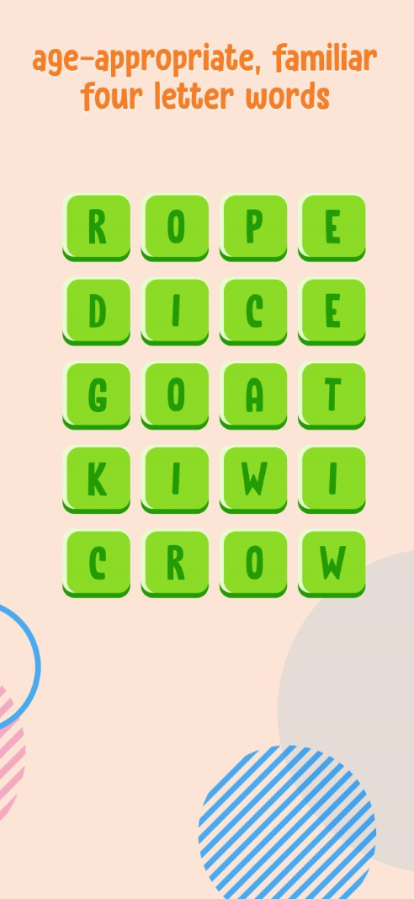
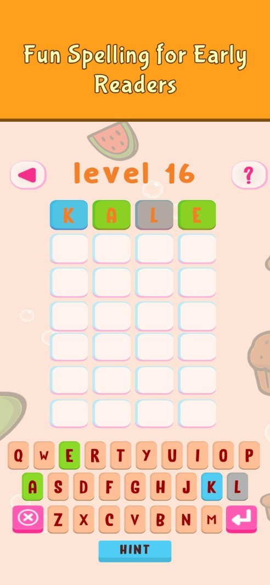

You can see all the related updates [here](/tags/wordxplorer)

## Automated Screenshot Capture

Updating the WordXplorer store listings has been a tedious affair. Previously, I had to manually capture screenshots for every device size, which made it difficult to keep visuals up to date as the game improved.

To solve this, I wrote a series of custom **Unity Editor scripts** to automate the process. These scripts programmatically trigger high-resolution renders for every required form factor and automatically apply a branded banner to each shot.

| Before | After |
|:---:|:---:|
| { width=200 } | { width=200 } |

## Teacher Approved Feedback

I’ve been working toward getting the "Teacher Approved" badge on the Google Play Store. While the app was previously approved, Google has identified two specific areas I need to address to maintain that status: **Text Volume** and **Replayability**.

I'm currently brainstorming ideas to address these two concerns and ensure the game gets approved again.

## Demo Build Updates

I’ve updated the [web demo](https://wordxplorer.ankursheel.com/) to include all themes and levels available in the paid version. While active play is still limited to the first six levels, users can now browse the full library of content.

My goal is to ensure players see the full scope of the game before purchasing, so they know exactly how much content they are getting in the full version.

## What's Next?  
  
I’m currently prioritizing which features to add next - there were quite a few that were cut from the initial release to get the game into your hands faster. I'm looking forward to bringing those back into the roadmap.
  
## Get WordXplorer  
  
WordXplorer is available on the iOS App Store and Google Play Store.

<?# AppStoreBadges AppStoreLinkText="Get WordXplorer on App Store" AppStoreLinkUrl="wordxplorer-guess-the-word/id6504664783" GooglePlayLinkText="Get WordXplorer on Play Store" GooglePlayLinkUrl="com.glhf.wordleforkids"/?>

### Become a Beta Tester  
  
Want to help catch bugs before they reach the public? I’d love your help. Simply send me a screenshot of your app review, and I’ll add you to the beta team. As a thank you, I’ll also give you a **free copy of the app** to share with a friend!

### Try the Demo

Want to try before you buy? Check out the [web demo here](https://wordxplorer.ankursheel.com/).

Thank you for being part of this journey. Stay tuned for more updates!