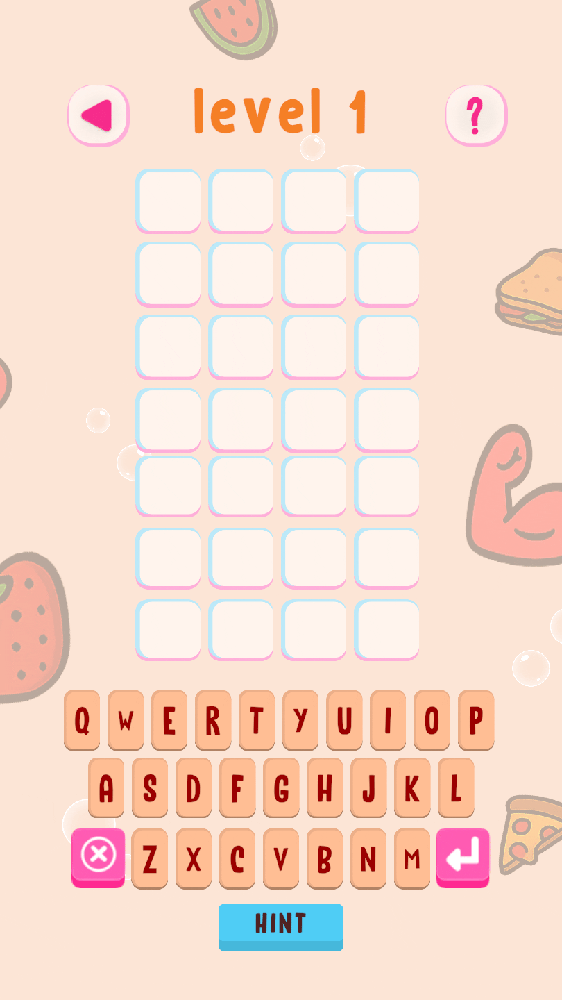
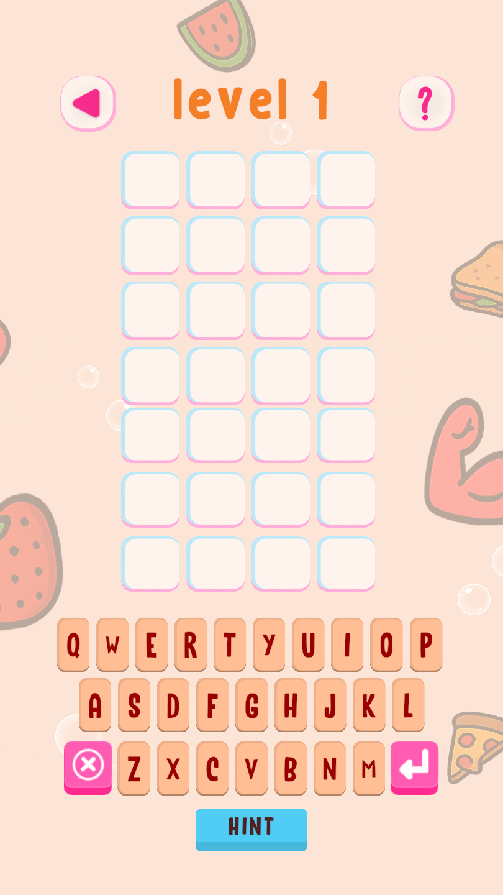

You can see all the related updates [here](/tags/wordxplorer)

## Flip Animation Overhaul

I updated the flip animation to make it a pop a bit more. You can see for yourself and tell me waht you think.

| Before | After |
|:---:|:---:|
| { width=200 } | { width=200 } |

## Code Cleanup and Unity Upgrade
                
I upgraded to Unity 6.3 to keep the engine current and to get the free AI credits. I am not sure what I did wrong but I was unable to get the AI credits to work.
                
I also removed some tech debt to make it easier to add tests and updated Github Actions to use macos-26 to stop a Apple warning related to Xcode.

## What's Next

I had some UX and copy improvements ready to go but ran out of free GitHub Actions minutes before I could ship them. They'll be in the April update.

## Become a Beta Tester  
  
Want to help catch bugs before they reach the public? I’d love your help. Simply send me a screenshot of your app review, and I’ll add you to the beta team. As a thank you, I’ll also give you a **free copy of the app** to share with a friend!

## Get WordXplorer  
  
WordXplorer is available on the iOS App Store and Google Play Store.

<?# AppStoreBadges AppStoreLinkText="Get WordXplorer on App Store" AppStoreLinkUrl="wordxplorer-guess-the-word/id6504664783" GooglePlayLinkText="Get WordXplorer on Play Store" GooglePlayLinkUrl="com.glhf.wordleforkids"/?>

Want to try before you buy? Check out the [web demo here](https://wordxplorer.ankursheel.com/).

Thank you for being part of this journey. Stay tuned for more updates!
