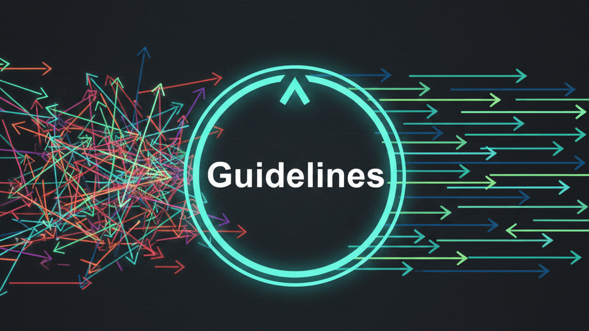

Whenever I join a new team, unless there are written guidelines, every person has a different opinion on what good tests look like. The codebase ends up inconsistent and the same debates cycle endlessly till everyone gives up.

And lets be honest, some engineers still write tests just to tick a checkbox and meet a requirement.

> It’s not that we don't know how to write tests. It's that we’ve never actually agreed on what **good** means for our team.

While guidelines might sound like unnecessary bureaucracy, in practice they offer a lot of advantages:

- They reduce cognitive load for both authors and reviewers by providing a clear set of standards to lean on and reference. 
- They ensure long-term readability, making it easy to pick up a test someone else wrote six months ago and actually understand what it's doing.
- They speed up writing by eliminating the endless micro-decisions that don’t actually add value.
- They make your codebase AI-friendly. Hand these guidelines over to an AI coding agent, and it will write tests exactly how you expect them.

I highly recommend every team come up with their own. These are mine. While they have been sourced from the many companies I have worked at, I have also adapted them heavily for my personal projects. Feel free to use them as a starting point or adopt them wholesale. 

_Disclaimer: No mock objects or QA engineers were harmed in the making of these guidelines. If you are deeply emotionally attached to `HappyPath` as a test name, please consult your local reviewer before reading further._



## Core Testing Philosophies

### Test Both Sides of Your Feature Flags

Always write tests for both the flag-off path and the flag-on path. If testing the flag off scenario is too difficult, document exactly why, note what is missing, and make sure to manually test the scenario.

### Optimize for Readability over DRY

> A good test suite should read like a **Lego instruction manual**. Every step is laid out sequentially, is self-contained, and is completely obvious.

When someone navigates to a test to understand how a piece of code is supposed to behave, they should be able to figure it out quickly. A little duplication in tests is a small price to pay  if it makes the intention obvious. 

Think of your test suite as executable documentation.

### Test names should convey the behaviour

A test name like `GetUser_HappyPath` tells me nothing. What is the happy path? What does success look like? Unless I look at the test body and the underlying implementation, I have no idea what it is doing.

Better names express the _state_ and the _expected outcome_:

- `GetUser_HappyPath` → `CanRetrieveUserById`
- `GetUser_ReturnsError` → `WhenUserNotFoundReturnsNotFoundError`

I have written about this in more detail at [A better naming convention for unit tests](https://www.ankursheel.com/blog/better-naming-convention-unit-tests)

### Keep Flag Logic Out of Parameterized Tests

It is incredibly difficult to convey what a test is actually doing when you rely on boolean parameters to toggle flags inside the test cases. Keep flag paths in separate, explicitly named tests instead.

Since you will eventually delete the flag-off path, it is perfectly fine to add a `_FlagOff` suffix to the test that will eventually be removed.

### Structure every test as Arrange → Act → Assert

Each test should have one setup phase, one action, and one set of assertions. If you find yourself doing Arrange → Act → Assert → Act → Assert, you have two tests trying to live inside one. Split them up.

### Leave Private Methods Alone

Private methods are implementation details. You should test the public methods that call them.

The rare exception to this rule is when testing a highly specific, complex internal behaviour. An example of this is when I wanted to test batching logic for a SQL query with pagination. Since the batch was a constant of 10,000, testing it via the public method would have been extremely painful.

### No branching in tests

An `if` statement inside a test makes it harder to understand and significantly harder to debug when it fails. Instead, pull the shared code into a helper method and write two separate, clean tests.

### Avoid spies

> Needing a spy is usually a design smell.

A spy wraps a real object and lets you verify which calls were made on it. Using one suggests your code is doing something internally that isn't represented by a clean interface.

The right fix is almost always to extract that dependency and inject it as a mock or test double instead. However, if you are working in a legacy codebase and can't easily restructure the code, use the spy but leave a comment explaining why. This forces you to articulate why there was no better option and saves the next developer from wondering why it's there.

### Use test doubles in integration tests, not mocks

Integration tests verify that your components work together correctly. When you mock a dependency, you replace real behaviour with a scripted response. If your assumptions about how that dependency behaves are wrong, your tests will pass while production breaks.

Fakes and stubs actually implement the behaviour, just in a simpler way. For example, a fake email service that stores sent emails in memory still behaves like an actual email service.

I have written about the different options at [Stubs vs Mocks vs Fakes vs Spy](https://www.ankursheel.com/blog/difference-stubs-mocks-fakes-spies).

## Setup

### Keep Setup Code Relevant to the Assertion

If setup code is unrelated to what you are asserting in a specific test, move it into a helper method. Parameterise your helper methods so it is immediately clear what is unique about the current test.

However, if removing the setup from the test body altogether makes the test harder to follow, keep it inline.

```csharp
var user = CreateValidUser(id: "invalidId");

userService.Validate(user);
```

### Start from the minimum for database-dependent tests

For tests that rely on the database being in a specific state, start from the minimum setup required for the application to run, and build up the state directly inside the test.  This keeps dependencies explicit and prevents a change in shared test data from breaking tests.

## Assertions

### Assert one concept per test

Asserting one concept does not mean you are restricted to a single assertion line. A test called `CanRetrieveUserById` can comfortably assert on multiple returned fields:

```csharp
var user = userService.GetUser();

Assert.Equal("id", user.Id);
Assert.Equal("name", user.Name);
```

What it _shouldn't_ do is also verify that an underlying analytics service was called during the retrieval. That is a separate concept and should live in its own test.

### Assert on properties, not object equality

When you assert on object equality, you are at the mercy of how `Equals` is overridden on that class.. You're trusting that whoever wrote it checked every field you care about.

Asserting on properties directly means your test is explicit about what it actually cares about. When it fails, you know exactly which field is wrong.

Avoid this:

```csharp
var expected = new User
{
    Id = "id",
    Name = "name"
};

var user = userService.GetUser();

Assert.Equal(expected, response);
```

Do this instead:

csharp

```csharp
var user = userService.GetUser();

Assert.Equal("id", user.Id);
Assert.Equal("name", user.Name);
```

***Exception***: If you want to catch the case where someone adds a new field and forgets to handle it, create an explicit `AllFieldsAreSetCorrectly` test and use object equality there intentionally.

### Use `Assert.Multiple` for multiple assertions

If a test has multiple assertions and fails, you want to see all the failures at once, not just the first one that blocked the run. 

xUnit 3 has `Assert.Multiple` and `Assert.MultipleAsync` built in for this. For older versions, I put together [xUnitHelpers](https://github.com/AnkurSheel/xUnitHelpers), a small NuGet package with helpers I  I found myself writing from scratch on almost every project.

### Verify what matters, ignore what doesn't

If your code delegates an important, state-changing call to a mocked dependency, verify it explicitly. But avoid verifying every single interaction or assertion on unrelated dependencies. It only makes your tests brittle.

# A starting point, not a finish line

I'm not suggesting you adopt these exact guidelines wholesale. Every team has different constraints, languages, and codebases.

But next time a code review devolves into a circular argument about test names or assertion styles, ask yourself: 

> Is the real problem just that nobody ever wrote the expectations down?

Pick a starting point, document it, and iterate. The goal isn’t a perfect document on day one. It’s simply having a shared standard to point to.

Note that these are guidelines, not rigid rules. Treat your guidelines as a living document, and update them as your team learns and evolves.

What is one rule on this list you disagree with, or one guideline your team swears by that I missed? Let's discuss in the comments below!