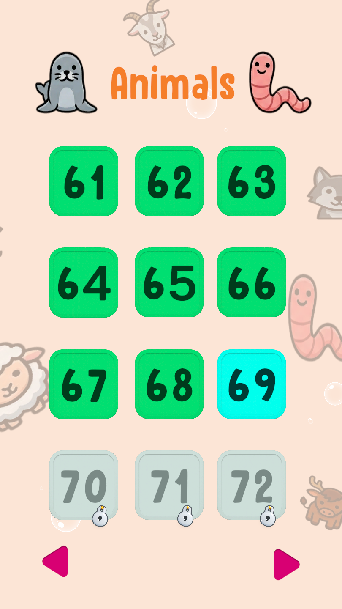
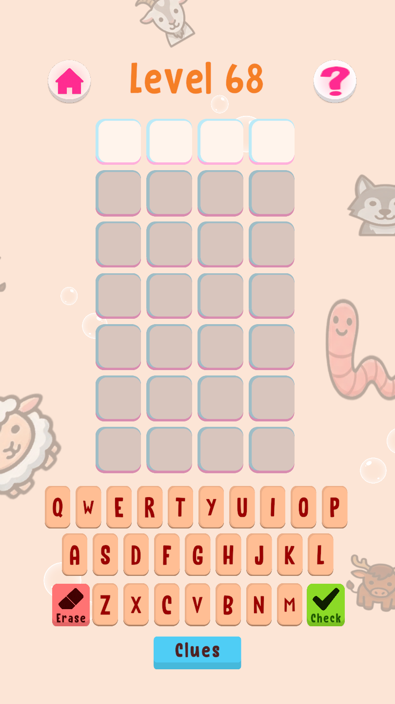
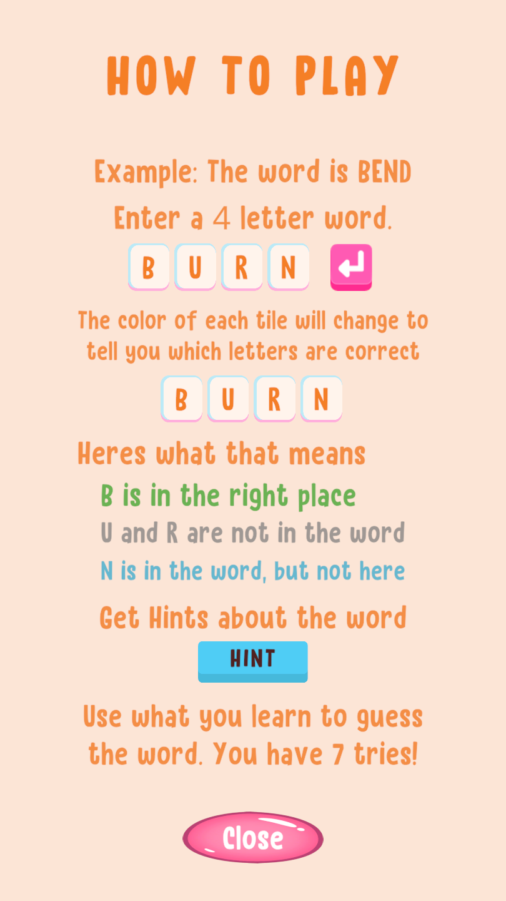
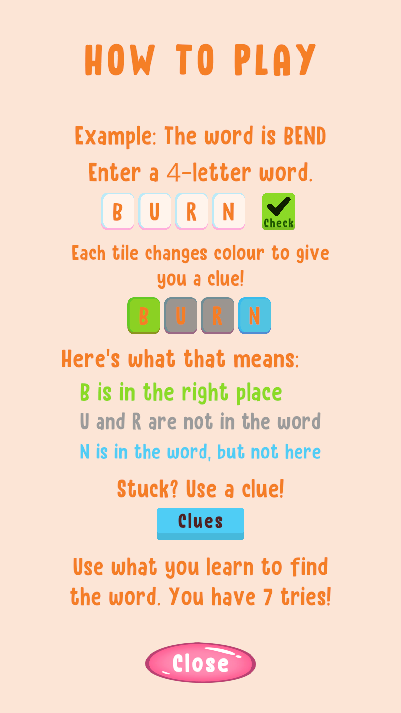
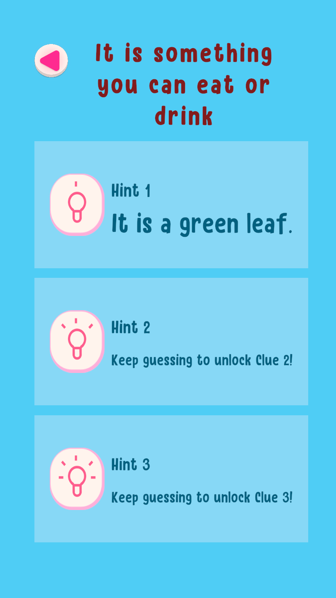
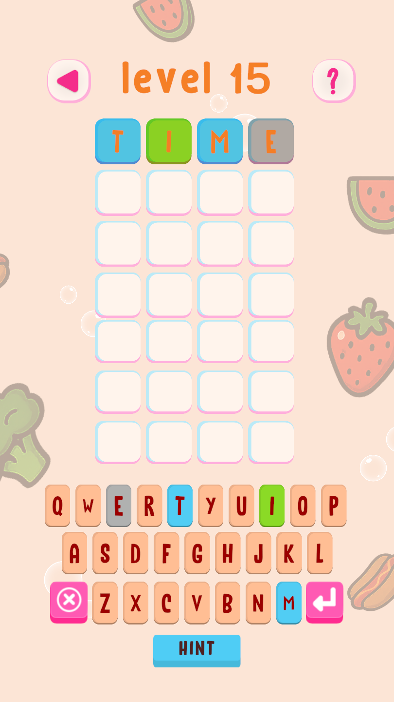
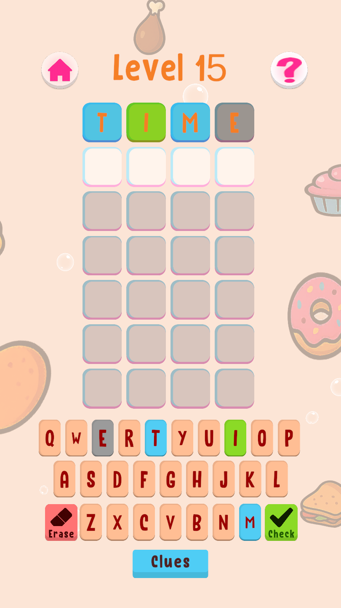
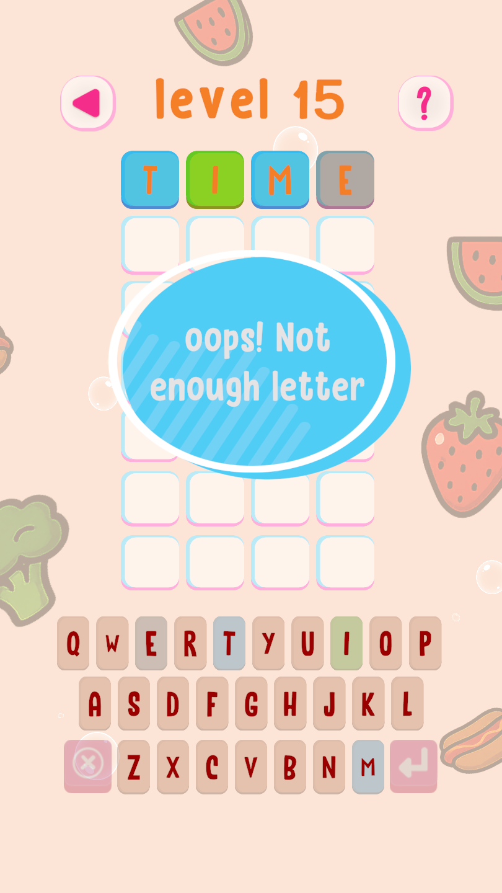
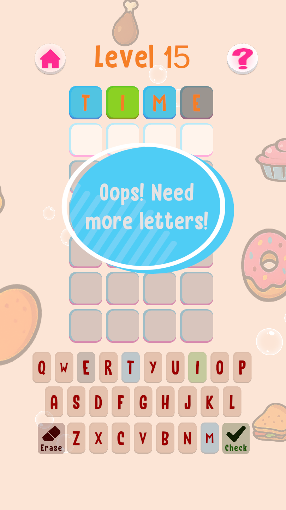

You can see all the related updates [here](/tags/wordxplorer)

## New Theme: Animals - 24 New Levels

The biggest change is a brand-new theme with 24 new levels.

I wanted the game to keep growing in a way that still feels approachable for kids, so this update adds a fresh set of words themed around animals.

|                                  Level Selection Screen                                  |                            Game Screen                             |
|:----------------------------------------------------------------------------------------:|:------------------------------------------------------------------:|  
| { width=200 } | { width=200 } |

## Clearer UI and Friendlier Copy

I also updated some of the text and buttons in the game.

The old text just felt way too verbose. The instructions, notifications, and hint copy should now be clearer and easier to understand. Since WordXplorer is aimed at younger players, I want the wording to be simple, helpful, and friendly.

I also updated buttons like Submit and Delete so the main actions are easier to understand at a glance.

| Before | After |
|:---:|:---:|
| { width=200 } | { width=200 } |
| { width=200 } | { width=200 } |
| { width=200 } | { width=200 } |
| { width=200 } | { width=200 } |

## Cleaner MonoBehaviours

Behind the scenes, I spent most of my time making the Unity MonoBehaviour classes leaner and moving the actual logic into plain C# classes.

By decoupling the game's core rules from Unity's engine architecture, I was finally able to write proper unit tests for the logic.

This was a calulated trade-off. I could have worked on some more features that would be more visible. But having tests gives me immense confidence when making future updates, knowing a tiny change won't accidentally break three other things in the process.

## What's Next

Next up is adding a menu screen to the game and possibly some more sound effects. If you have any suggestions for features or improvements that you would like to see immediately, please let me know.

## Become a Beta Tester  
  
Want to help catch bugs before they reach the public? I’d love your help. Simply send me a screenshot of your app review, and I’ll add you to the beta team. As a thank you, I’ll also give you a **free copy of the app** to share with a friend!

## Get WordXplorer  
  
WordXplorer is available on the iOS App Store and Google Play Store.

<?# AppStoreBadges AppStoreLinkText="Get WordXplorer on App Store" AppStoreLinkUrl="wordxplorer-guess-the-word/id6504664783" GooglePlayLinkText="Get WordXplorer on Play Store" GooglePlayLinkUrl="com.glhf.wordleforkids"/?>

Want to try before you buy? Check out the [web demo here](https://wordxplorer.ankursheel.com/).

Thank you for being part of this journey. Stay tuned for more updates!
