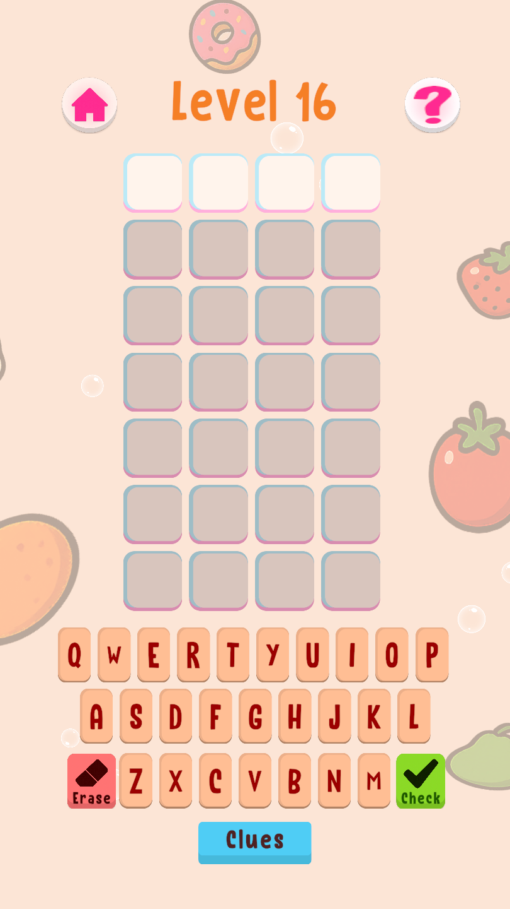
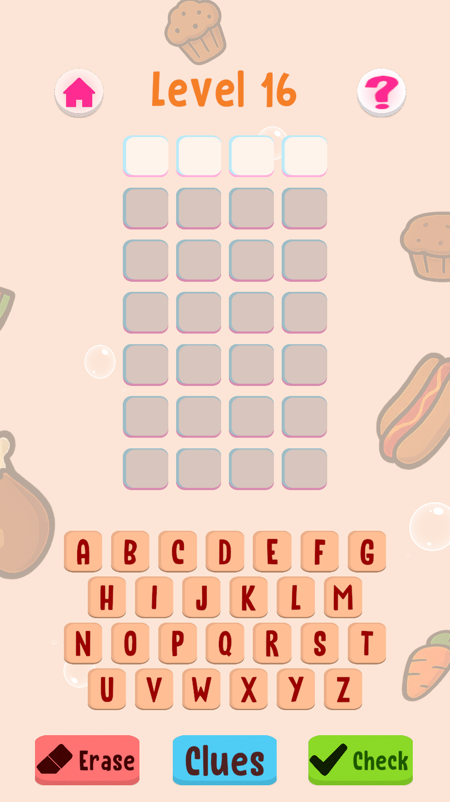
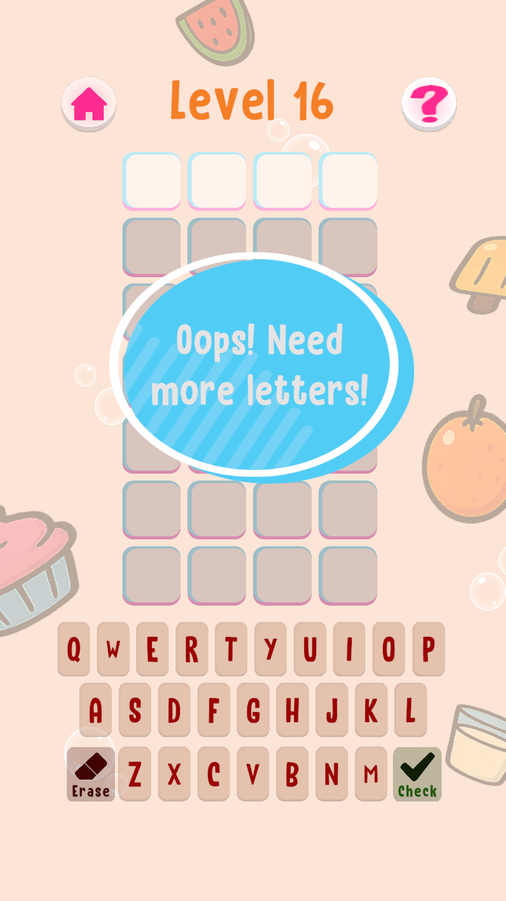
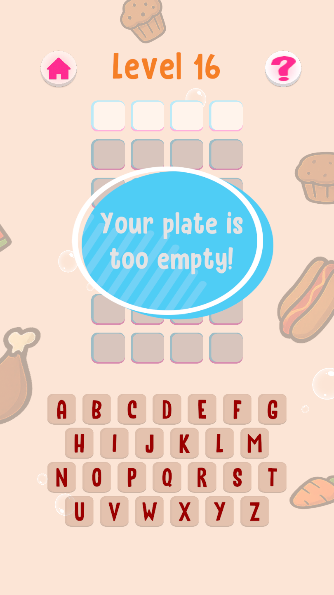
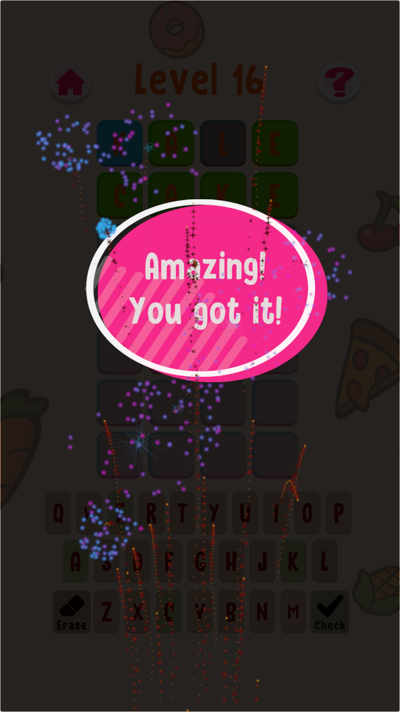
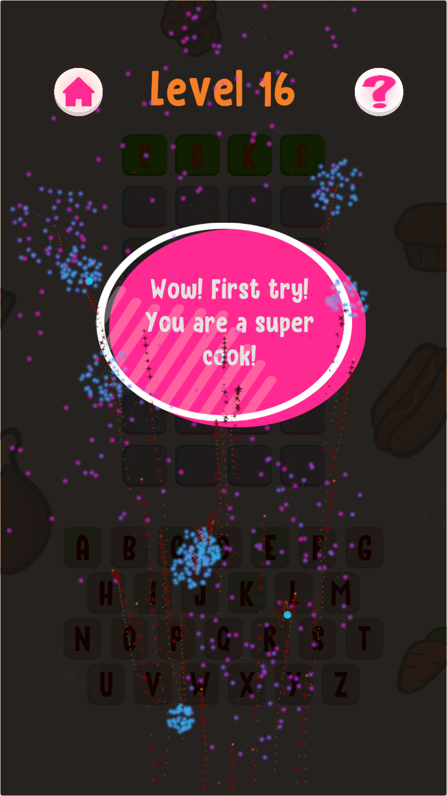
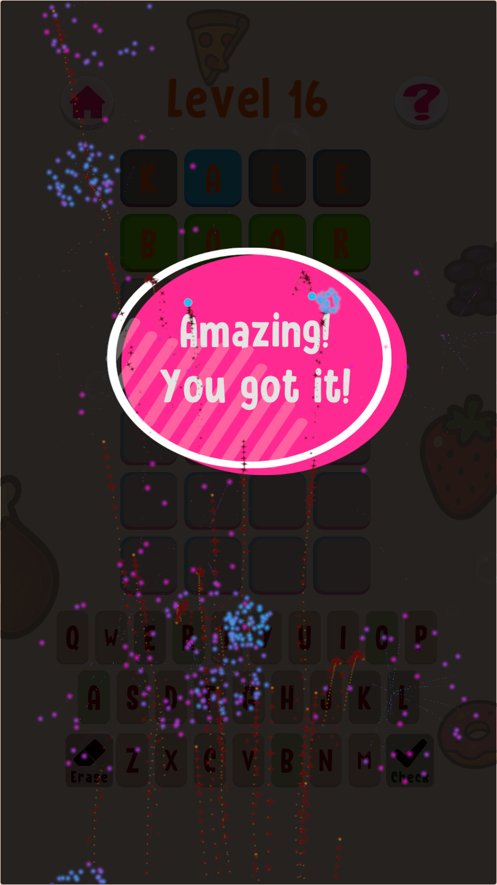
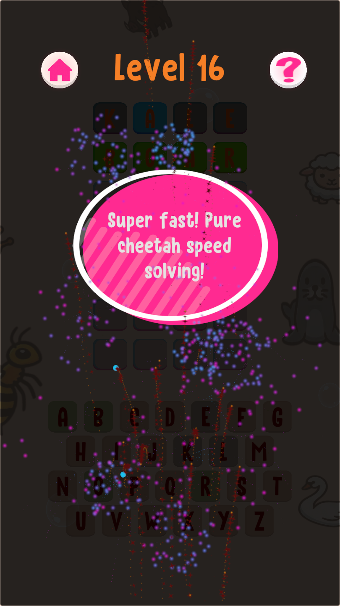
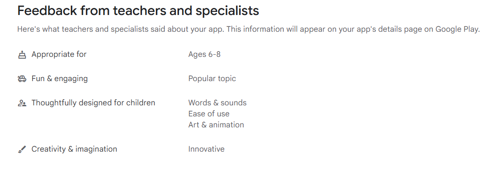

You can see all the related updates [here](/tags/wordxplorer)

The main focus of this update was making WordXplorer much more intuitive and approachable for kids.

## Ditching QWERTY for an Alphabetic Keyboard

Based on feedback, I made a major change to the in-game keyboard.

Adults are deeply conditioned to type on QWERTY layouts, but younger kids are still learning the alphabet sequentially. For a child trying to spot letters, a scattered QWERTY board just adds unnecessary cognitive load.

I updated the keyboard to follow a simple alphabetic layout (A–Z).

In the previous design, action keys were too close to the letter tiles. Now, the main actions are clear, separated, and much easier to hit on small screens.

I also pulled the **Check** and **Erase** buttons out of the main keyboard and made them larger.

|                Old Keyboard Layout                |                New Keyboard Layout                |
|:-------------------------------------------------:|:-------------------------------------------------:|
|  |  |

## Dynamic & Theme-Specific Notifications

Until now, every notification in WordXplorer said the same thing, regardless of which theme you were playing or how many guesses you had left. Won on your first try or scraped through on your last chance, you got identical text.

This was again based on direct feedback.

So now the notification text is custom per theme and depends on how many chances were taken.

|                Old Not Enough Letters                 |                New Not Enough Letters                 |
|:-----------------------------------------------------:|:-----------------------------------------------------:|
|  |  |

|               Old theme 1 guess 1               |               New theme 1 guess 1               |
|:-----------------------------------------------:|:-----------------------------------------------:|
|  |  |

|               Old theme 2 guess 2               |               New theme 2 guess 2               |
|:-----------------------------------------------:|:-----------------------------------------------:|
|  |  |

## Teacher Approved Again

Google Play has a pretty thorough review process for apps aimed at children, where teachers and educational specialists evaluate apps on design, usability, and learning value. WordXplorer had the Teacher Approved badge on Google Play once before. Then, at some point, it disappeared.

WordXplorer was reviewed again recently and received the official **Teacher Approved** badge on the Google Play Store!

 
It's always reassuring to get validation from educators that the updates and design decisions are hitting the mark.
    
## Store Listing Refresh

I also gave the store listing a refresh  and updated the description and screenshots on both the App Store and Google Play. I am hoping it reduces the amount of refunds on Google Play and gives a better idea of what the game is about. Let me know what you think!

## What's Next

Next up is adding a menu screen to the game and possibly some more sound effects. If you have any suggestions for features or improvements that you would like to see immediately, please let me know.

## Become a Beta Tester  
  
Want to help catch bugs before they reach the public? I’d love your help. Simply send me a screenshot of your app review, and I’ll add you to the beta team. As a thank you, I’ll also give you a **free copy of the app** to share with a friend!

## Get WordXplorer  
  
WordXplorer is available on the iOS App Store and Google Play Store.

<?# AppStoreBadges AppStoreLinkText="Get WordXplorer on App Store" AppStoreLinkUrl="wordxplorer-guess-the-word/id6504664783" GooglePlayLinkText="Get WordXplorer on Play Store" GooglePlayLinkUrl="com.glhf.wordleforkids"/?>

Want to try before you buy? Check out the [web demo here](https://wordxplorer.ankursheel.com/).

Thank you for being part of this journey. Stay tuned for more updates!
