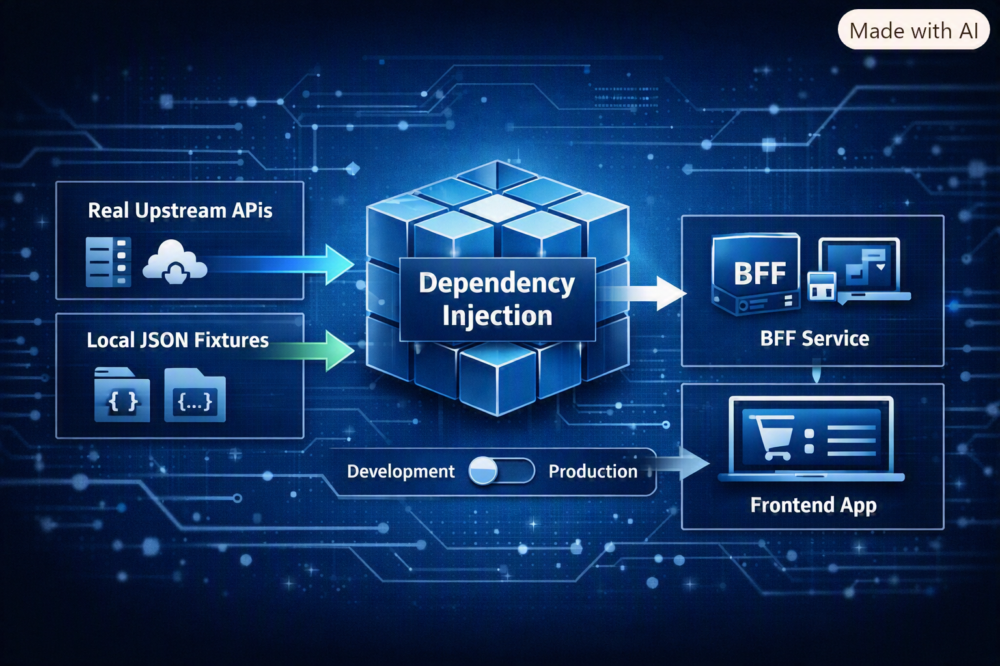

Recently, I was working on a frontend feature that depended on transaction data from a Backend-For-Frontend (BFF) service. The upstream service filtered out any transaction older than X days, leaving my dataset empty and useless for development.

I didn't have write access to the upstream database, so seeding real data against a local database wasn't an option. And asking the upstream team to add some test data would have turned a two-hour task into a multi‑day dependency.

This post shows how to solve that friction inside the BFF itself using a single running example: an endpoint returning a customer’s order history by merging an `OrdersApi` and a `RefundsApi`.

## Approach 1: Comment-Toggling

The quickest dirty fix is reading data from a JSON file and leaving it commented out right next to the real HTTP call.

```csharp
public async Task<IEnumerable<OrderSummary>> GetOrderHistory(Guid customerId, CancellationToken ct)
{
    var orders = await _ordersApi.GetOrders(customerId, ct);
    var refunds = await _refundsApi.GetRefunds(customerId, ct);
    return Combine(orders, refunds);
 
    // Uncomment below to test locally against fixture data:
	// var orders = await LocalJsonHelper.ReadAsync<OrdersResponse>("./Fixtures/orders.json");
	// var refunds = await LocalJsonHelper.ReadAsync<RefundsResponse>("./Fixtures/refunds.json");
	// return Combine(orders, refunds);}  
```

We’ve all seen this in pull requests, and it relies entirely on developer discipline.

> This is fine for a spike

You have to remember to revert the file before committing, and hope a reviewer catches it if you don't. Worse, that commented-out block isn't compiled, so as the surrounding method signature changes, those lines rot silently until someone tries to uncomment them and gets a wall of compiler errors instead of test data.

## Approach 2: A Per-Endpoint Config Check

A step up is gating the data source behind a runtime flag like `UseLocalJsonData` in your `appsettings.json` and injecting it via `IOptions<LocalDataSettings>`

```csharp
public async Task<IEnumerable<OrderSummary>> GetOrderHistory(Guid customerId, CancellationToken ct)
{
    OrdersResponse orders;
	RefundsResponse refunds;

    if (_localDataSettings.UseLocalJsonData)
    {
	    orders = await LocalJsonHelper.ReadAsync<OrdersResponse>("./Fixtures/orders.json", ct);
	    refunds = await LocalJsonHelper.ReadAsync<RefundsResponse>("./Fixtures/refunds.json", ct);
	}
	else
	{
		orders = await _ordersApi.GetOrders(customerId, ct);
	    refunds = await _refundsApi.GetRefunds(customerId, ct);
	}  
    return Combine(orders, refunds);
}  
```

This is a genuine improvement. Both branches compile, and the fixture data actually flows through the real `Combine()` logic instead of sitting in a comment.

The problem is that your core business handlers are now littered with `if/else` branching that exists purely for local convenience. You've mixed two responsibilities into one method, added cognitive load to every code review, and introduced control paths that will never run in production.

## Approach 3: Push the Switch into Dependency Injection



Instead of branching inside the handlers, we can push the switch out to the dependency injection container. The orchestrating services, mappers, and controllers stay clean. They have no idea whether the payload came from disk or over the wire.

### Step 1: Target the API Client Boundary

Ensure every upstream service dependency is hidden behind an interface.

```csharp
public interface IOrdersApi  
{  
    Task<OrdersResponse> GetOrders(Guid customerId, CancellationToken ct);}  
```

### Step 2: Implement the Local Client

Implement a local version of the client that reads raw upstream JSON payloads from disk. 

```csharp
public class LocalOrdersApi : IOrdersApi  
{  
    public async Task<OrdersResponse> GetOrders(Guid customerId, CancellationToken ct)
	{
		return await LocalJsonHelper.ReadAsync<OrdersResponse>("./Fixtures/RawUpstream/orders.json", ct);
	} 
 }
```

### Step 3: Conditionally Register in the DI Container

Register your production HTTP clients by default, then conditionally overwrite them in development.

```csharp
// 1. Register the real API clients
services.AddScoped<IOrdersApi, OrdersApi>();
services.AddScoped<IRefundsApi, RefundsApi>();
  
// 2. Conditionally overwrite them for local development
if (ShouldUseLocalData(environment, configuration))
{
	services.AddScoped<IOrdersApi, LocalOrdersApi>();
	services.AddScoped<IRefundsApi, LocalRefundsApi>();
}  
```

**What are we doing here?** The registration order matters. ASP.NET Core's container resolves the last registration for a given interface, so the local clients silently take over without either registration knowing the other exists. Nothing in `OrderHistoryService` or its callers changes at all.

Notice the check is `ShouldUseLocalData(environment, configuration)` rather than a bare config lookup. That's deliberate. It adds an independent environment check on top of the config flag, so even if someone misconfigures `appsettings.json` in a shared environment, fixture data still can't leak into production.

```csharp
private bool ShouldUseLocalData(IWebHostEnvironment environment, IConfiguration configuration)
{
	var localDataSettings = configuration.GetSection(LocalDataSettings.SectionName).Get<LocalDataSettings>();
	return localDataSettings.UseLocalJsonData && environment.IsDevelopment();
}  
```

### Step 4: Isolate Local Code from Production Assemblies

If you want absolute isolation, move the `Local*Api` classes into a separate project, `Bff.LocalDevelopment`, and reference it conditionally

```xml
<ItemGroup Condition="'$(IncludeLocalDevelopmentAssembly)' == 'true'">  
  <ProjectReference Include="..\Bff.LocalDevelopment\Bff.LocalDevelopment.csproj" /></ItemGroup>  
```

You can pass `IncludeLocalDevelopmentAssembly` via `-p` on the command line, but a more durable option is setting it in `Directory.Build.props` and forcing it off on CI agents:

```xml
<Project>
  <PropertyGroup>
    <IncludeLocalDevelopmentAssembly Condition="'$(IncludeLocalDevelopmentAssembly)' == ''">true</IncludeLocalDevelopmentAssembly>
  </PropertyGroup>

  <!-- Force false on CI build agents -->
  <PropertyGroup Condition="'$(GITHUB_ACTIONS)' == 'true'">
    <IncludeLocalDevelopmentAssembly>false</IncludeLocalDevelopmentAssembly>
  </PropertyGroup>
</Project>
```
 
The first `PropertyGroup` defaults the property to `true` only if nothing has set it already, so a plain local build gets the assembly with no extra flags needed. The second `PropertyGroup` only matches on GitHub Actions runners, which set `$(GITHUB_ACTIONS)` to `true` automatically, and forces the value back to `false` there. Nobody on the team has to remember to opt out locally, and CI can't opt in by accident.

**Why not just check `$(Configuration) == 'Debug'`?** Build configuration and runtime environment are different concepts. It's far too easy for a developer to run `dotnet build -c Release` locally, or for a pipeline step to compile in Debug mode on a wrong assumption. An explicit MSBuild property removes that guesswork.

### Is This Overengineering?

Fair question. That's four steps, an interface per client, a `ShouldUseLocalData` guard, and possibly a whole separate assembly for what's ultimately a way to read a JSON file instead of calling an API.

If you need this for a single one-off bug, it probably is overkill. Approach 1's commented-out block is faster to write, and you'll delete it in twenty minutes anyway.

It stops being overengineering the moment the local codepath needs to be kept for a longer time, which in my experience happens quickly. The interface boundary that lets you swap in fixture data is the same boundary you'd want for testing your code, so you're not adding an abstraction so much as formalising a seam that probably should have existed already. Once that's in place, Steps 3 and 4 are a few lines of DI registration and an MSBuild condition, not a new layer to maintain.

However, if you're only doing this for a handful of endpoints, Step 4 is probably overkill and you can skip it.

## What This Unlocks
 
### Unlock 1: Preventing Drift with Snapshot Testing

Because a fixture-backed client is deterministic, you can run it through your production `OrderHistoryService` in a unit test and assert the output with a snapshot tool.

```csharp
[Fact]
public async Task GetOrderHistory_MatchesSnapshot()
{
    var localOrdersApi = new LocalOrdersApi(Options.Create(new LocalDataSettings()));
    var service = new OrderHistoryService(localOrdersApi, new OrderMapper());

    var result = await service.GetOrderHistory(Guid.Empty, CancellationToken.None);

    await Verify(result);
}
```

If someone renames a property or breaks a mapping rule, the snapshot test fails instantly in CI with a visual diff and helps you catch breaking changes much faster.

### Unlock 2: Automating Frontend Mocks

Instead of frontend teams maintaining separate hand-written stubs that drift over time, you can pipe your verified `.verified.json` snapshots directly into WireMock stubs, Storybook fixtures, or TypeScript type generators. Your frontend mocks are now guaranteed to match true backend execution output.

### Unlock 3: Simulating Upstream Failures and Edge Cases

Happy-path testing is straightforward, but add a failure flag to the local client and you can simulate an upstream outage without touching the network at all.

```csharp
public class LocalOrdersApi : IOrdersApi
{
    private readonly LocalDataSettings _settings;

    public LocalOrdersApi(IOptions<LocalDataSettings> settings)
    {
        _settings = settings.Value;
    }

    public async Task<OrdersResponse> GetOrders(Guid customerId, CancellationToken ct)
    {
        if (_settings.SimulateOrdersApiError)
        {
            throw new HttpRequestException("Simulated upstream 503 Service Unavailable");
        }

        return await LocalJsonHelper.ReadAsync<OrdersResponse>("./Fixtures/RawUpstream/orders.json", ct);
    }
}
```

Toggle `"SimulateOrdersApiError": true` locally to check your fallback and retry logic actually does what you think it does.

## Summary

The extra interface and DI wiring cost a little upfront, but you get deterministic data for local devving. The edge case you couldn't get an upstream service to return becomes a JSON file away.

What's your team doing to fake upstream data locally, and where has it broken down for you?