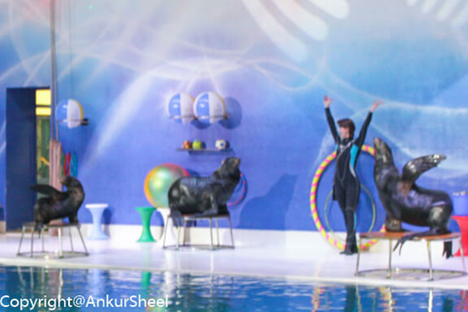
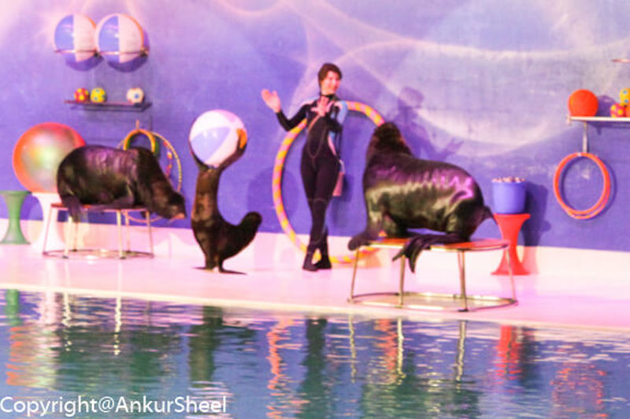
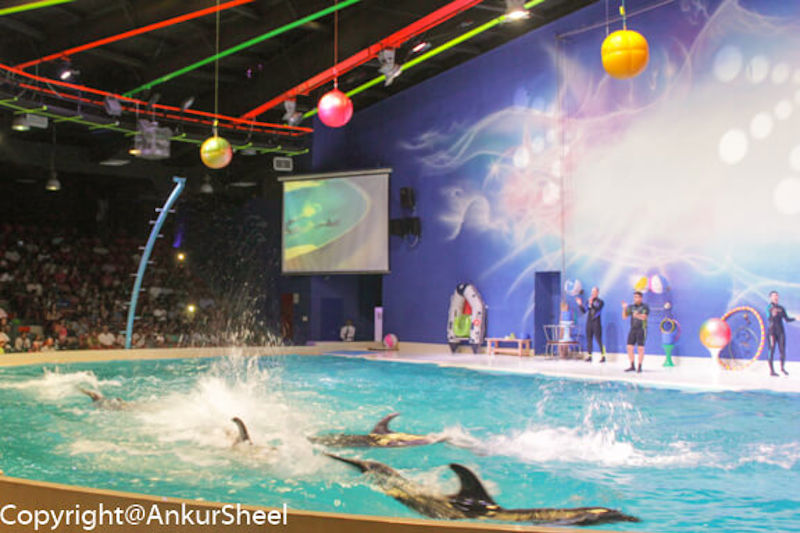
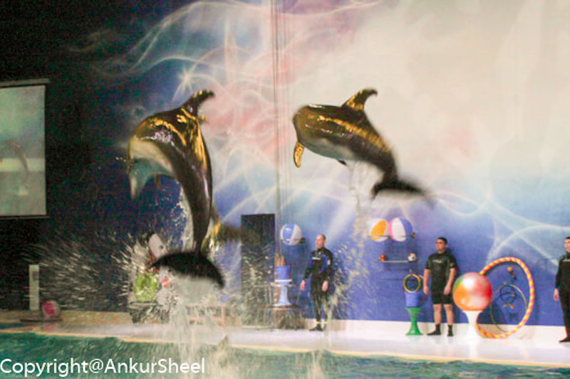
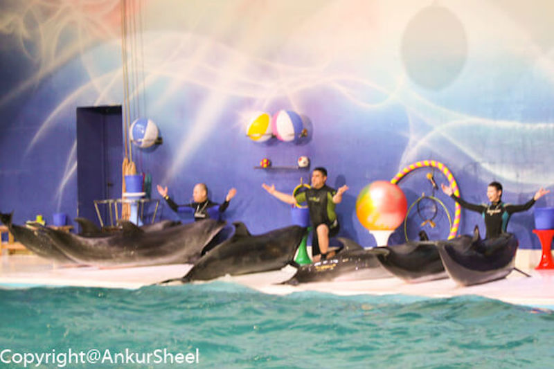

A must-see in Dubai is the Dubai Dolphinarium located at the Creek Park. The entry fee is about 75 dirhams.

Dolphins are some of the most fascinating of marine mammals.

It was Gunjan's first time to watch a live seal and dolphin show. I was a bit sceptical about the quality of the show but these reservations were quickly shattered once the show started. While it's certainly not SeaWorld, the show is very good.

The seals show off their skills first. They balance a ball with their nose, sing into a microphone and dance.

After the seals finish their tricks, they exit and the dolphins start their antics. They play with rings, basketball, jump and touch balls which are held high and jump through rings.

At one point, one of the dolphins painted a picture which was then auctioned off to the audience for a price. The trainer also holds the tail of one of them and moves around the pool. She also stands and rides one of the dolphins. The best part was their play with the audience. While we throw giant balls to them, they throw it back to us.

There was a lucky draw for the children. You had to buy small balls which were about 10 dirhams each and all the children would throw them in the pool. The ball which the dolphins pick up and return first is the winner. The winner got to be pulled in a small boat by a dolphin.

<?# ResponsiveYouTube sUo_fI09GKI Title="Dubai Dolphinarium"/?>
