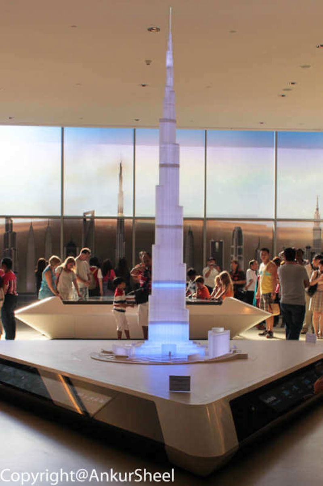
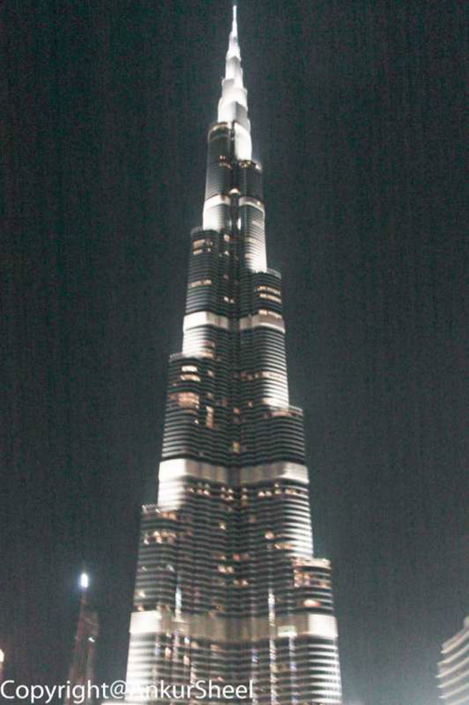
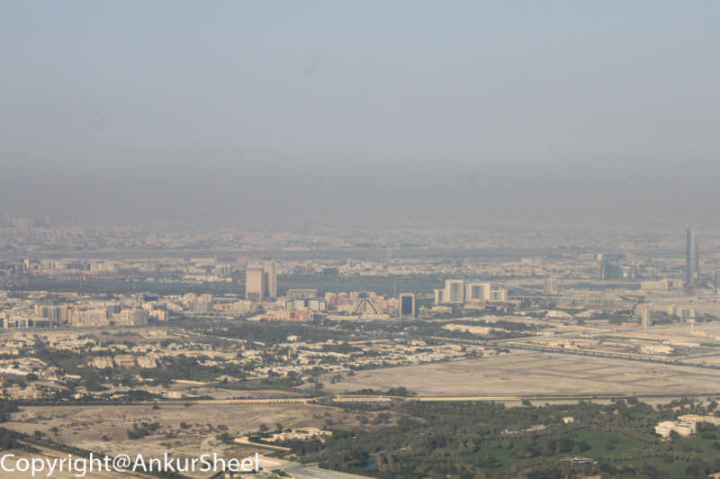
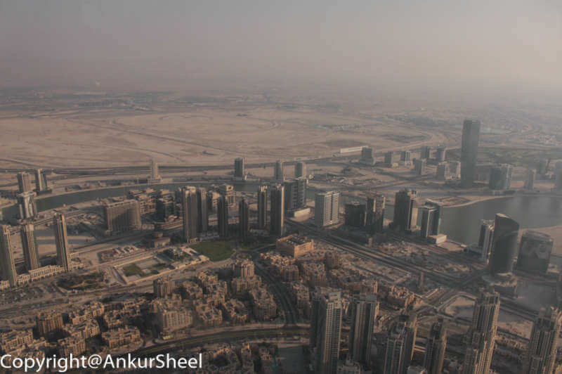
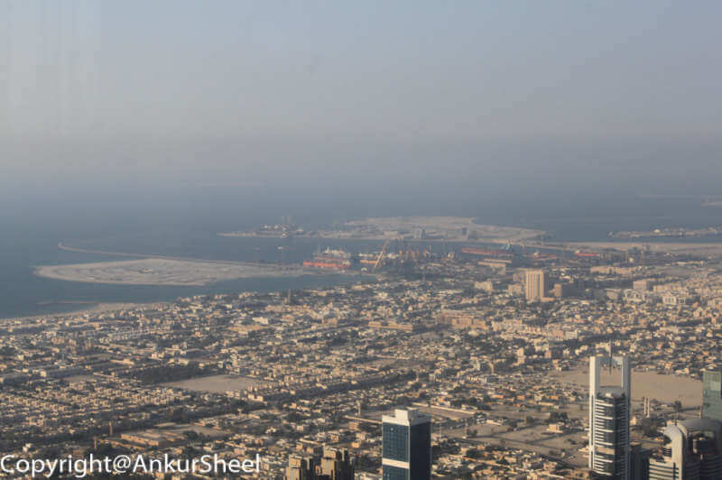
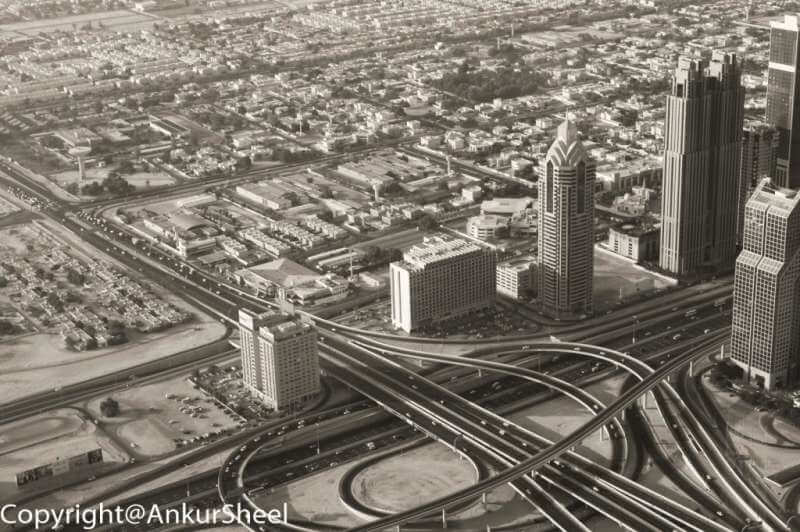

At The Top' experience or scaling the world's tallest building (standing at 829.8 meters) is a must. Even though we had booked our tickets about 2 weeks in advance, we could not get the timings we wanted and had to settle for an afternoon slot instead of being there around sunset. Well, you roll with the punches, and so we planned our day as follows.

-   leave early in the morning to roam around the Dubai Mall and spend some time shopping.
-   grab lunch someplace.
-   spend a couple of hours scaling the world's tallest building.
-   catch the Dubai Fountain show.

The scenery is pretty incredible from the world's highest outdoor Observatory Deck on the 124th floor. The journey to reach the Observatory Deck is a tad long. Still, the relatively long walk through the corridors reveals the beauty of the architecture of the building. All in all, I think about 1.5 to 2 hours should be enough to reach the top and spend a fair amount of time there.

It is better to make an online reservation as there is a considerable price difference. It is about Dhs 400/person for immediate entry instead of Dhs 125/adult if you make an online reservation. Another thing to note is that the tickets are dated and timed, and the evening slots are sold out much in advance.

By the way, Tom Cruise is supposed to have scaled the Burj Khalifa building on his own for his movie Mission Impossible – The Ghost Protocol.
