Dubai is one city that probably has everything that money can buy. One of the biggest examples of this is the artificial islands of Palm Jumeirah. The Palm Jumeirah is an artificial cluster of islands created and arranged in the form of a giant palm tree. After the visit to the mosque, we took a taxi to the Dubai Marina metro station.

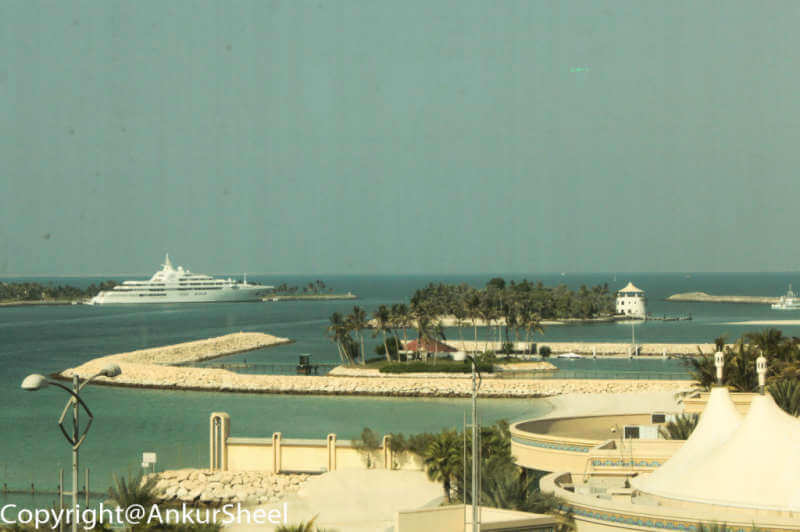

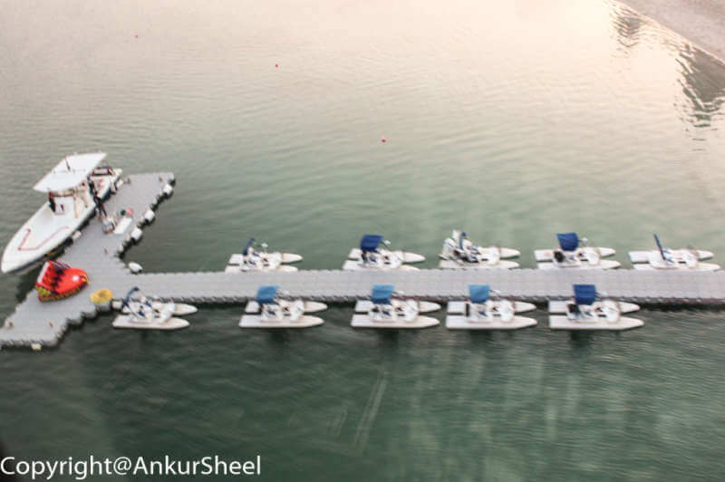

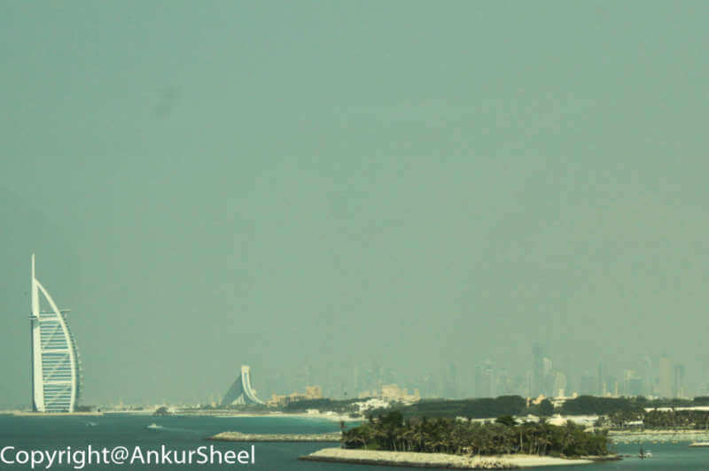

From here, we took the Palm Monorail ride to the Palm Islands. The monorail runs along the trunk of the Palm Jumeirah, and you can see the entire Palm from the top. You can see not only the private beach of each villa but also the private boats.

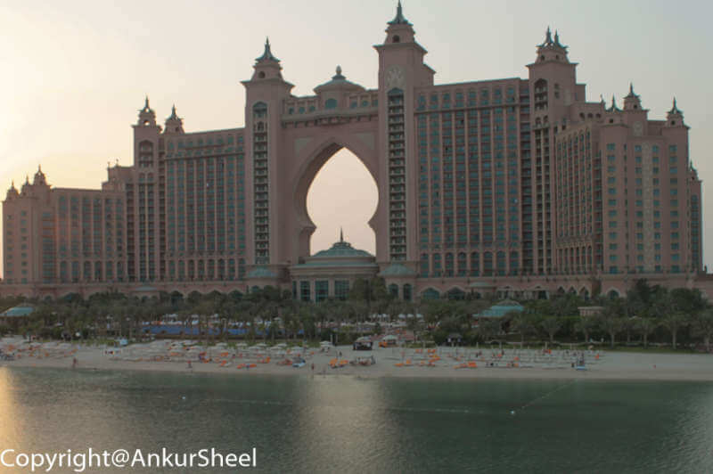

At the end of the monorail is the Atlantis hotel. Although entry to the hotel is limited to the hotel's guests, the Atlantis Lost Chambers is open to the public (for a fee :-P ).

Dubai has two aquariums – one in the Dubai mall and one in the Atlantis. However, since most websites recommend the Lost Chambers, we visited this one.

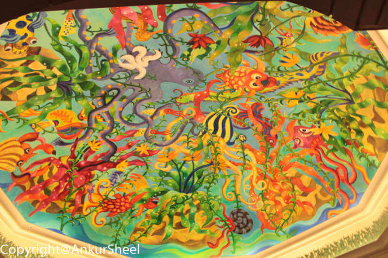

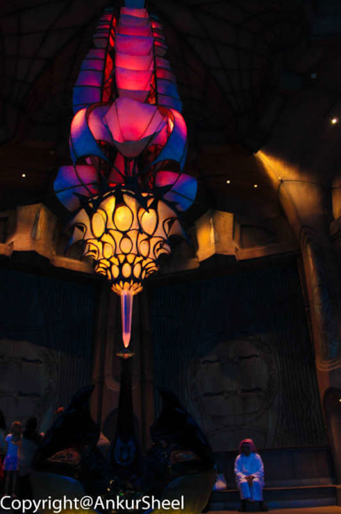

As soon as you enter the Atlantis, the thing that pops out at you is the mural on the walls. Apart from the shops, restaurants etc., the novelties here are the water park, the dolphin bay and the lost chambers aquarium. The entire interior has some impressive lighting effects, water spouts and, best of all, some unique marine animals.

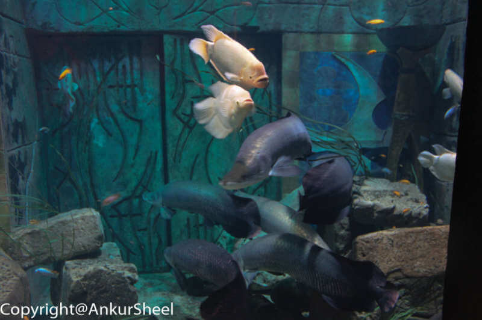

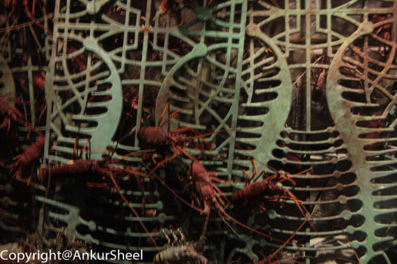

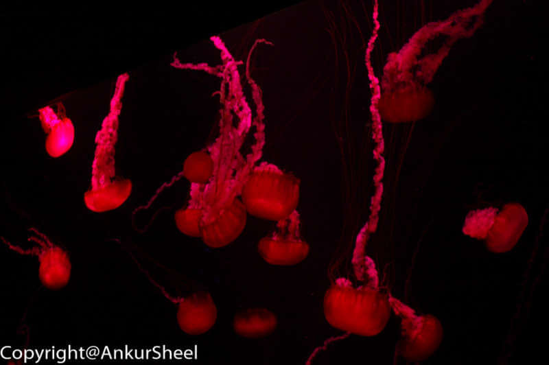

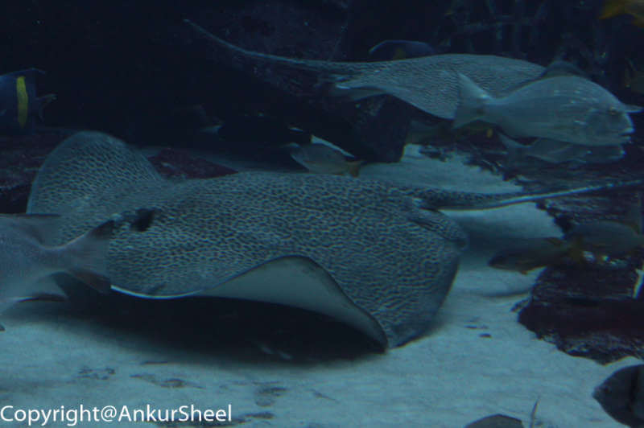

Luckily, we were there for the feeding frenzy wherein a couple of divers entered the giant fish tank and fed the fish. The divers put on a very humorous show, and the chaos is unbelievable when the feeding starts.

Let's play a game and see in how many of the pictures you can spot the divers :-)

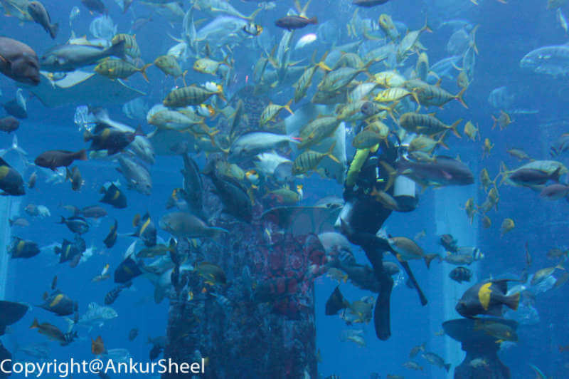

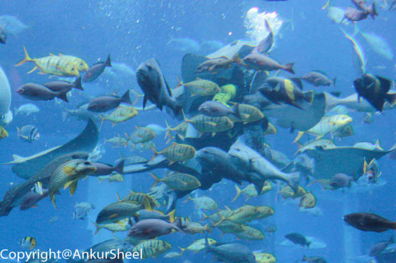

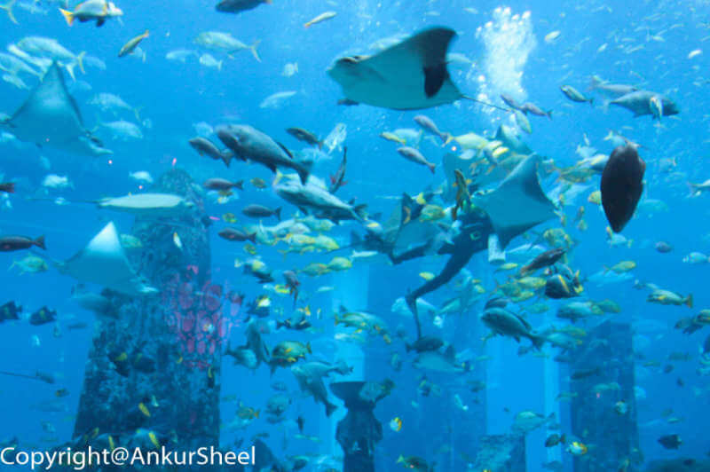

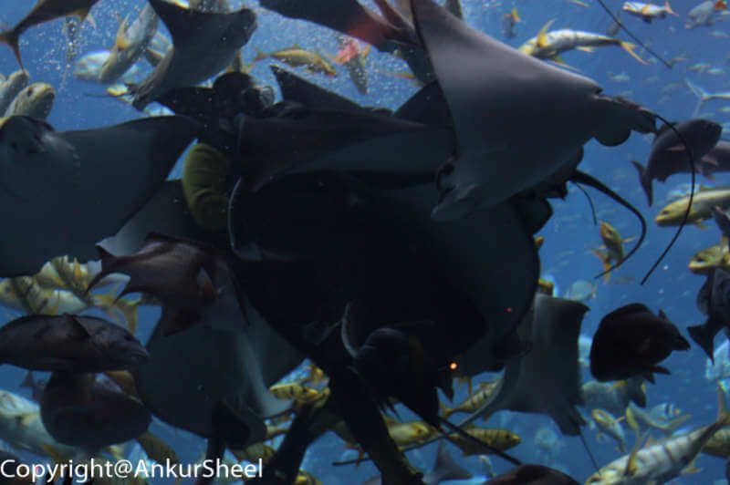

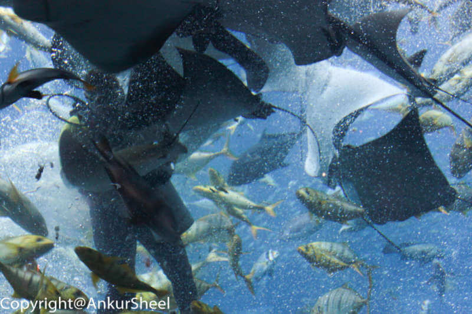

How many did u spot?
