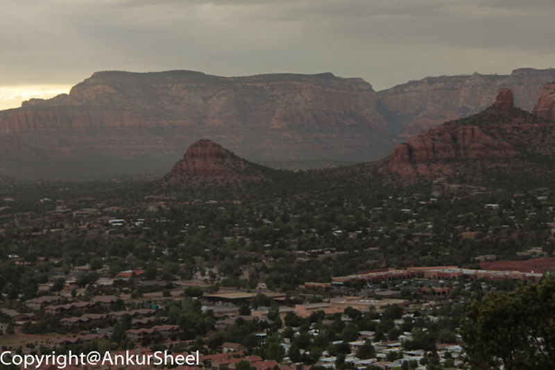
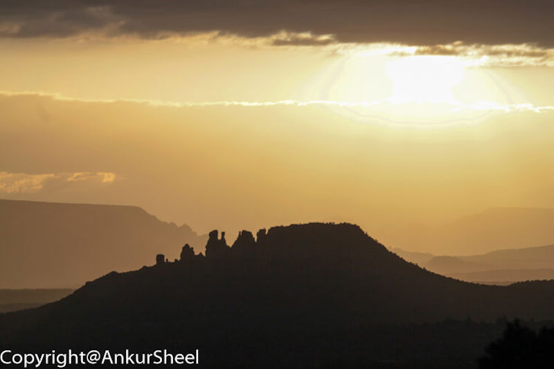
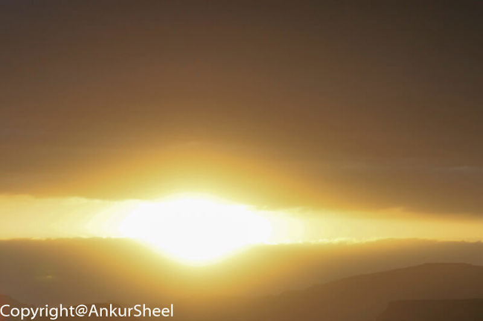
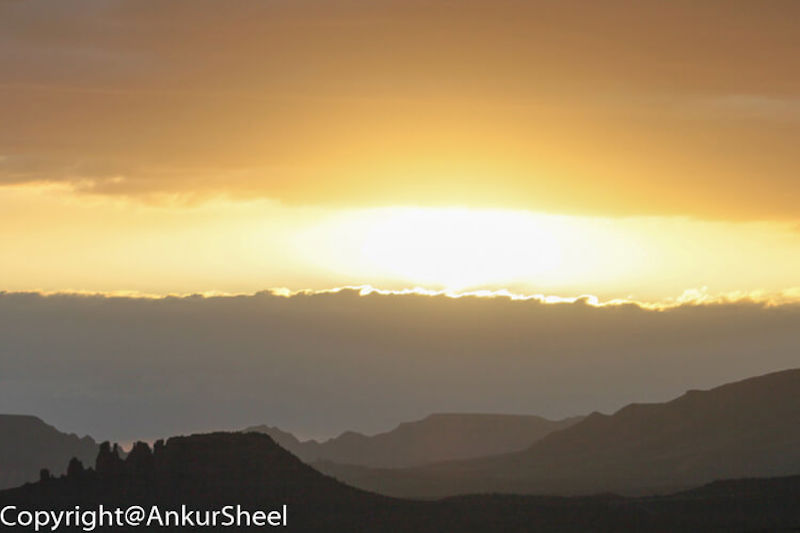
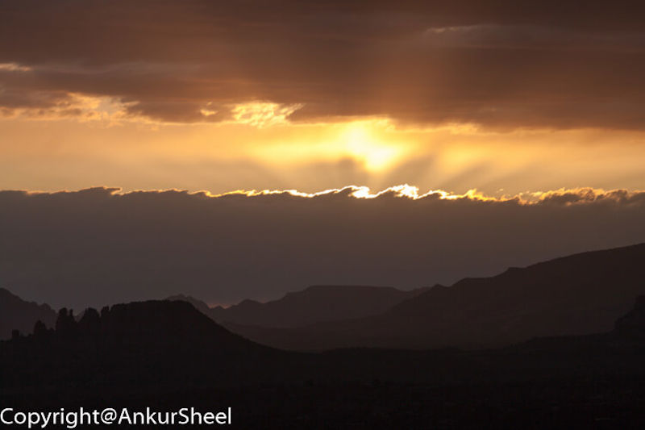
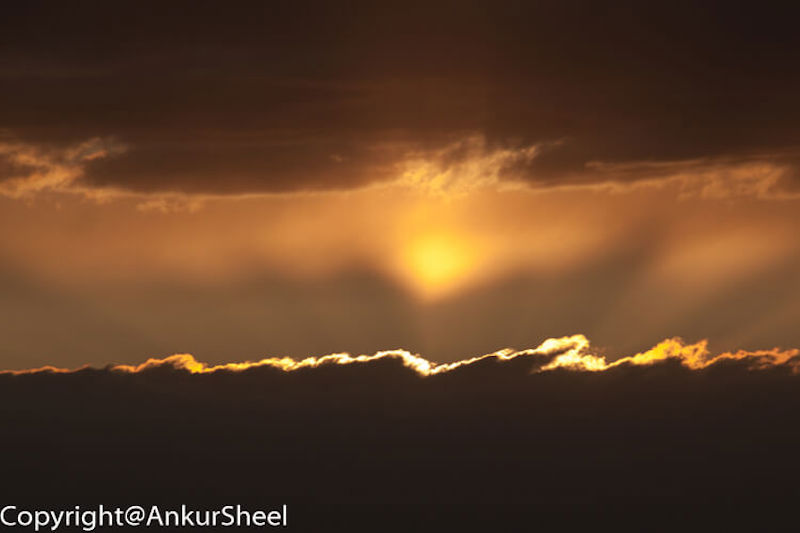

After visiting the Grand Canyon, next on the itinerary was the Stockyard's at Fort Worth in Texas. But, before we could reach Fort Worth , we found a gem of a place in Sedona, Arizona.

The surreal red rock landscape makes for some stunning, photographs especially at the right time of the day.

