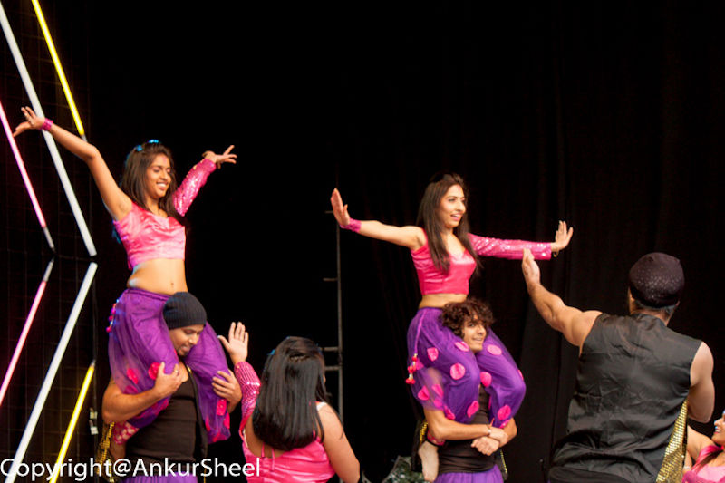
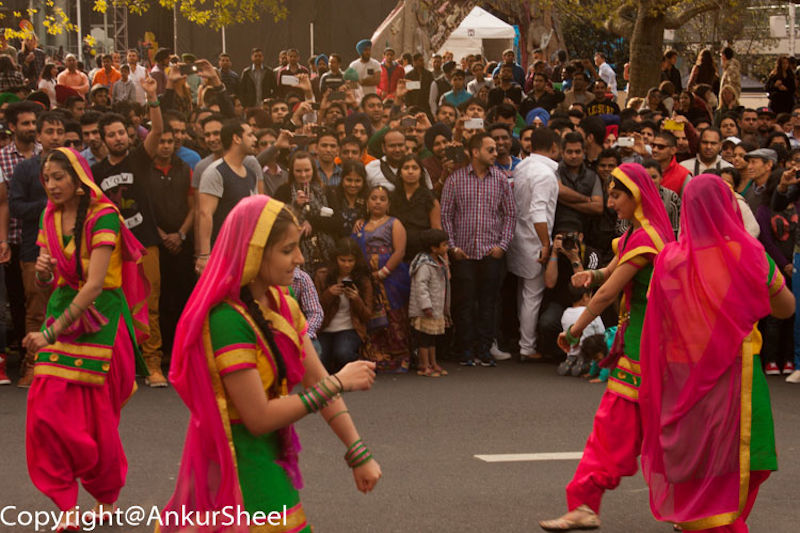
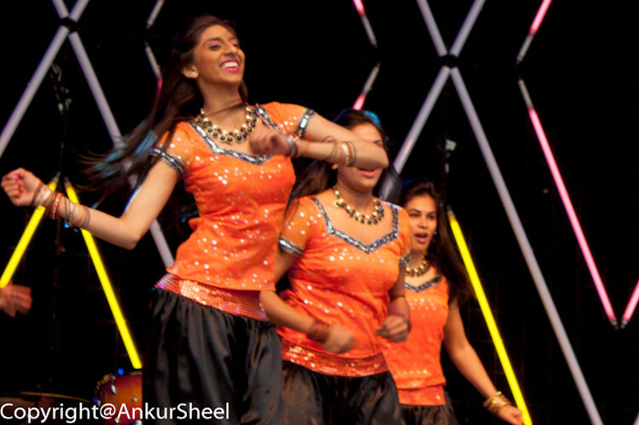
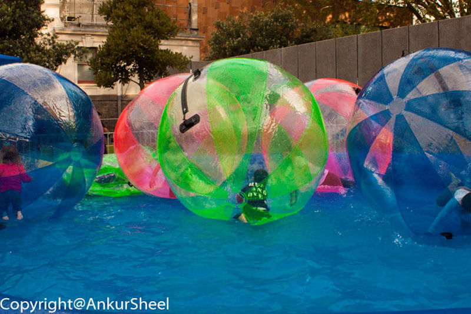
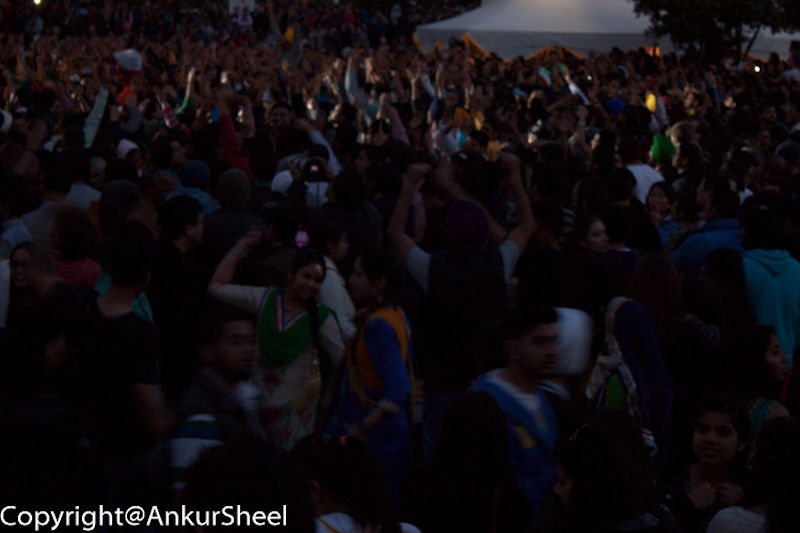
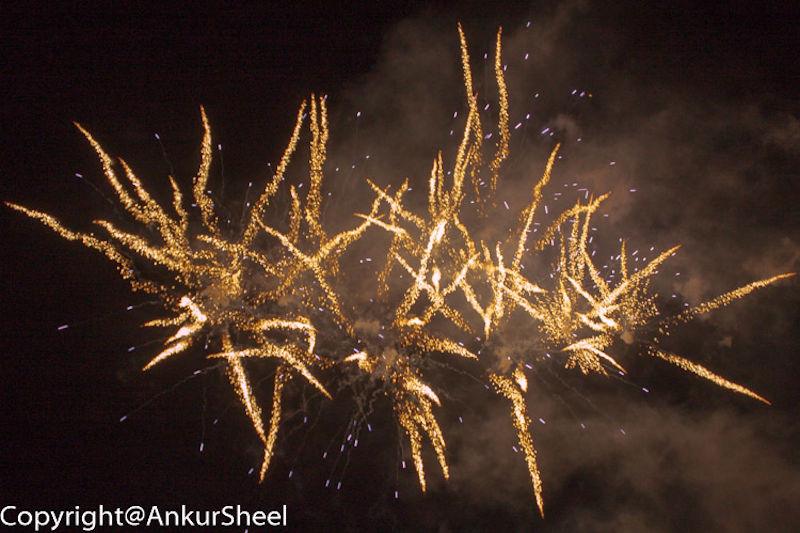
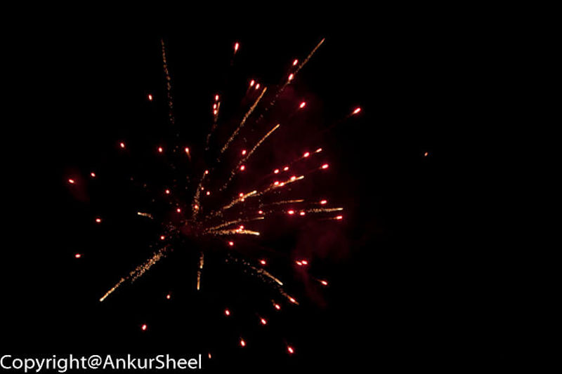
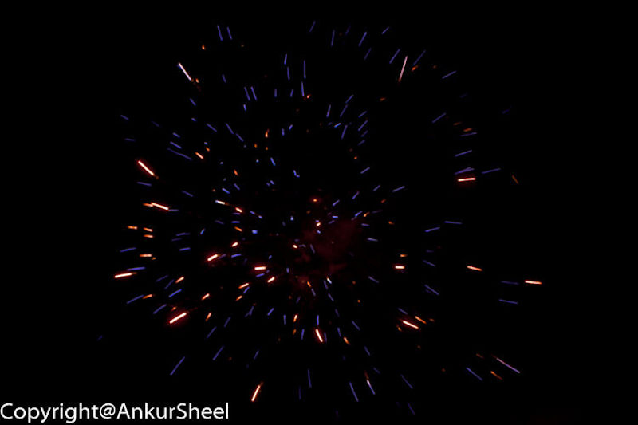

A bit late, but Happy Diwali.

This is a series of photographs taken at the Diwali Festival organised by the Auckland Council.

The activities ranged from various dance performances on the main stage to street performances and street food.

They even had a separate area catering to kids so that the young ones wouldn't get bored. The dancing was not just limited to the performers. You could see people dancing in the crowd to their favourite songs.

Without further adieu, the photographs:

How did you celebrate Diwali this year?
