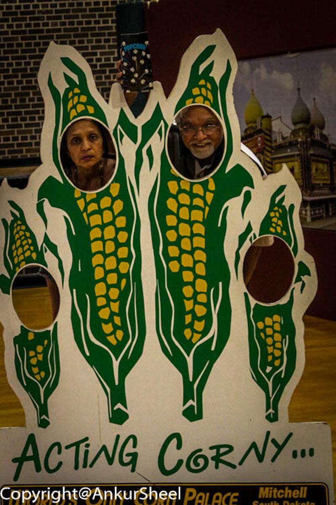
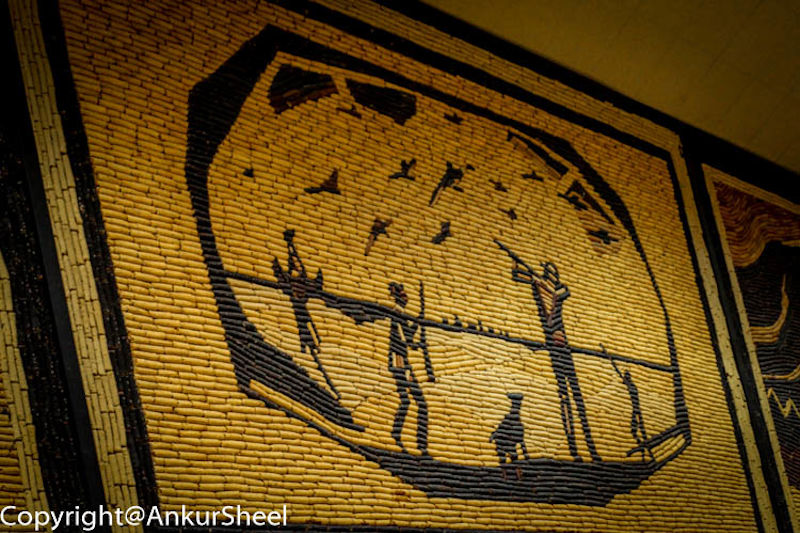
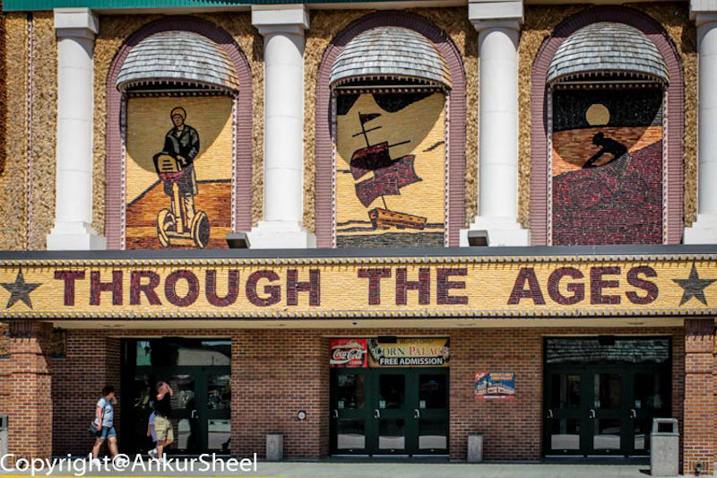
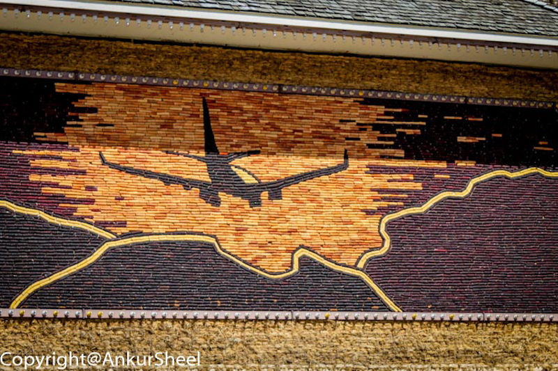

From Niagara Falls, we visited some relatives in Chicago for a few days. Since, I was too busy eating and drinking, I didnt take too many pictures.

However, the next stop is the Corn Palace in Mitchell, South Dakota.

This is exactly as it sounds - The building is decorated with crop art i.e. all the designs covering the building are made from different types of grain.

