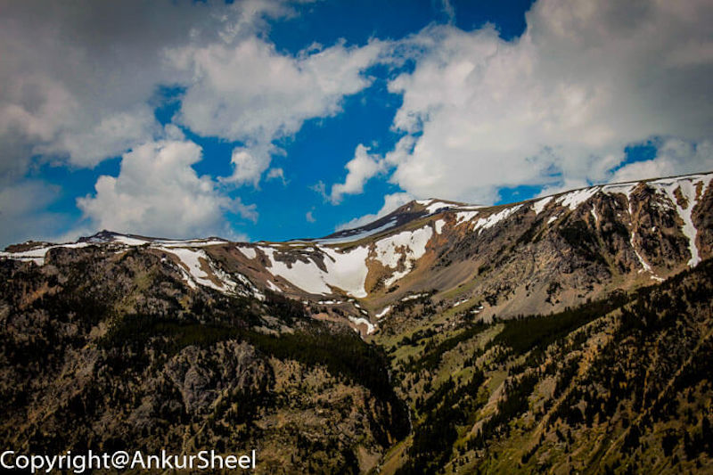
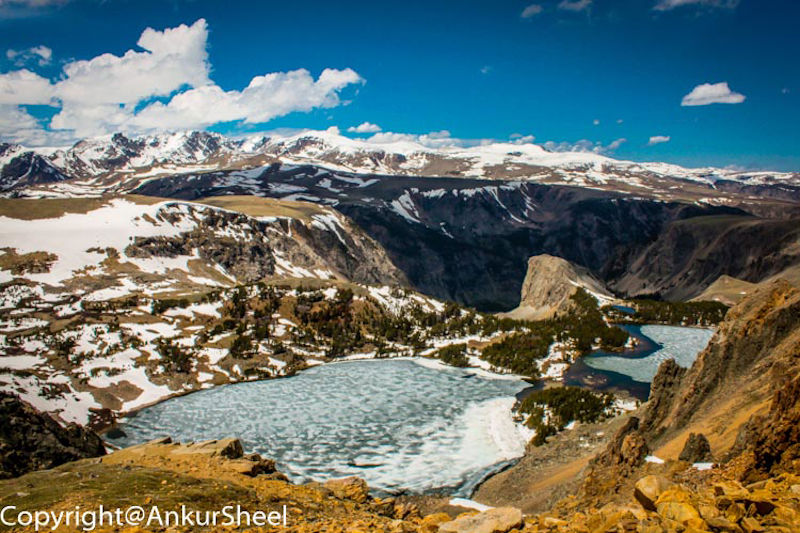
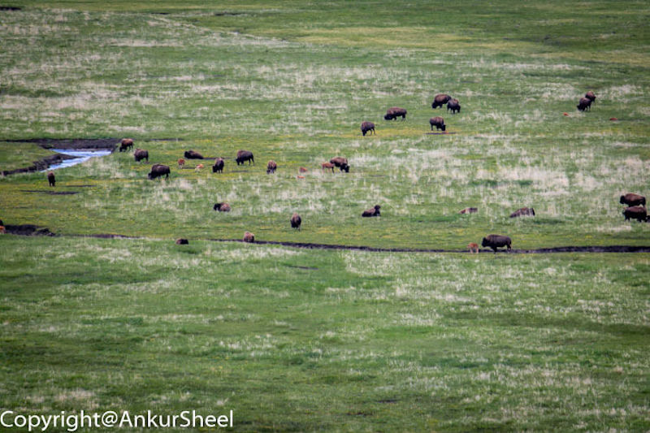
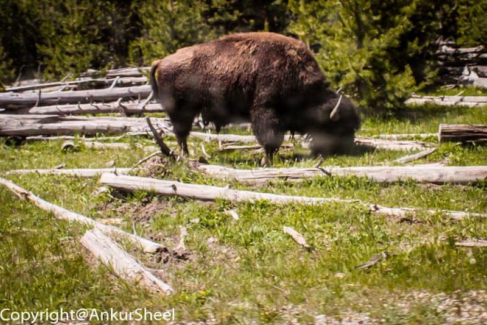
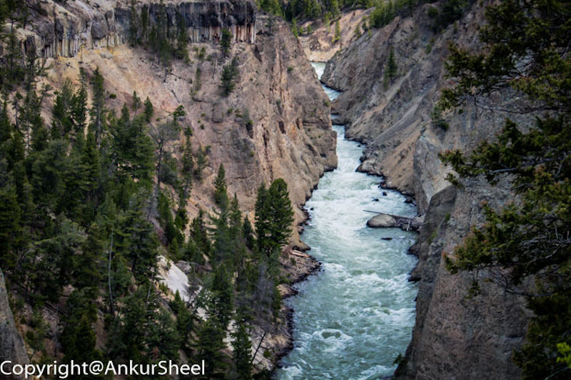
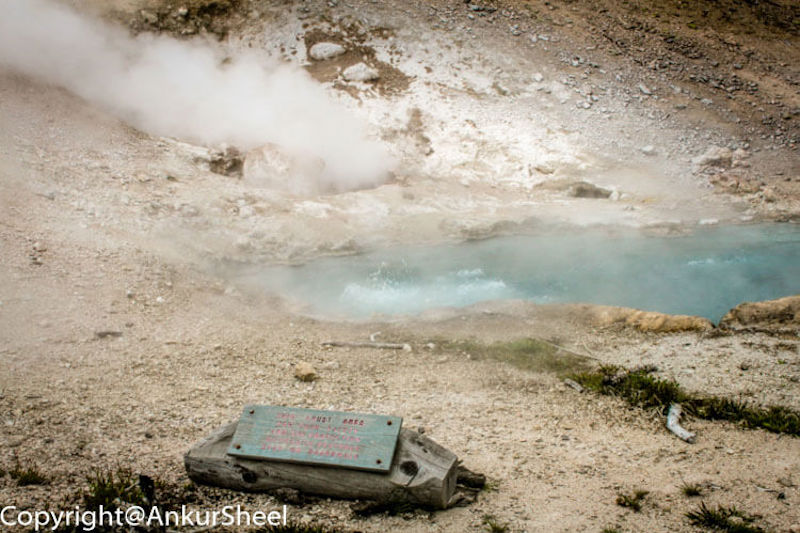
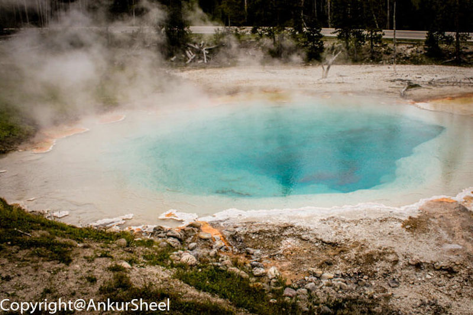
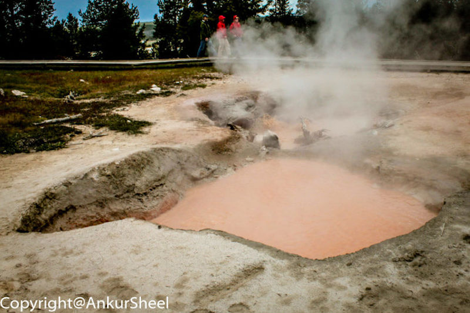
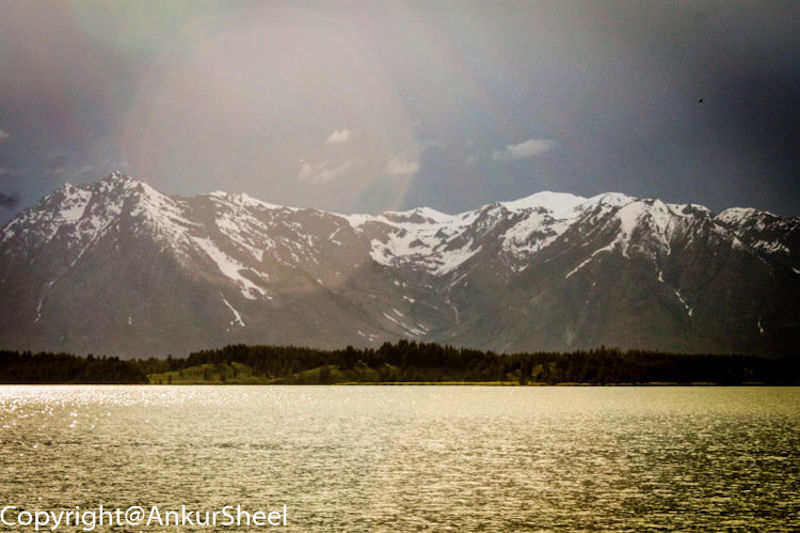
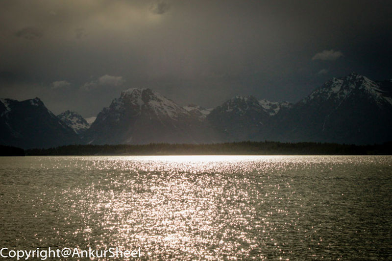

From the Corn Palace, we now move to Yellowstone National Park.

It is known for its wildlife, geothermal features and the Old Faithful Geyser. This is one of those places that I believe should be on your itinerary.

It is a beautiful place, and pictures cannot do justice (even though I have tried). If you are planning a day trip, try to be at Old Faithful just before it is scheduled to erupt.

Even though we were unaware of the timings, we were lucky enough to reach the geyser just a few minutes before the eruption.

