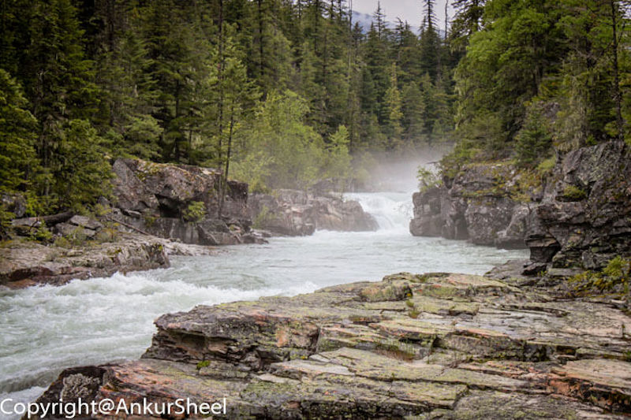
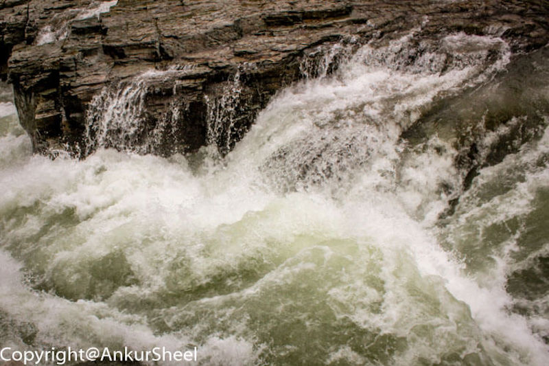
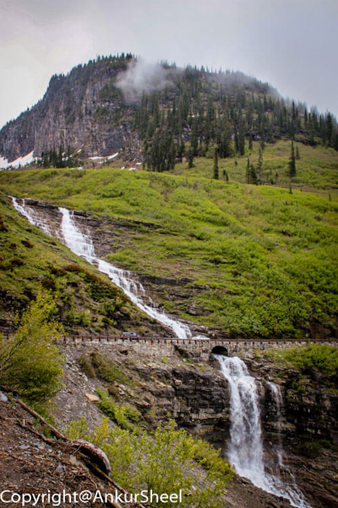
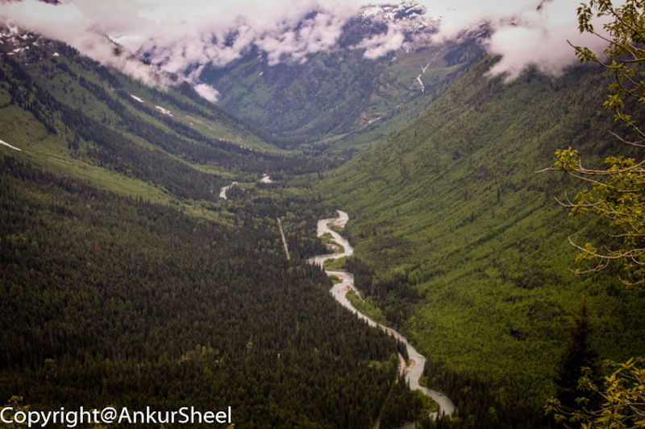
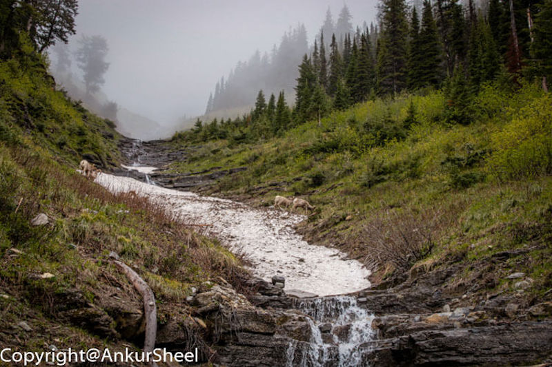
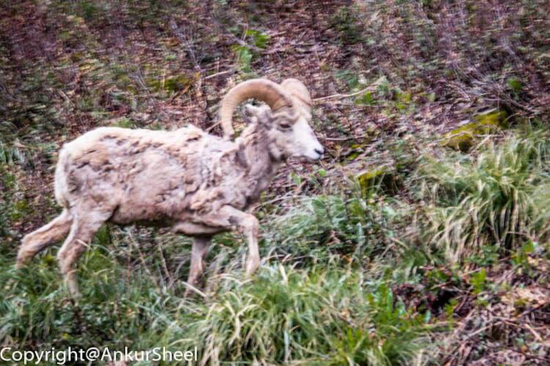
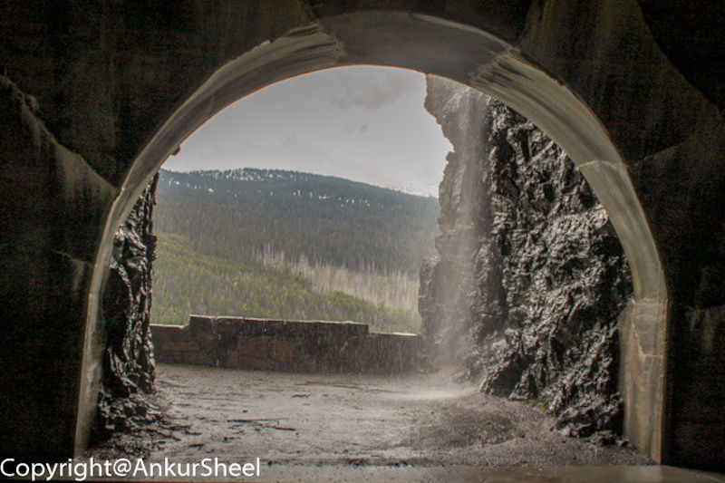
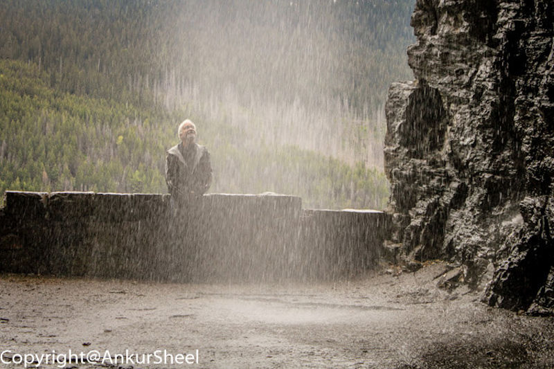
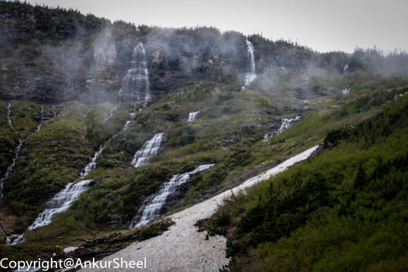

From the Yellowstone National Park, we reach another gem in the USA - The Glacier National Park.

It is known for its original native plant and animal species.

This is another one of those places that I believe should be on your itinerary. It is a beautiful place, and the landscapes are just breathtaking.

