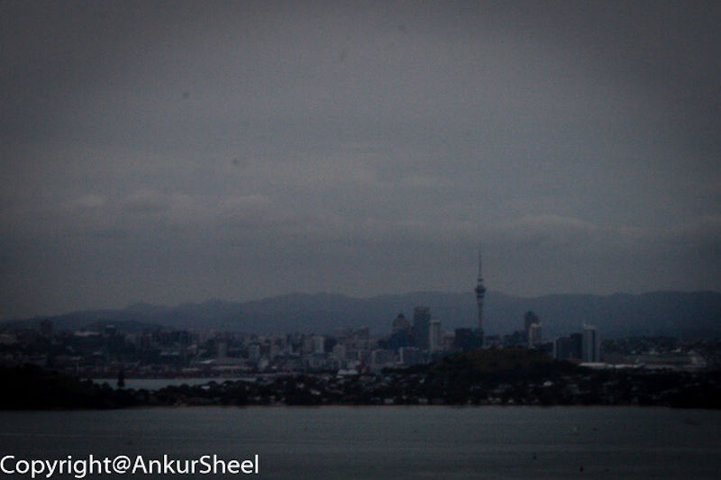
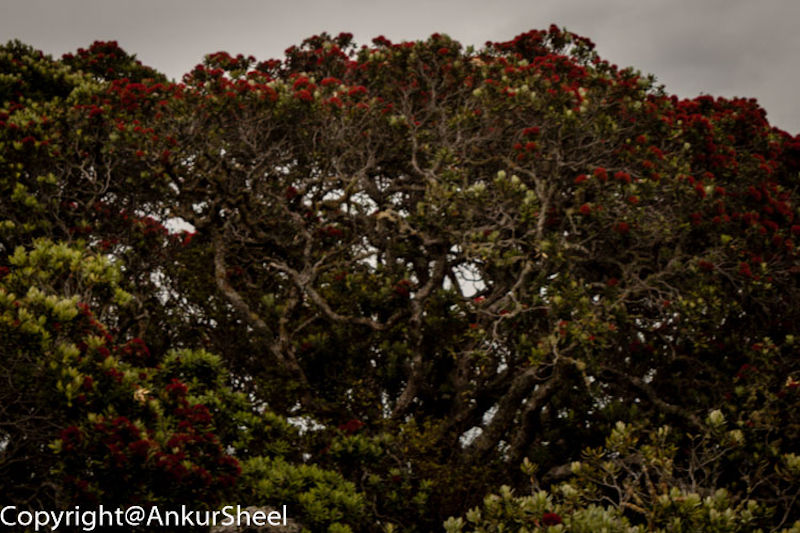
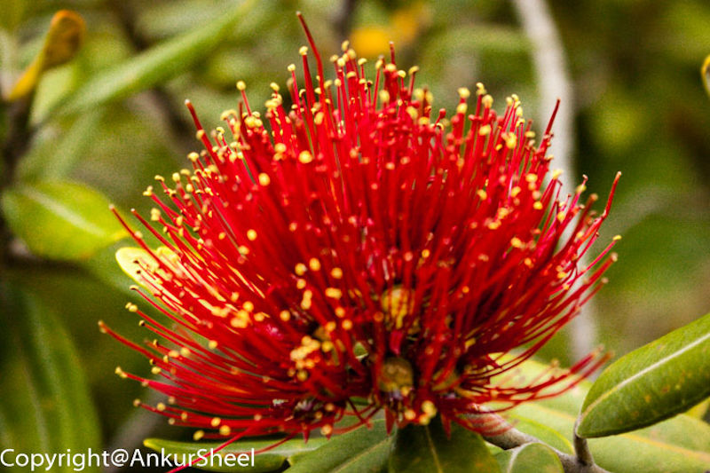
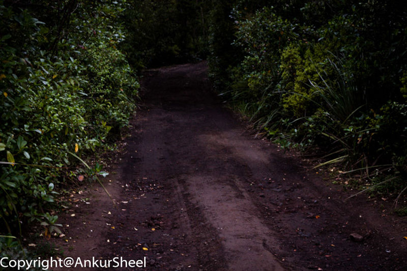
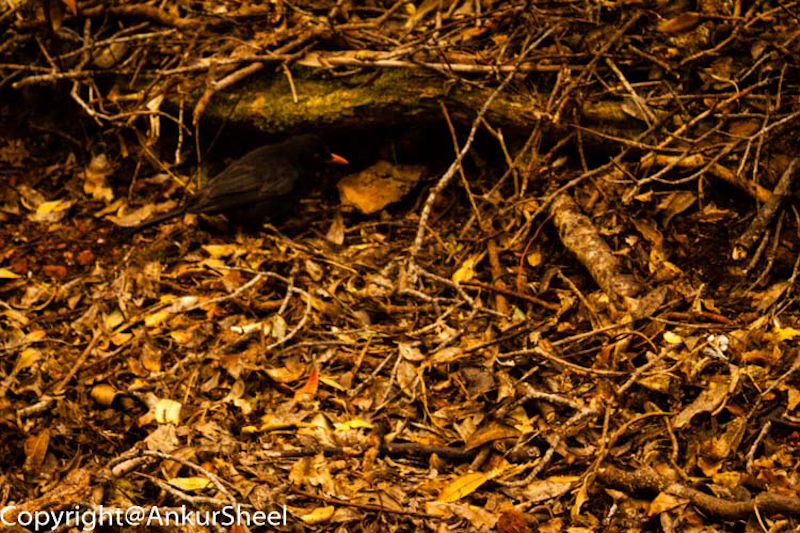
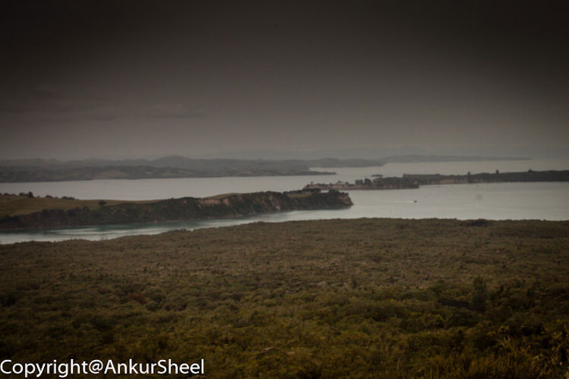
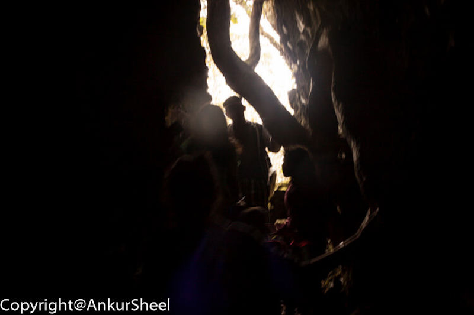
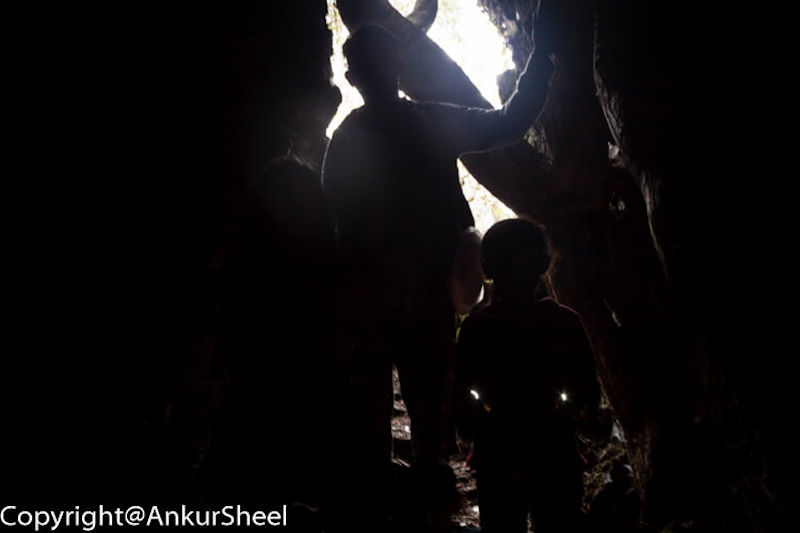
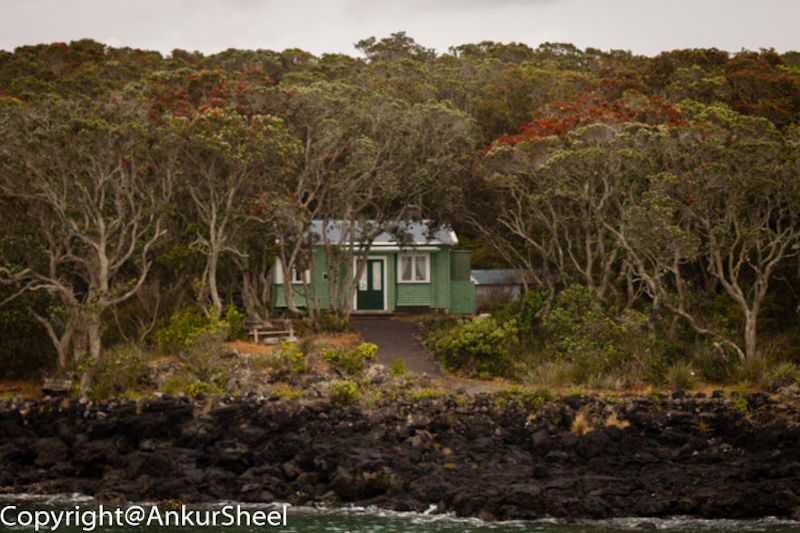

Rangitoto island makes up part of the Auckland Volcanic Field, erupting less than 600 years ago. Its elongated cone shape is an iconic image of the Auckland horizon.

It is a natural landmark that holds many hidden gems, including a walk to the summit. Here you can gain a spectacular 360-degree view of Auckland and the Hauraki Gulf islands.

It is an exciting trip, not just because it's a giant volcano, but also its impressive scenery, many walking trails, and fascinating human history.

## How to get there

Fullers run a regular ferry service from Britomart & Devonport out to Rangitoto with several trips a day. You can get a great map and guide at Fuller's ticket office, which I recommend you grab. A short, scenic ferry ride across the harbour from downtown Auckland brings you directly to Rangitoto.

## What to do at Rangitoto?

Rangitoto is home to NZ largest Pohutukawa forest – there are over 200 species of native plants, including 40 species of ferns.

Once we docked, most people took the most direct trail to the summit, but we decided to take the long way around.

If you are not the walking type, they have a tour you can purchase where they will drive you to the summit trail. Although, I feel this beats the purpose of the trip.

The paths around the island vary a lot. There's the typical standard dirt walking tracks, but you will sometimes have lovely solid wooden walkways or wide rocky roads. Yet, at other times, your path will be steep and barely determinable with piles of rocks that might be difficult to get across. You can quickly go from one extreme to another.

The first part of the hike was pretty easy, with gravel/lava rock roads and reasonably flat. I did wonder how they cleared the road. But, after about an hour and a half, the trails started to get a little steeper, and the grind had begun.

It took us about 2.5 hours to reach the summit, but we did check out the Black Gull colony and the Mckenzie Bay. We did not run into too many people, making us feel like we had the island to ourselves.

There are a few things to look at upon the summit itself – it's the home of an old WW2 observation post, and there are a couple of other ruins around as well if you do the crater loop walk track.

We took in the view at the Summit Lookout, checked out the crater, walked the crater rim track, and snapped a few pictures. After exploring for a while, it was time for a good feed. We sat down and started munching on our lunches.

About 15 minutes from the summit, a track leads to the right, which takes you to the lava caves. Recharged after lunch, we decided it was time to check out the lava caves. These are natural tunnels formed by lava flows.

We pulled out our cell phones to provide us with light and jumped into the lava caves. Some of them got tighter as we progressed deeper and deeper. The lava rocks are uneven and can be sharp in places, so you must tread carefully. You could walk through some of the caves like a tunnel.

It was pretty impressive, and it is something I had never seen before. These are most definitely worth exploring.

Once we were out of the lava caves, we noticed the time.

One thing to note about Rangitoto is that the timings on Fuller's map for the walkways are not to be ignored. I am a fast walker, but if it says 2 hours, it will take 2 hours.

Also, you are not allowed to stay back on the island. This means that you have a limited time on the island and must catch the last ferry back. Unless, of course, you want a private water taxi or a helicopter to bring you back to the mainland.

Since there was only about an hour left for the last ferry, we decided to head back to the wharf. Luckily, the direct trail back didn't take us more than 45 minutes.

## Other things to keep in mind

Today there is no permanent population on the island. In the early 20th century, a small community lived in holiday houses – i.e. cottages scattered along the shoreline. In 1937 they prohibited any more buildings, and it is now considered a public reserve.

As a result, there are no shops on the island, so make sure you take plenty of water and food, sun-block, a hat and comfortable walking shoes. You might also want to carry some kind of a jacket as it can get chilly towards the evening.

## Conclusion

We were fortunate that we had an overcast day with a drizzle. I would avoid going on a blazing sunny day when the rocks reflect that heat at you.

Overall it was a great trip with some fantastic sights and walks. We would certainly do it again at some point. There are still many parts of the island we have yet to explore, bays with lighthouses, wrecks, quarries and of course Motutapu to see and do.

To experience the beauty and experience a trip to Rangitoto Island is a must-do for anyone new to Auckland.
