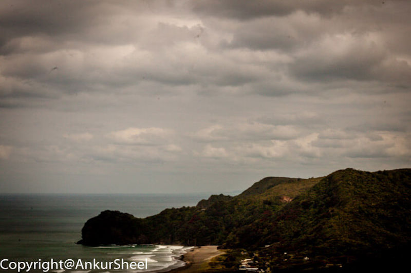
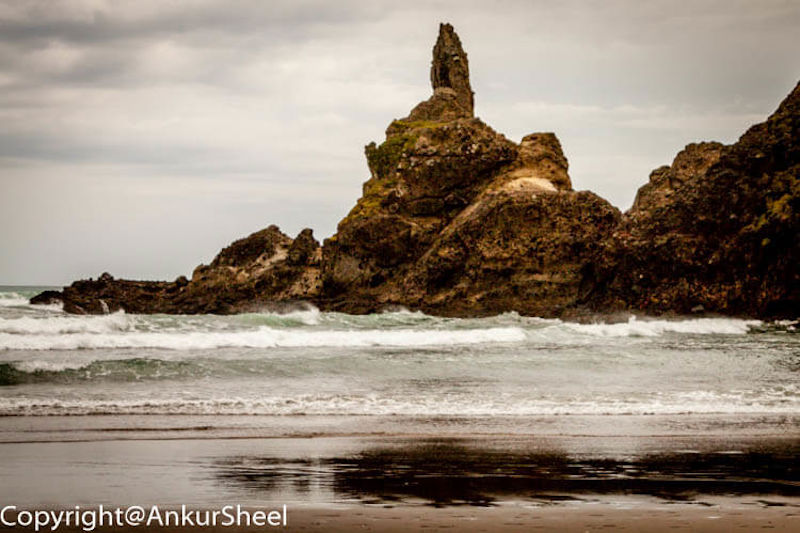
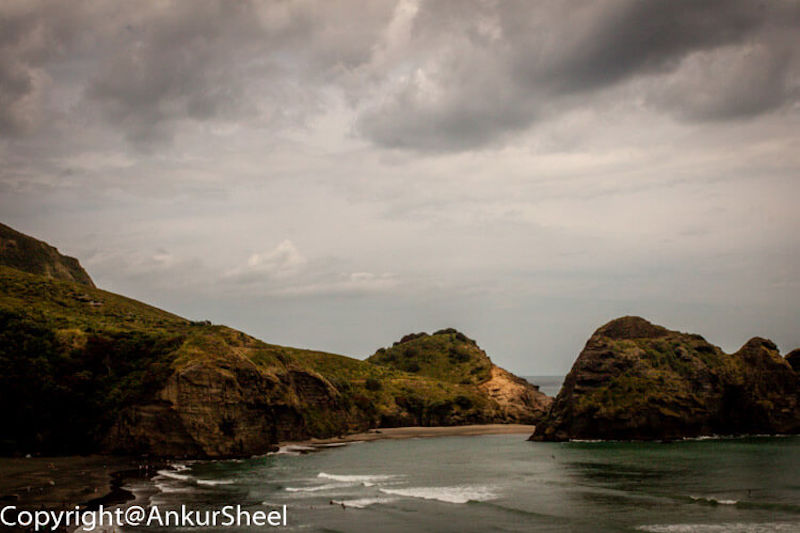
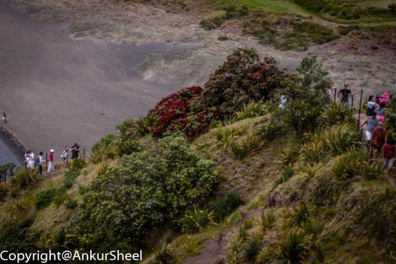
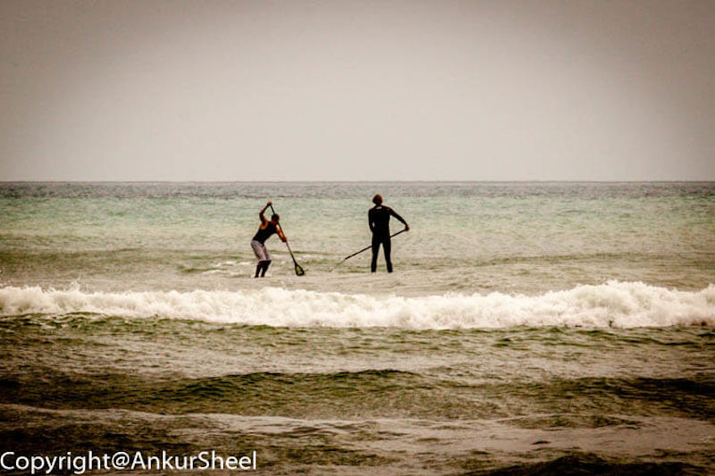

New Zealand is famous for its beaches, and none is more famous on the west coast than Piha. Piha is part of the Waitakere Ranges Regional Park and is a popular spot for swimmers, surfers and sunbathers. Since it came so highly recommended, we had to visit it for ourselves.

After about an hours drive, we arrived at Piha beach. However, even before you reach the beach, you can see the famous Lion Rock from the access road.

Lion Rock is an eroded volcanic neck named for its similarity to a lying male lion when viewed from the shore side is a natural formation dividing North and South Piha Beaches.

However, it's tough to visualise it as a lion till you find the "eye".

Once you reach the beach, you will notice that the sand is black.

After relaxing at the beach and watching the surfers for some time, we decided to climb up Lion Rock. Unfortunately, since the tide was still high, we had to wait for it to come down.

Considering that Lion Rock used to be a lookout point for the Maori, it should be no surprise that Lion Rock is tall and has a fantastic view.

The KiteKite waterfall is supposed to be close to Piha, and we thought we would visit it before leaving Piha. Unfortunately, we were not able to find the path to it. But, if you are interested in visiting it, KiteKite is supposed to be about a 20-minute hike from the parking lot.

After reading this, you might be eagerly waiting to get your feet wet, but before you get your swimwear ready, please remember that the surfs in Piha can be a treacherous and notorious killer. If my warning is not enough, you should catch the Piha Rescue reality series following the action of the Piha Surf Life Saving Club lifeguards.

Let me know how your visit was.
