Red, juicy strawberries are best eaten as soon as they've been picked, and one of the easiest ways you can do this is to get them at your local strawberry picking farm. So our next trip is to Sweet Red Strawberries - Massey Gardens.

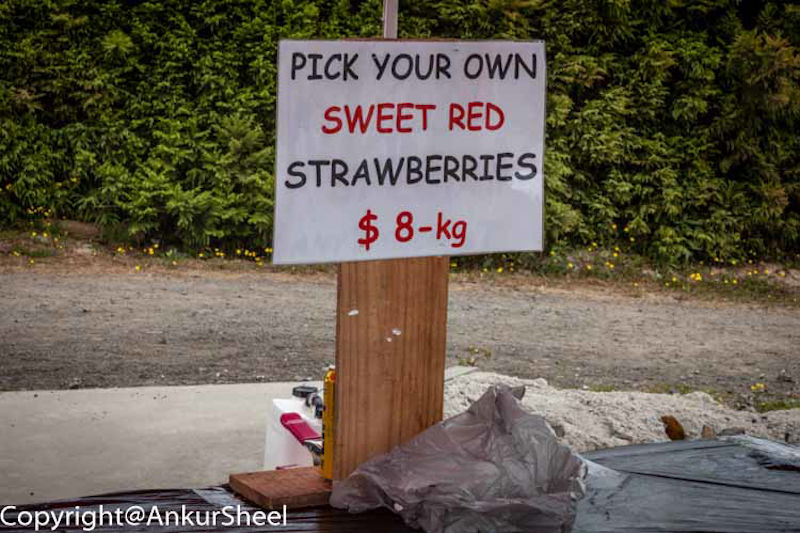

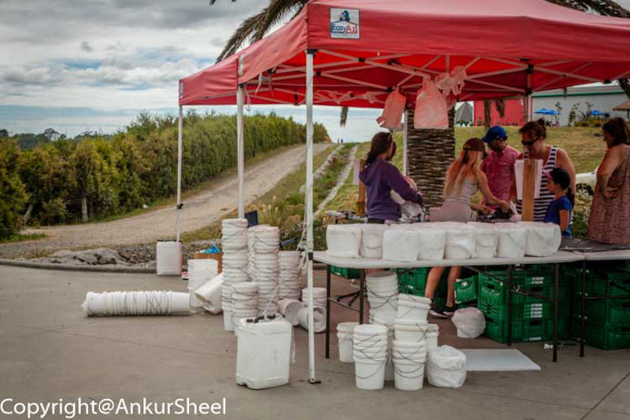

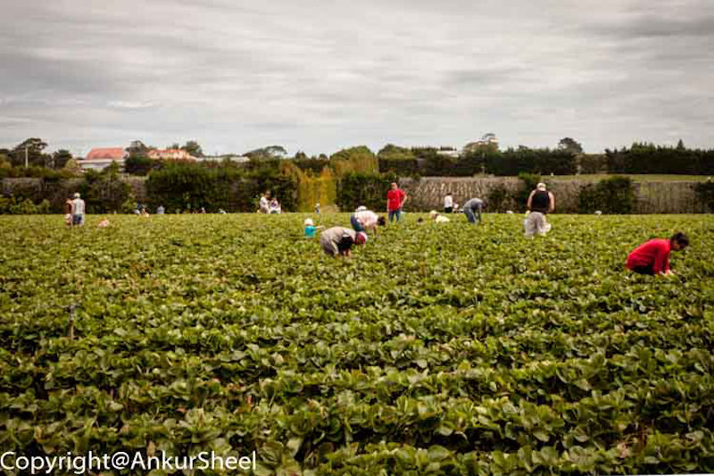

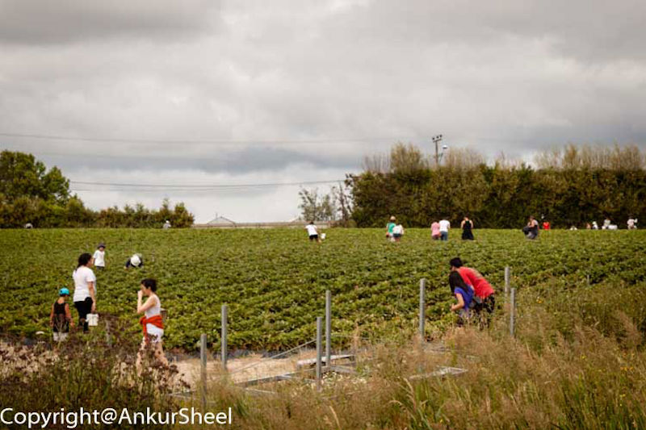

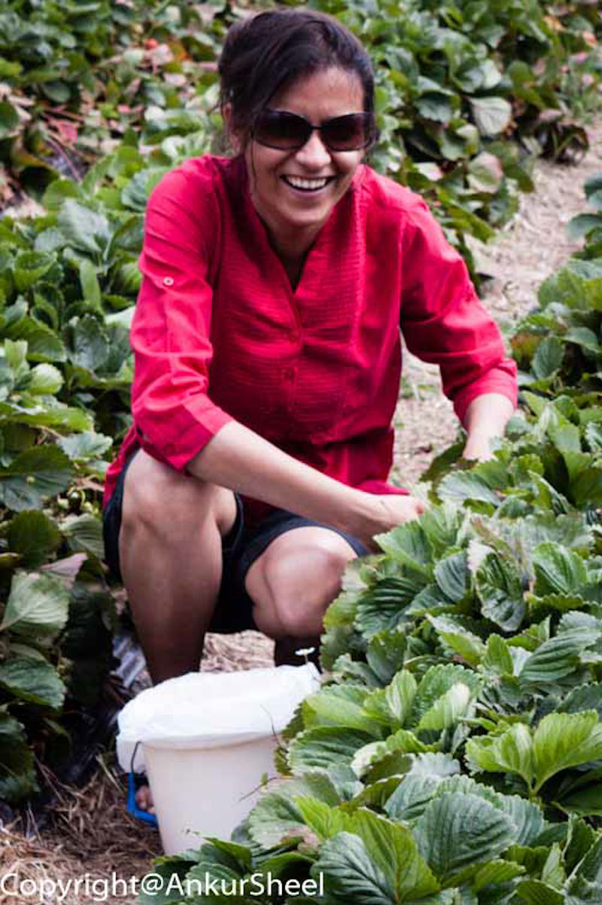

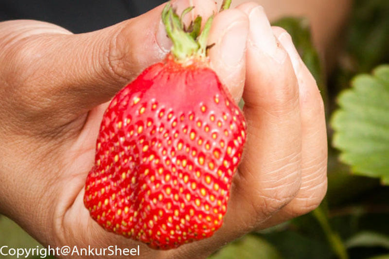

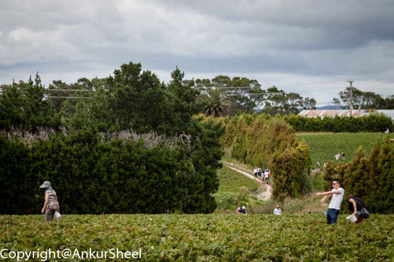

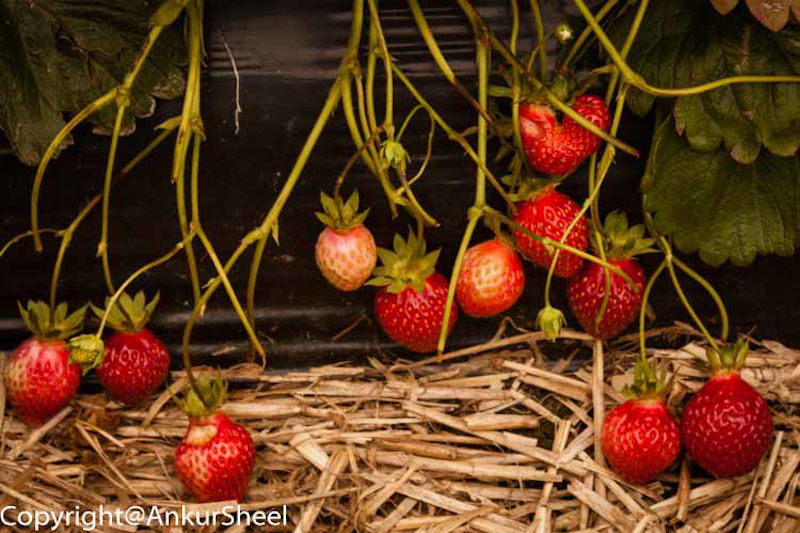

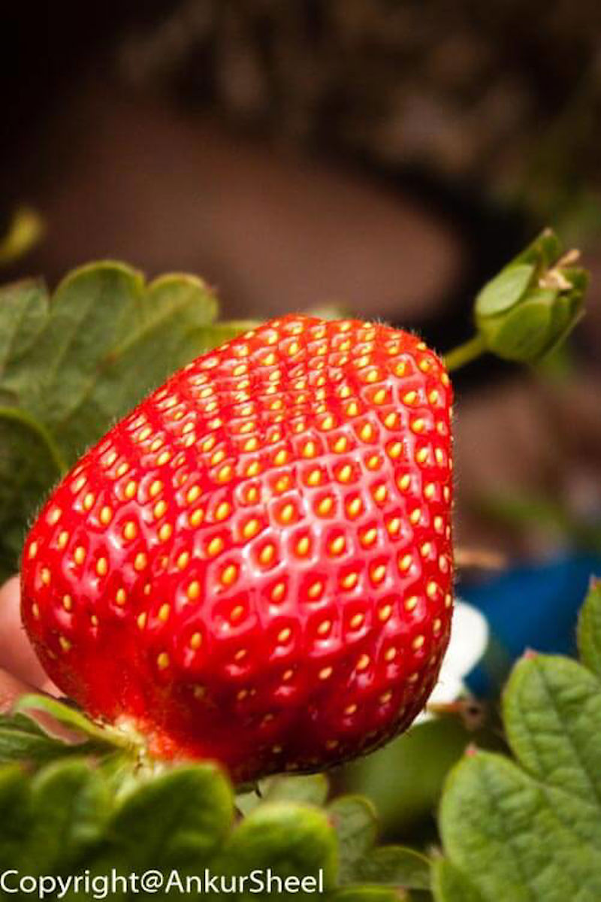

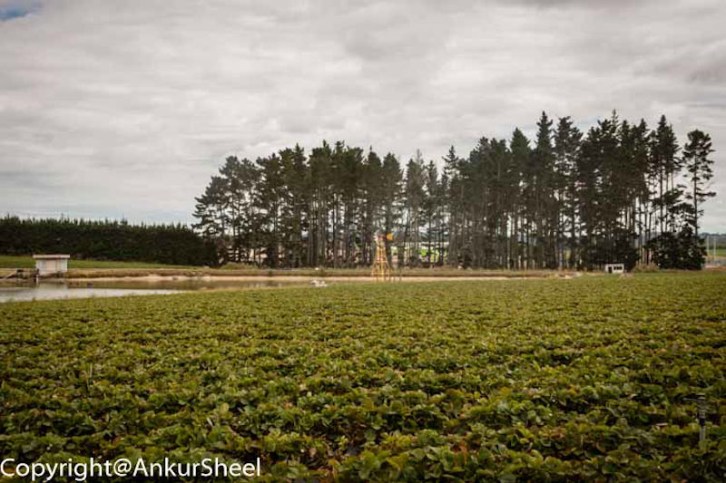

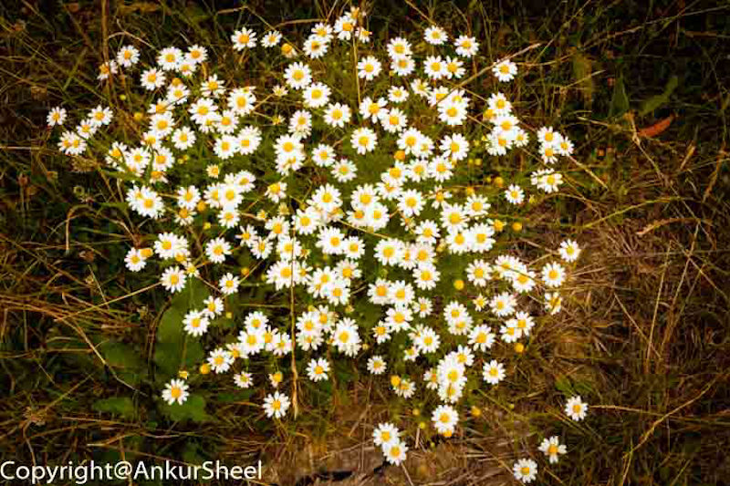

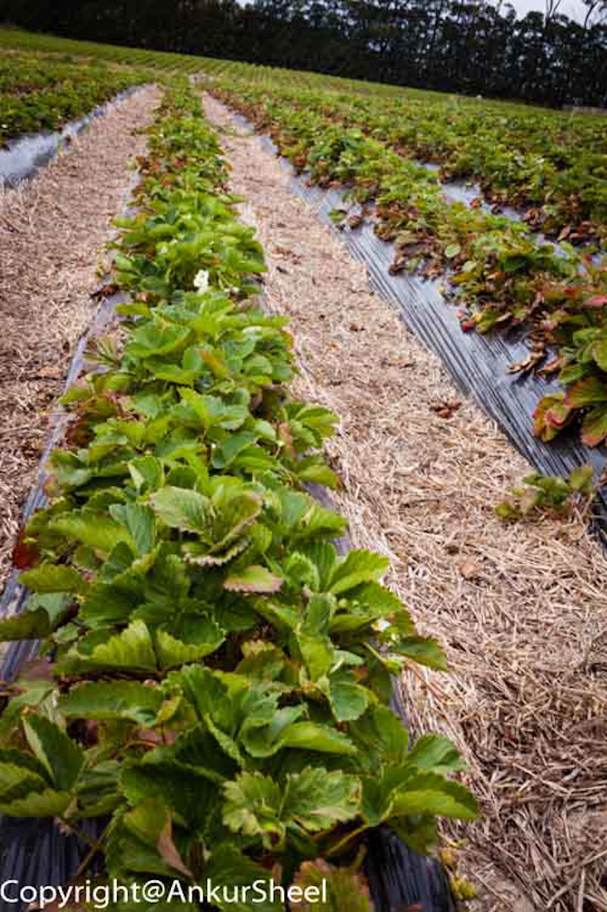

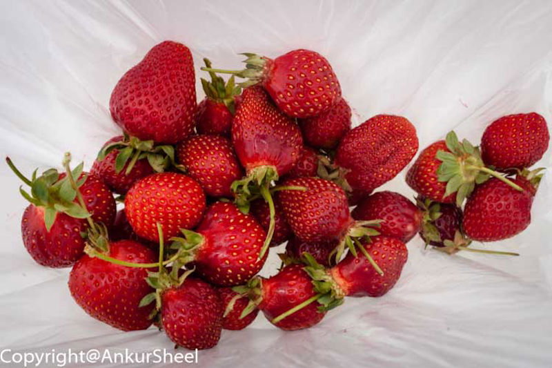

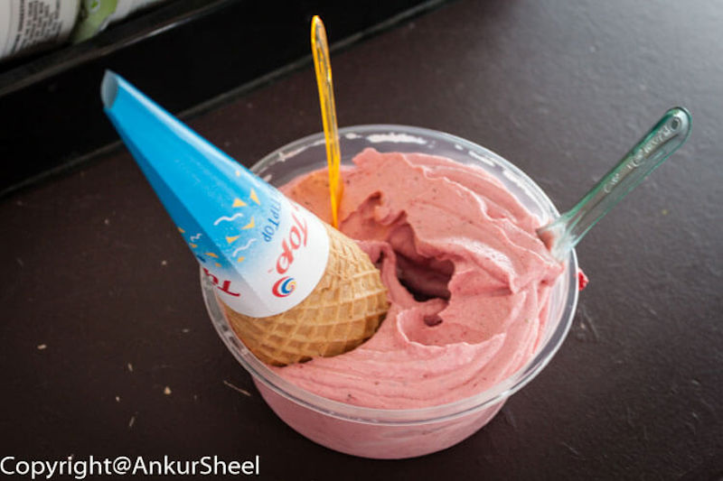

They have lots of wooden tables outside to sit on and lots of outdoor areas to walk around and admire the vast strawberry patch next door while you eat the fresh strawberry ice cream.

Let me know how your trip was.
