For our very next escape, we travel through Northland to the the very tip of New Zealand - the place where the Tasman Sea meets the mighty Pacific Ocean.

Travelling on an empty stomach is hard and the road is long. Luckily, our first stop is at the Matakana Farmers market and we are just in time for breakfast.

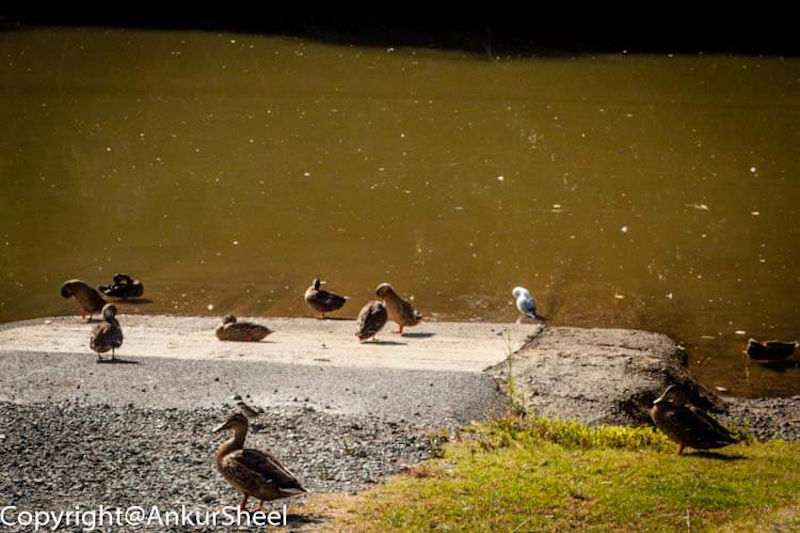

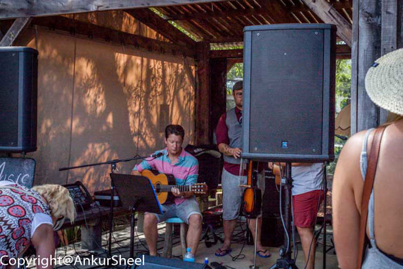

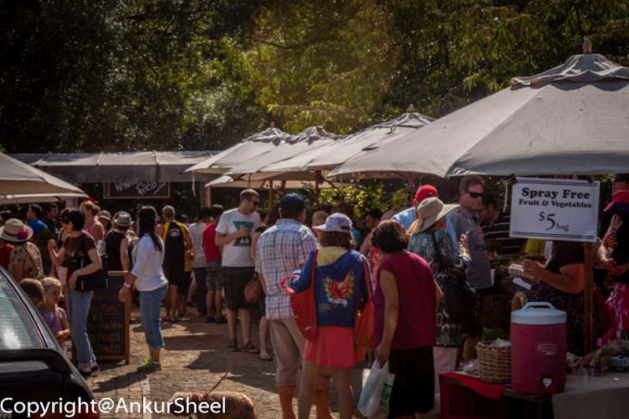

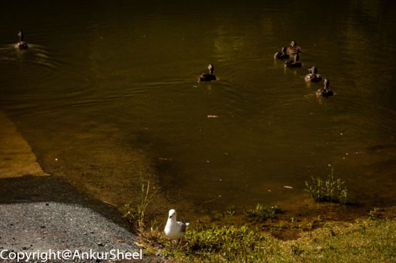

After filling our stomachs temporarily, we start off on our journey again only to reach our next stop at the Whangarei Falls Loop.

Whangarei Falls is a picturesque waterfall, falling vertically for 26.3 metres over basalt cliffs. Its a short walk from the parking lot to the waterfall. There is also a flight of steps to help reach the base of the waterfall safely.

The surprise of finding a picnic table at the base, made it the perfect spot to have lunch.

If you are the adventurous type, you can also take an extremely slippery path to go behind the waterfall. Its not very difficult, considering that my friends 9 year old daughter was able to join us easily.

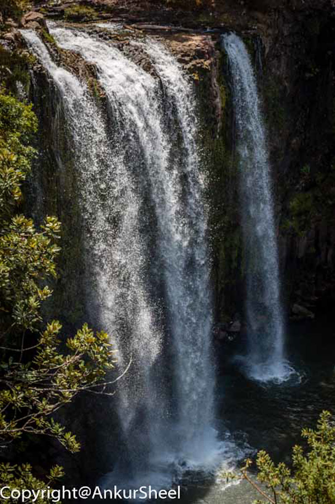

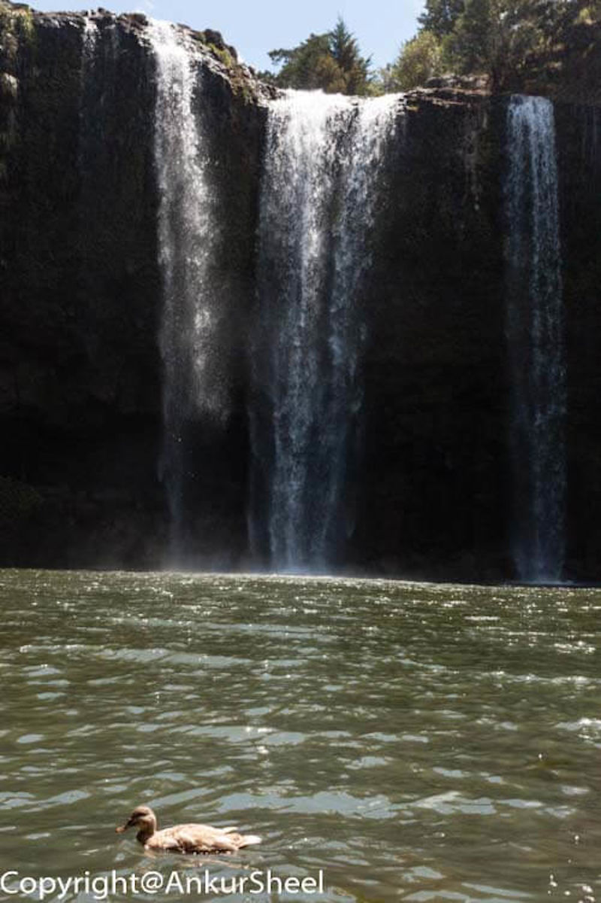

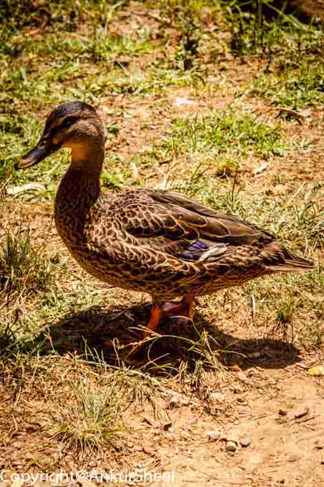

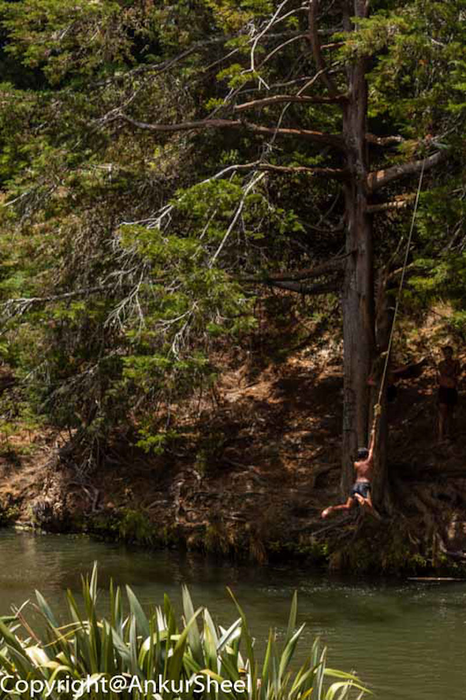

Next we take a quick break at the Cable Bay beach while wait for the rest of our group to catch up.

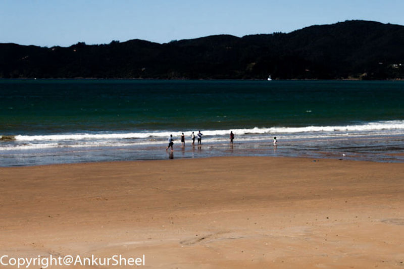

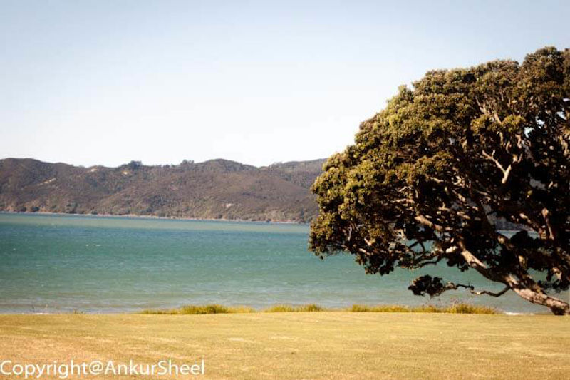

And we are off again to our final destination - Cape Reinga.

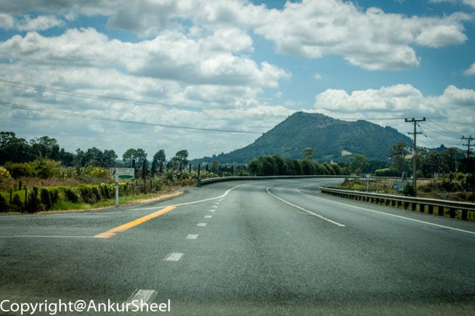

In the next part of the series, we will continue our journey to Cape Reinga and make our way back to Auckland.
