I love almost all forms of travel, be it via air, water or land. Sadly, the combinations have been lacking. However, seaplanes fit the bill perfectly.

Unfortunately, there are very few opportunities to travel in a seaplane. So, when we saw a deal open up on GrabOne for a Seaplane Ride with Auckland Seaplanes, we knew we had to take advantage.

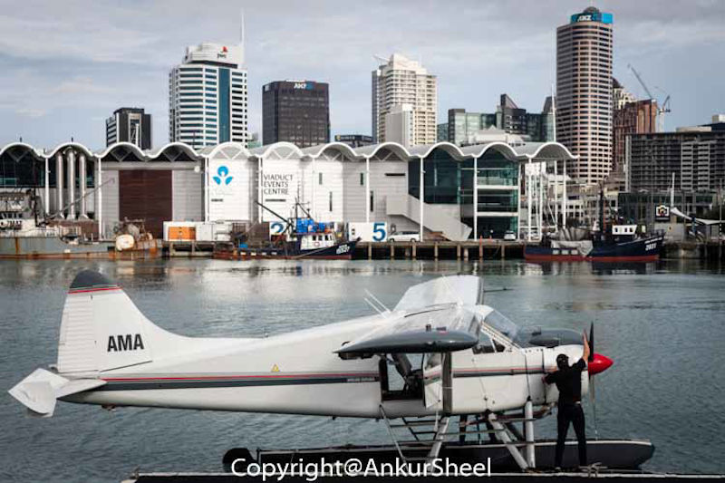

Our original flight was cancelled due to bad weather, but they called and rescheduled for another day. Since the day was overcast, we were worried that it would be cancelled again. But, the weather gods decided to shine upon us (literally), and the sun came out just in time for our trip.

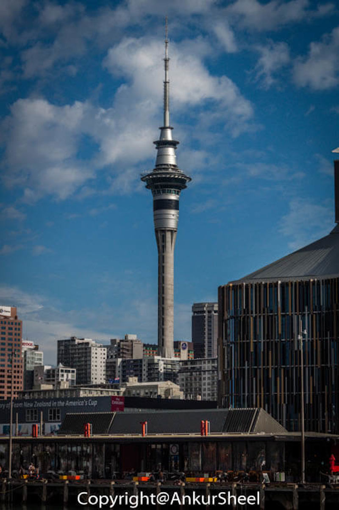

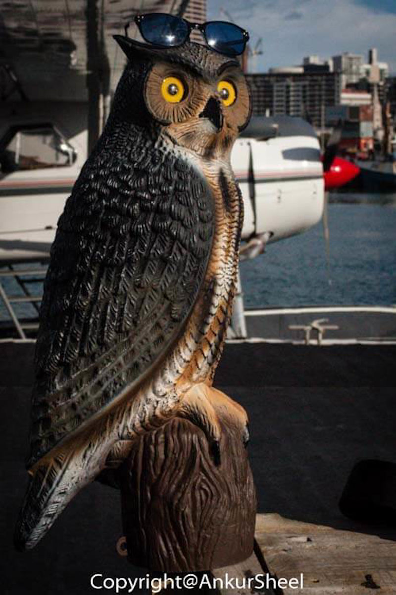

We boarded expecting to experience Auckland from above. Needless to say, we were not disappointed.

The pilot was extremely friendly and continuously gave us titbits of the various islands. Extra icing on the cake was that I got to sit in the front with the pilot while Gunjan got the back seat to herself.

If you are an aeroplane nerd like I am, be quick to choose to sit upfront in the seat next to the pilot. Just keep your hands on the camera and off the flight controls :)

It's a fantastic feeling to take off and land in the water. The views are spectacular. But don't take my word for it, let the pictures do the talking :)

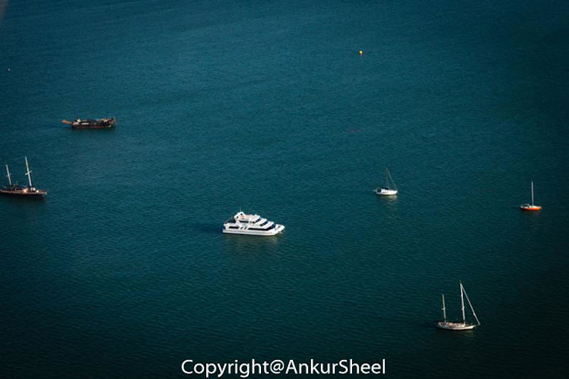

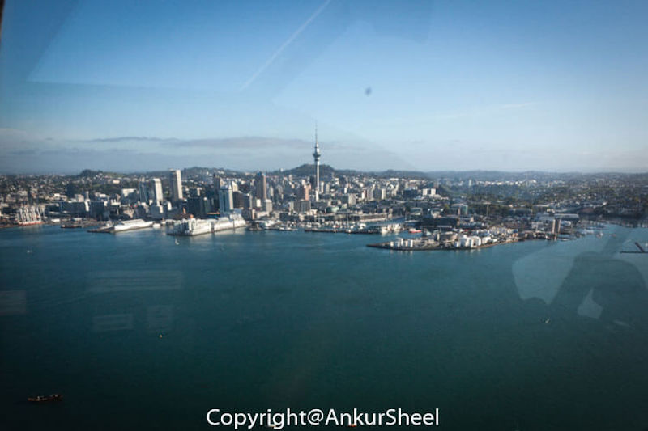

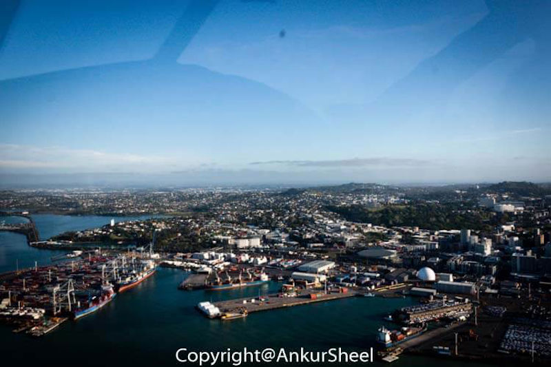

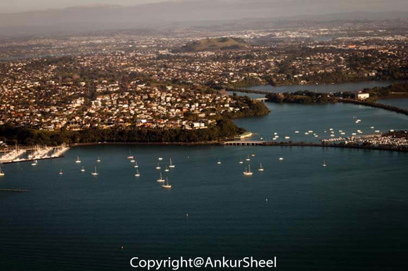

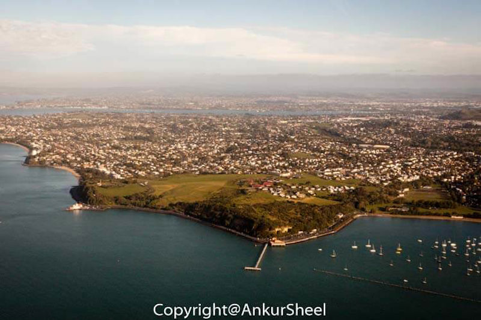

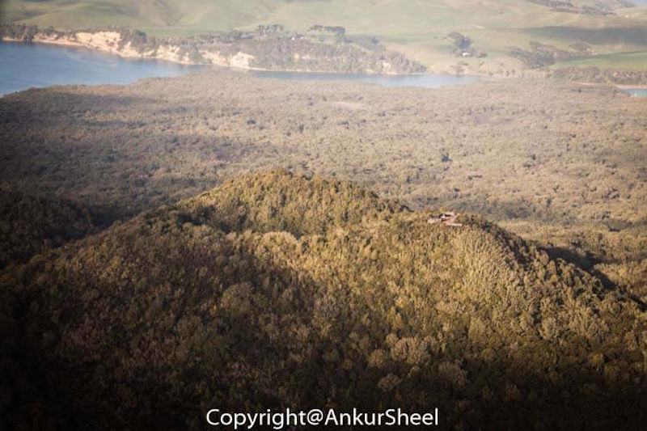

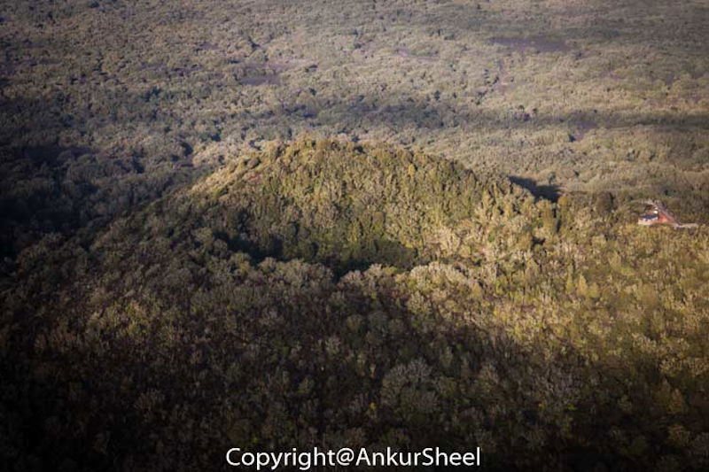

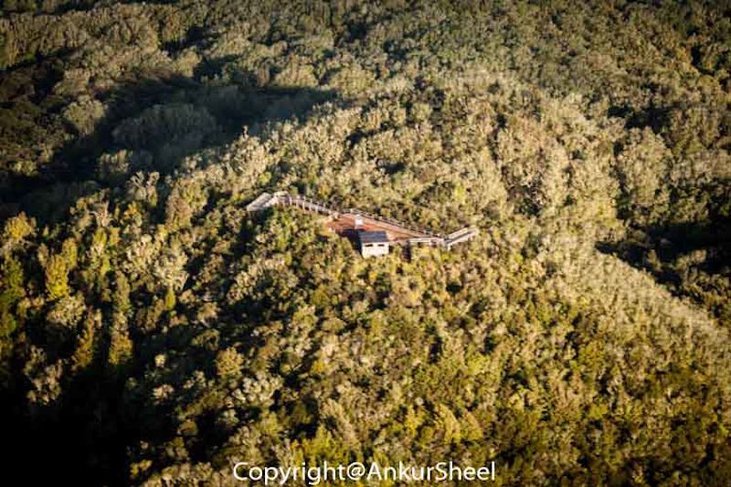

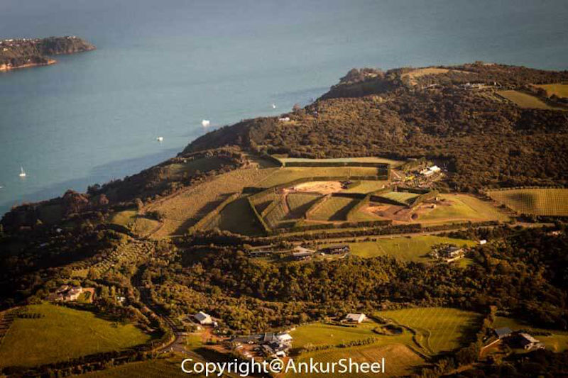

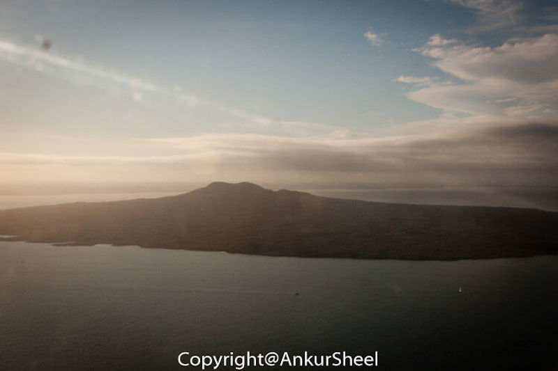

## Conclusion

**Expensive:** _I guess._

**Short:** _Probably._

**Must Do:** _Hell Yes_

> Some experiences simply do not translate, you have to go to know
>
> ""Kobi Yamada""

Another thing crossed off my bucket list.

Have you travelled on a seaplane before? Was it with Auckland Seaplanes? How was your experience? Let me know.
