A highlight for LOTR fans is a tour of the Shire at Hobbiton Movie Set in the countryside of the North Island. This has been one of the places I have wanted to visit ever since we moved to New Zealand.

> I feel that as long as the Shire lies behind, safe and comfortable, I shall find wandering more bearable: I shall know that somewhere there is a firm foothold, even if my feet cannot stand there again
>
> ""J.R.R. Tolkien""

Hobbiton is tucked away at the back of a working farm owned by the Alexander family. The original set was built of temporary materials. It was largely deconstructed at the end of The Lord of the Rings filming.

The set was rebuilt in 2011 for The Hobbit Trilogy - this time in permanent materials, complete with Hobbit holes, gardens, bridge, and mill. It is now operated by the Alexander family in partnership with Sir Peter Jackson.

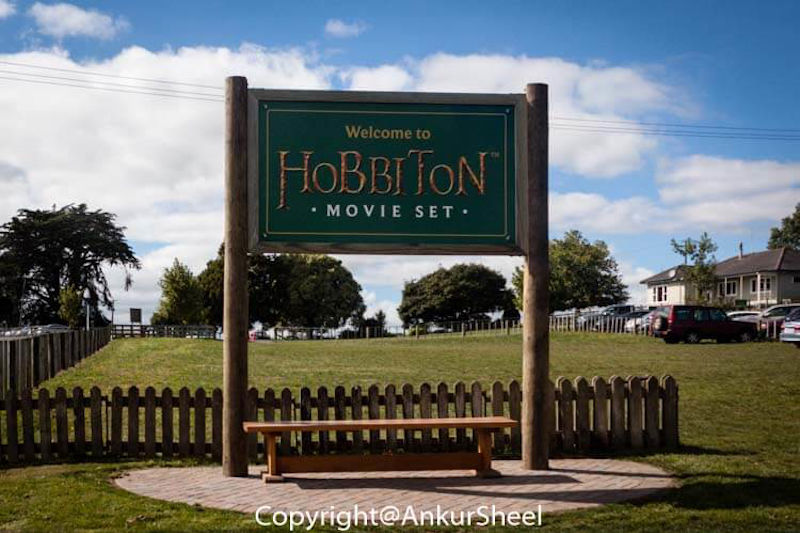

They have a tour running every 30 minutes, but it's better to prebook your tickets. We got stuck in a bit of traffic and missed our slot. However, the staff was understanding and booked us in the next available slot, which was after a wait of more than 1 hour.

A small bus ride later, and we were at the site. Once off the bus, the cameras went into overdrive. Our guide was approachable and knowledgeable about all things Hobbiton. Although he had a schedule to keep, he gave us plenty of time to explore and take photos. However, it was challenging to get pictures without people in it(even though each tour group is about 20 people) because there is always another group just ahead of you.

One or two hobbit holes had functional doors, but most were just façades as all the interior filming was done in a studio in Wellington. If you wondered why Frodo looked like a hobbit while Gandalf looked like a giant in the Shire, wonder no more. The magic was in the different sizes of the hobbit holes - designed to make you like a giant or a hobbit :)

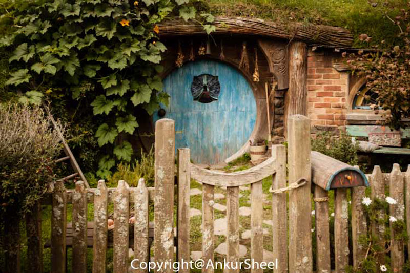

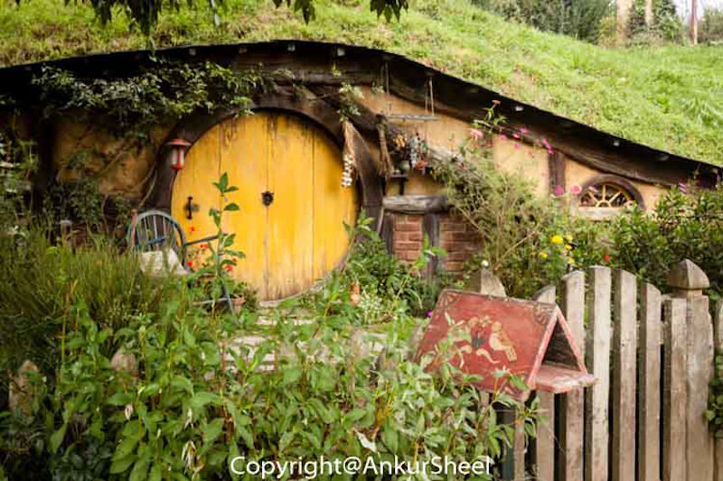

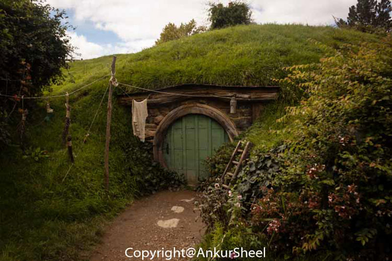

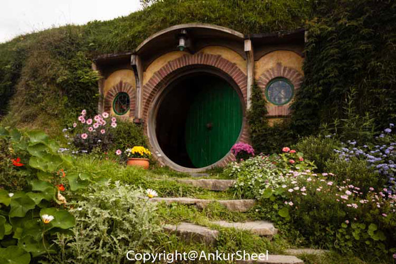

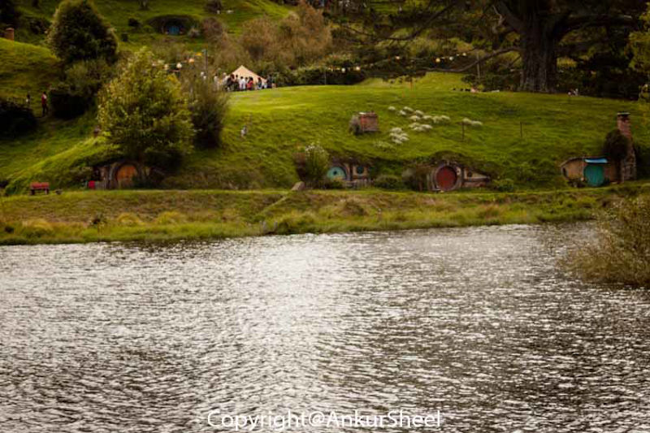

The attention to detail in the landscape and the sets were truly amazing.

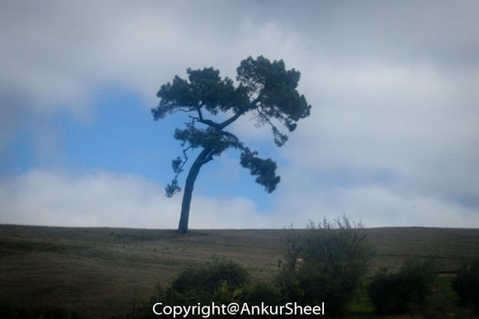

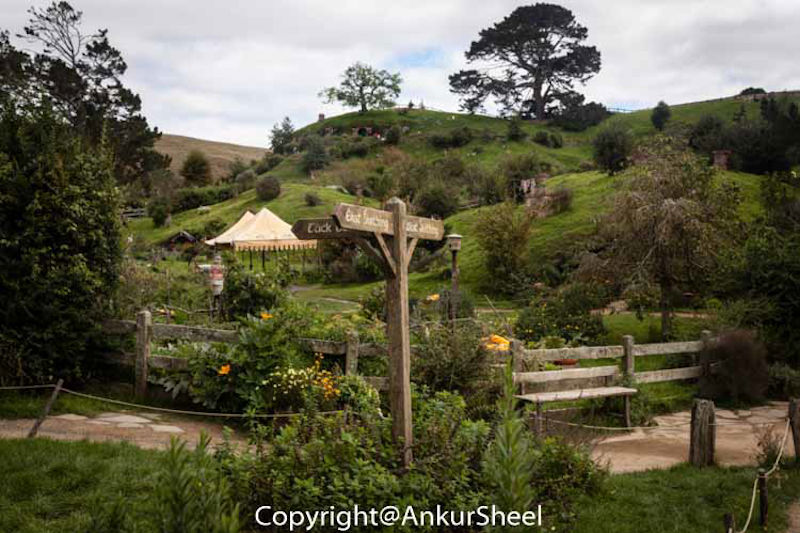

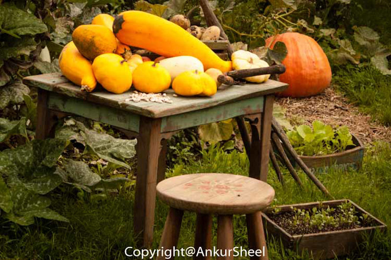

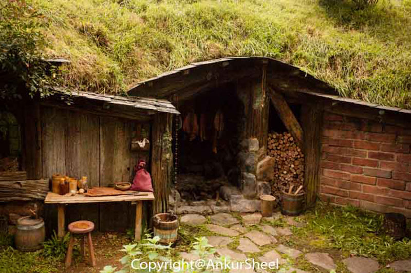

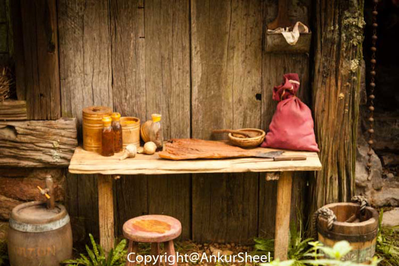

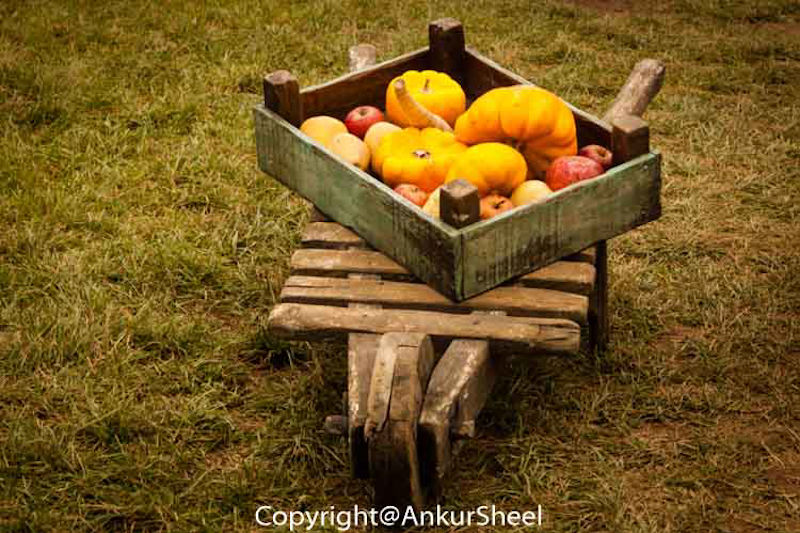

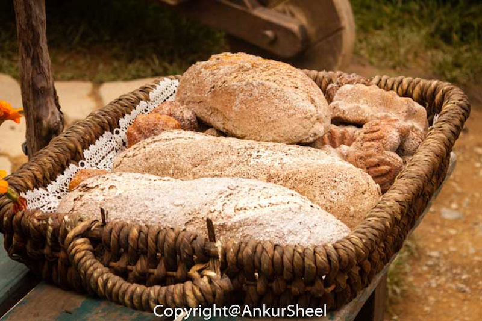

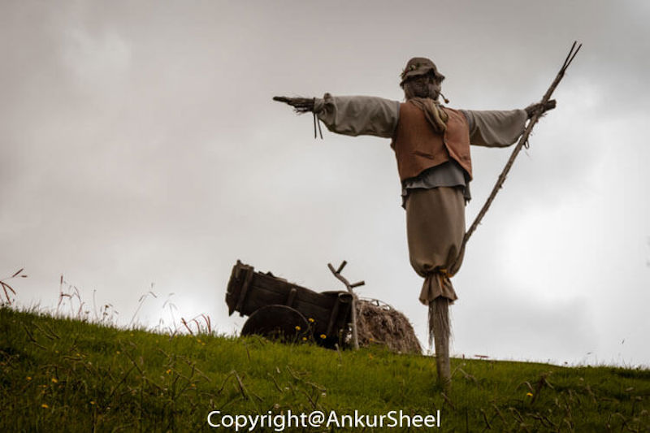

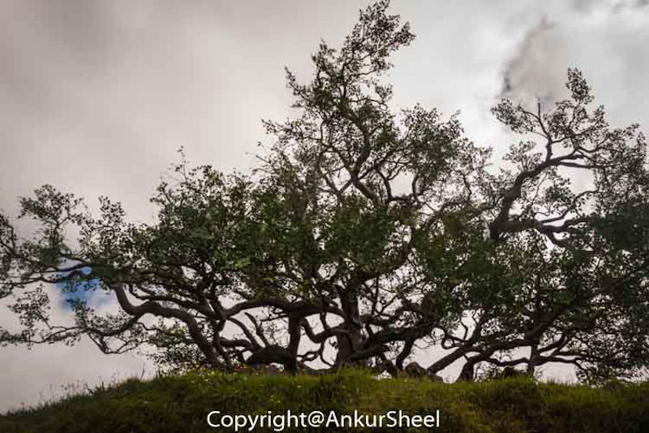

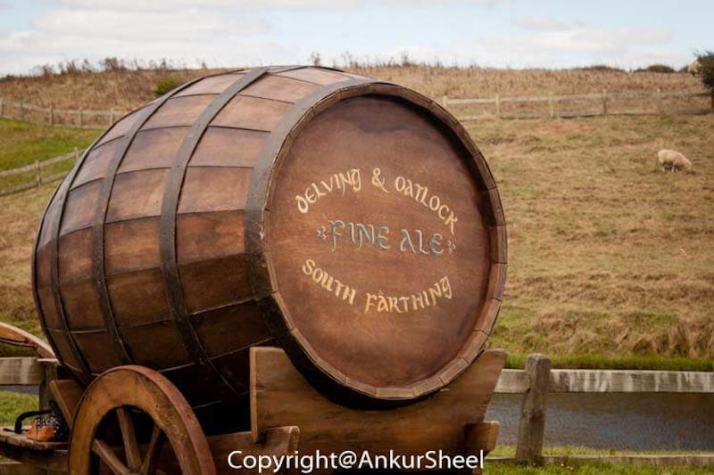

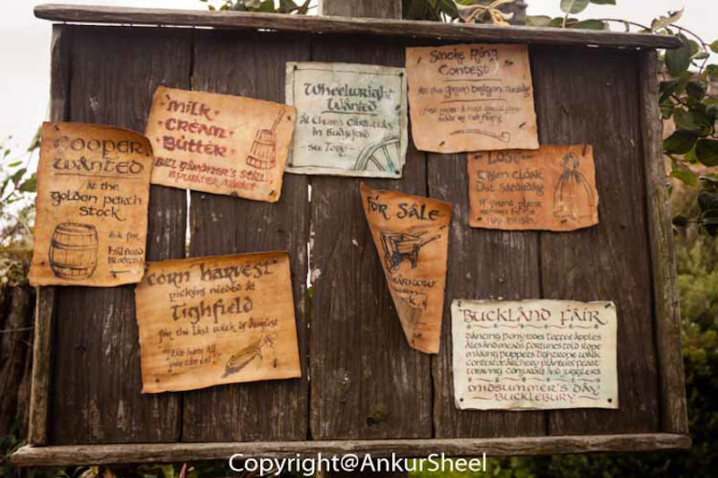

The tour's highlight for me was the Green Dragon Inn, where you got a free pint of ale or ginger beer, depending on your preference.

**The Hobbiton tour is not cheap but is the experience worth the money?**

If you are a big fan of the books or the movies, it's a no brainer you have to visit. Although, you would probably find the amount of time extremely short.

If you have read the books or seen the movies but have no strong feelings, you could still visit them.

If you don't like the books or the movies or have never heard of them, you should probably give it a miss.

Have you been to Hobbiton? How was your experience? Let me know.
