The Tranzalpine Express (operated by KiwiRail) is perhaps the most scenic train ride in New Zealand and an excellent alternative to driving to see the country. Since we had heard so much about it, Gunjan and I decided to ride the train for the 1st leg of our South Island trip.

Since the train runs daily from Christchurch to Greymouth and Greymouth to Christchurch, we first needed to figure out where to catch the train from. The one-way journey takes 4 and half hours, and the timing of the train makes it such that you can go from Christchurch to Greymouth and come back the same day with about an hour to spend in Greymouth. Several buses connect Greymouth to the Franz Josef Glacier, which makes a one-way trip viable.

Given the timings of the train, we decided to fly down to Christchurch and take the train to Greymouth the following day. We rented a car and drove down to the glacier and Queenstown for our onward journey (and this is what I recommend). But that part of the trip is for another post.

Bright and early on the day, we reached the station, collected our tickets and deposited our bags in the baggage van as no heavy baggage could be taken into the seating van. Apart from the seating carriages, there is an open-air viewing platform and a cafe-bar carriage.

Guess where I spent most of my time?

If you decide to spend your time in the comfort of the closed carriages, you can listen to the commentary (at various intervals) about the scene around on the provided headsets.

Anyway, enough of the dry details, it's time to see the pretty pictures.

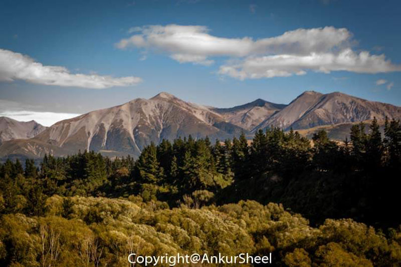

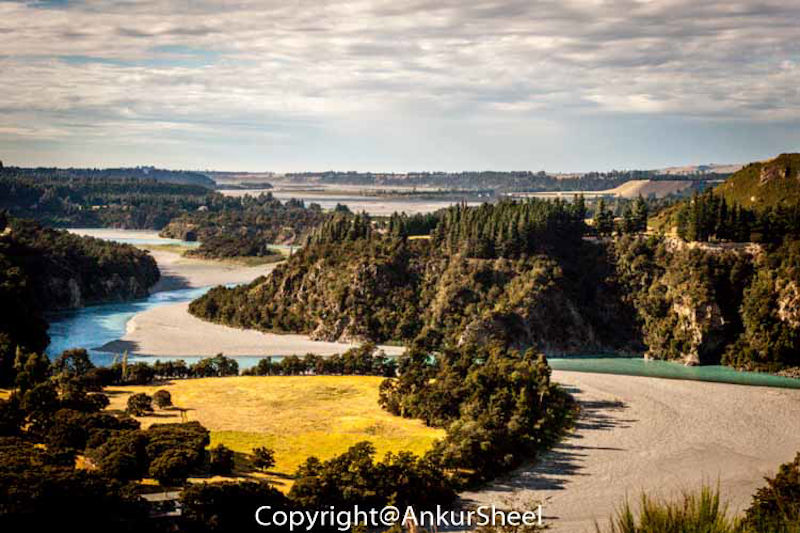

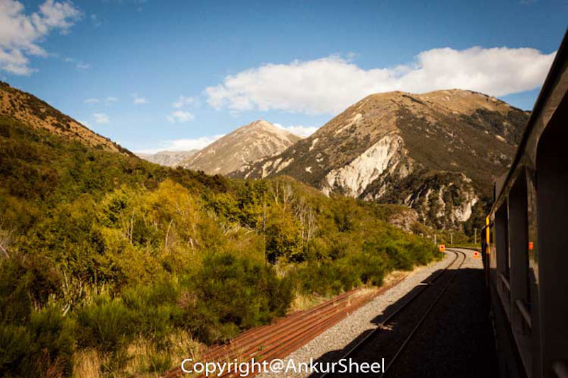

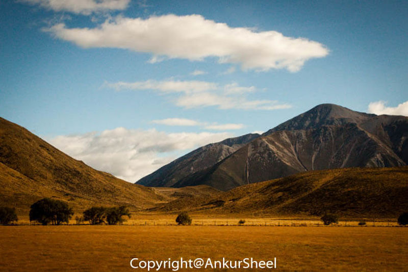

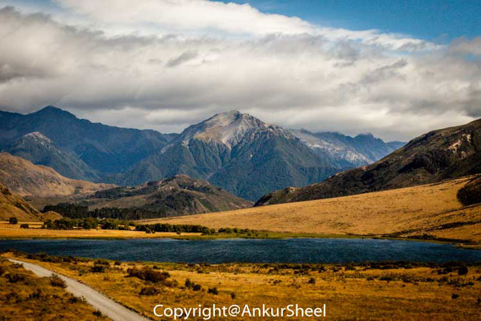

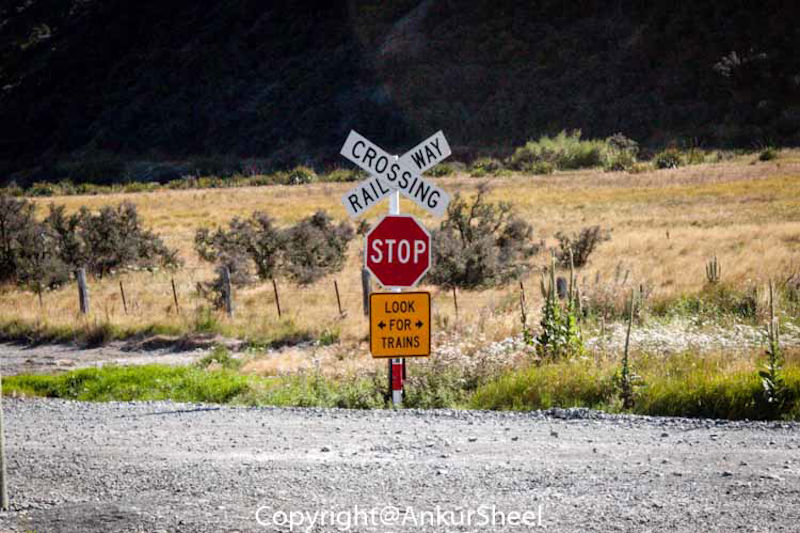

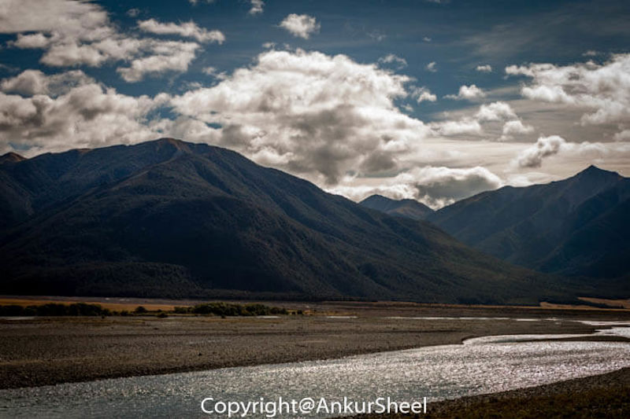

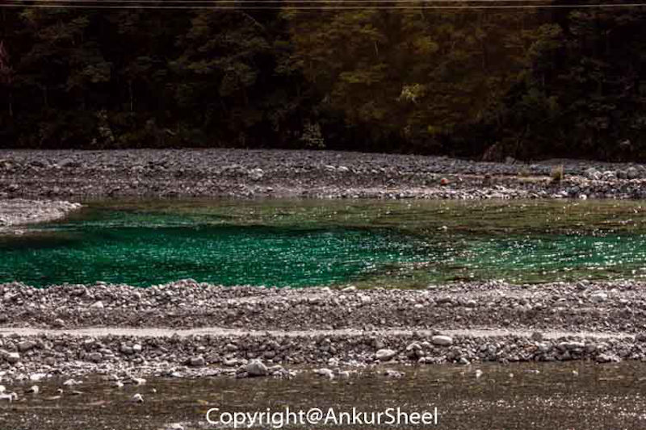

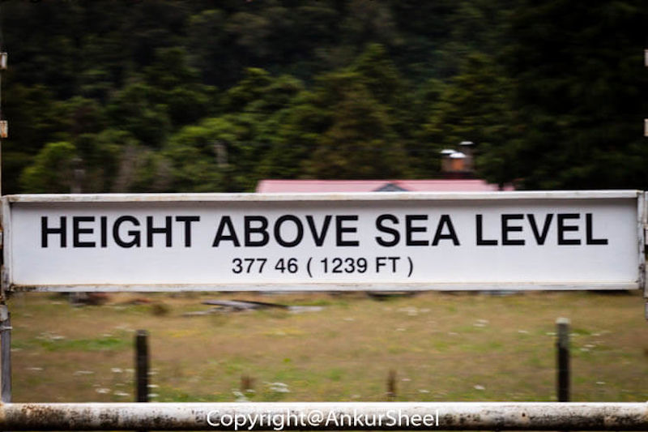

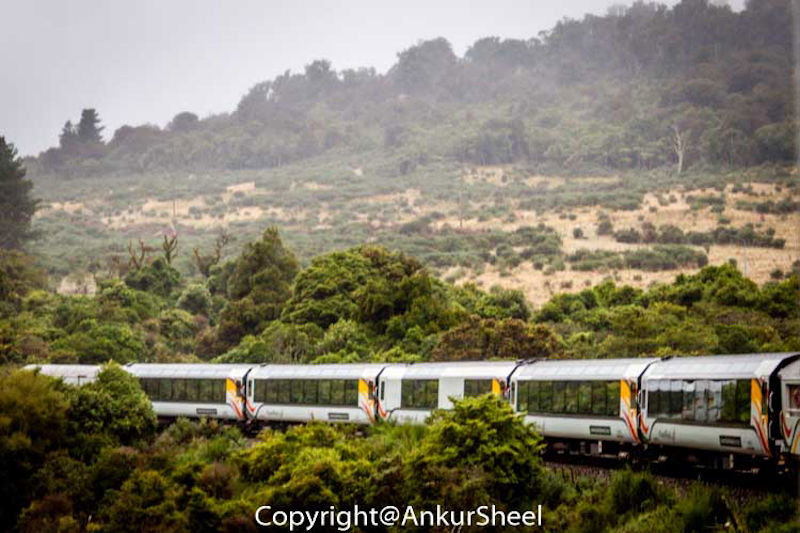

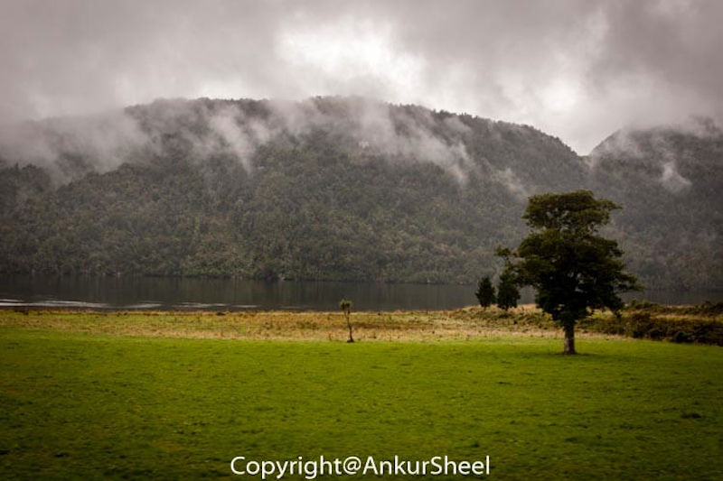

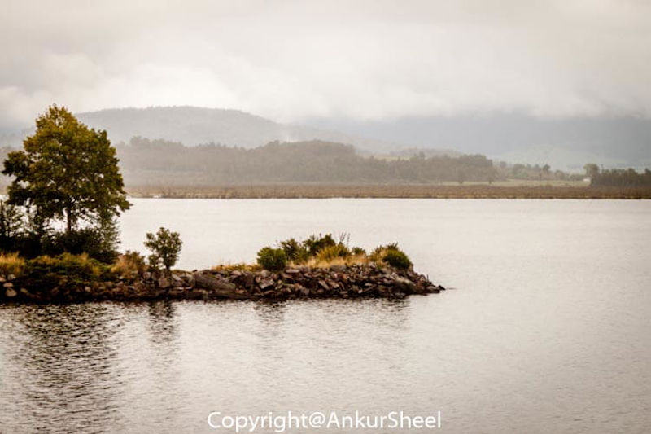

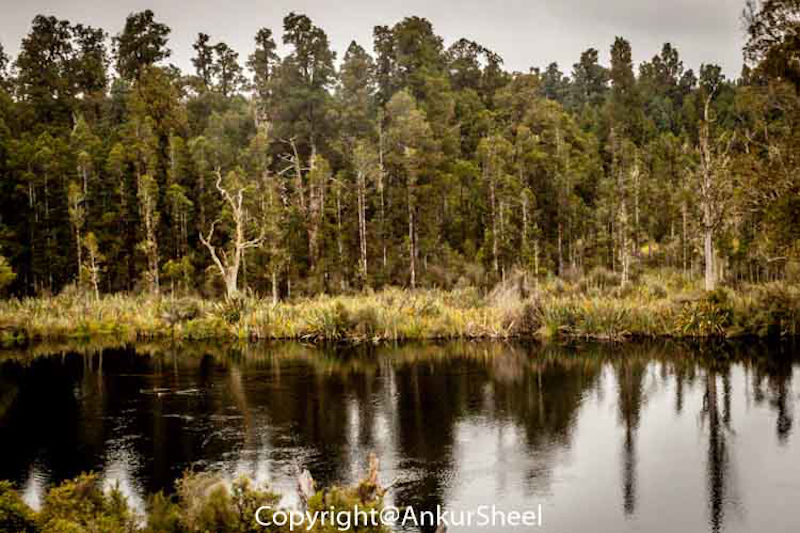

## Travel Tips

-   Book early on the [Kiwirail website](https://www.greatjourneysofnz.co.nz/) since they have a couple of options (on the price) depending on when you book.
-   Seats are not allocated at booking, but you can make a seating request by calling KiwiRail's free number and quoting your booking reference. If you're going from Christchurch to Greymouth, try to get seats on the right-hand side of the train.
-   If you want to spend a lot of time in an open-air viewing car, it might be worthwhile to ask for a carriage close to it.
-   Bring cash for the cafe bar as cards are sometimes not accepted.
