Unlike most day trips, a day trip to Milford Sound is even more beautiful when it's wet and rainy. When it rains, the rainfall makes hundreds of waterfalls combined with the rainbows, a mystical sight. But don't take my word for it. Take a look at the images.

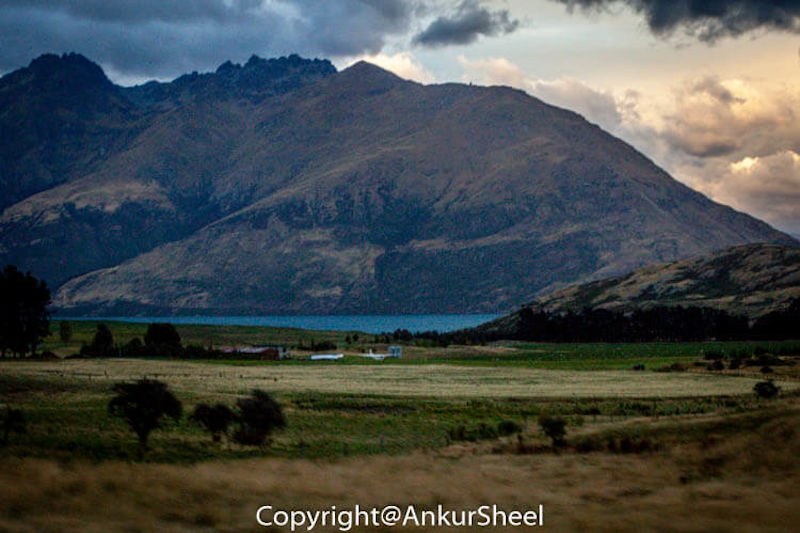

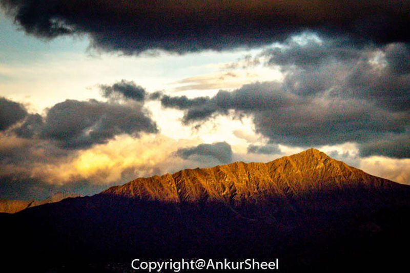

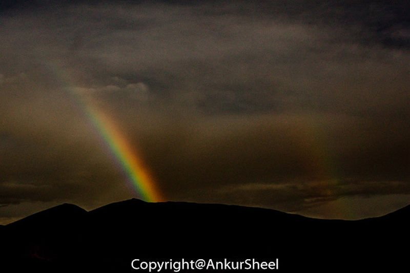

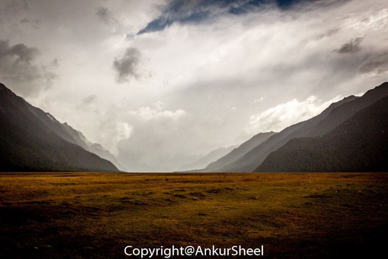

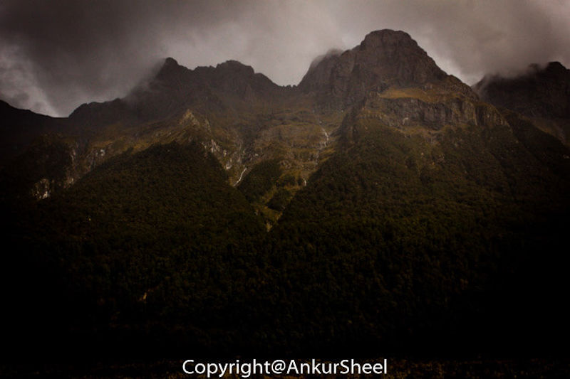

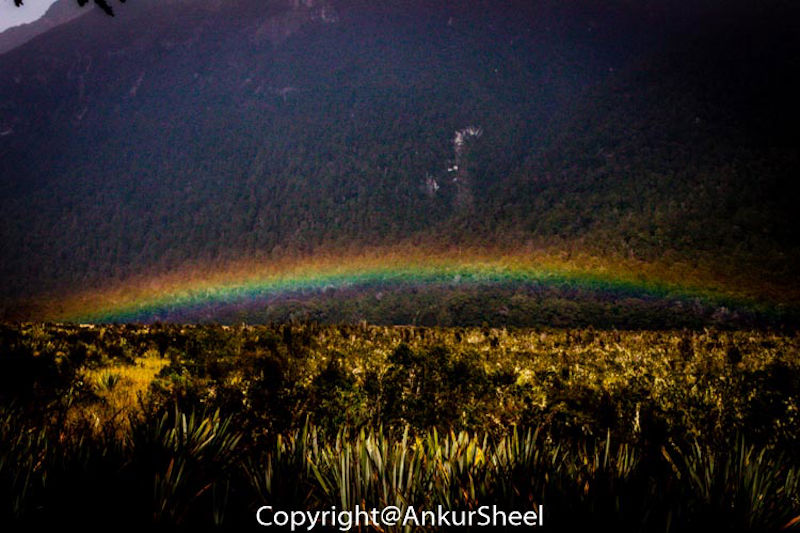

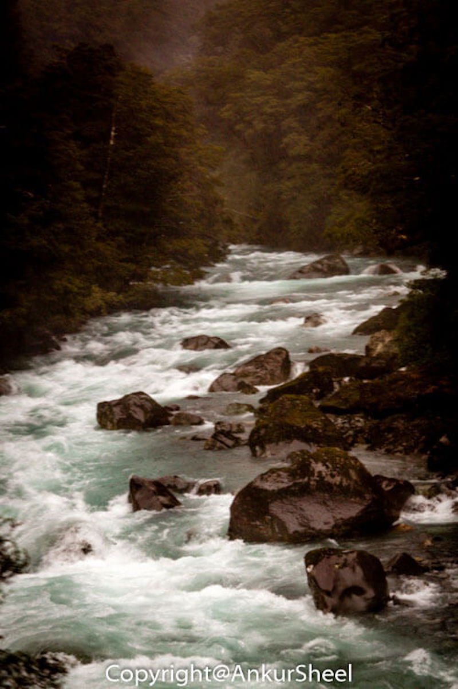

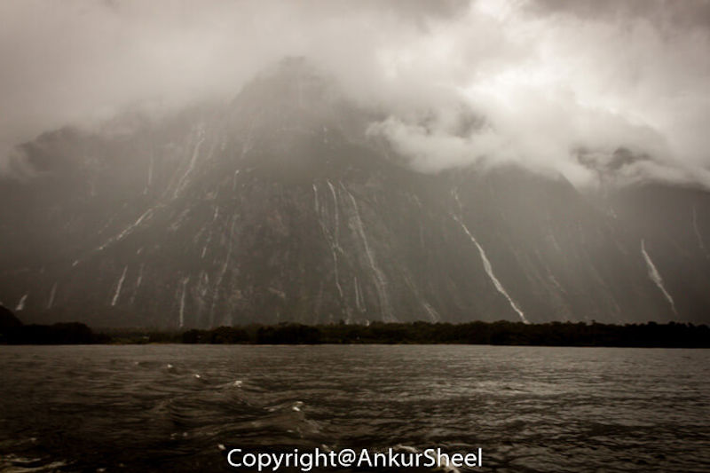

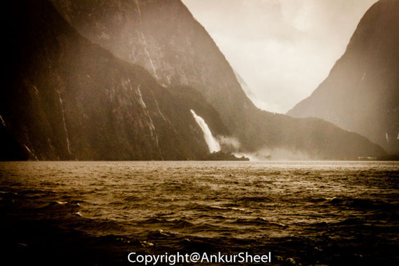

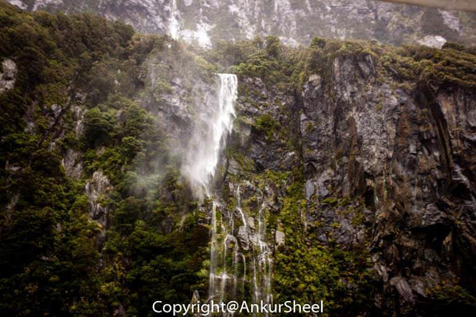

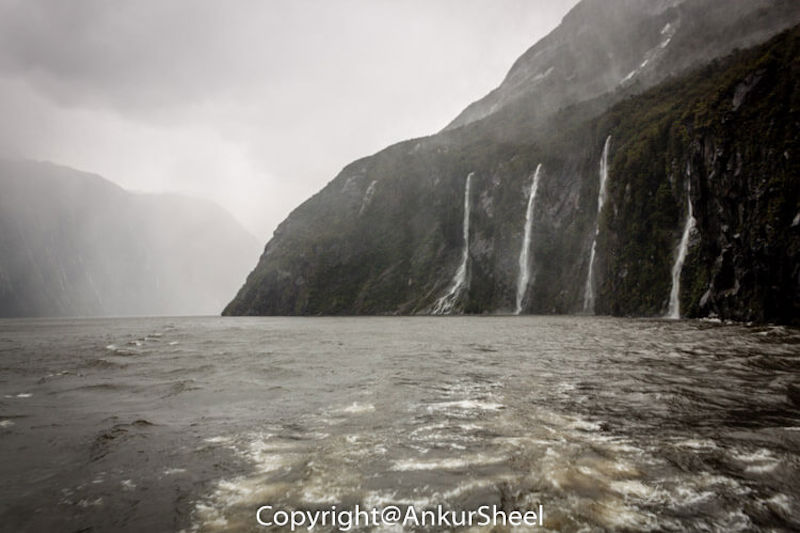

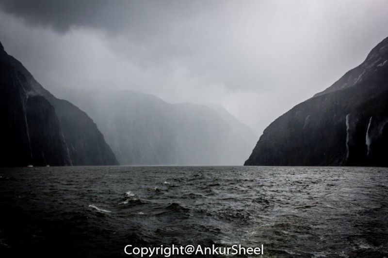

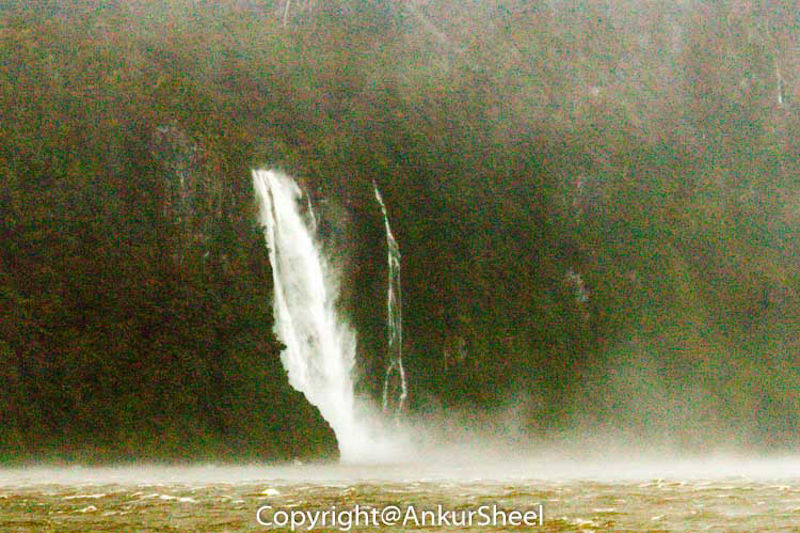

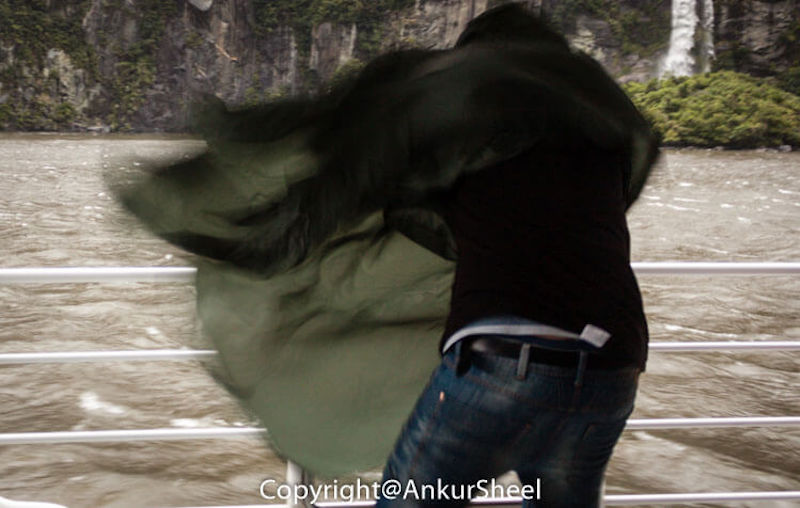

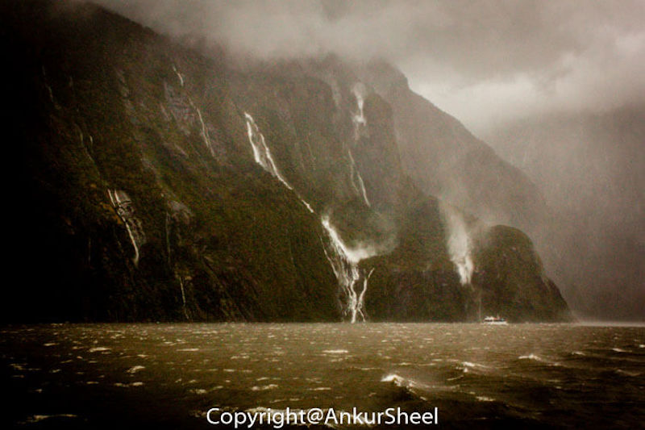

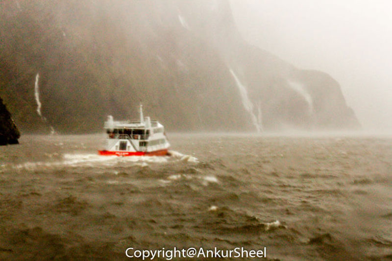

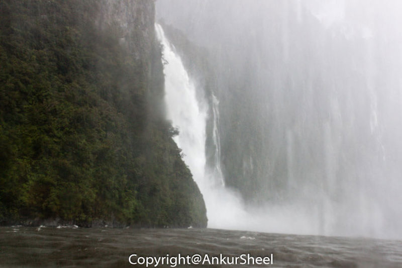

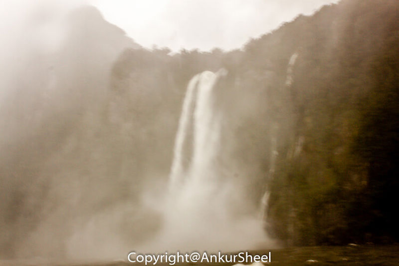

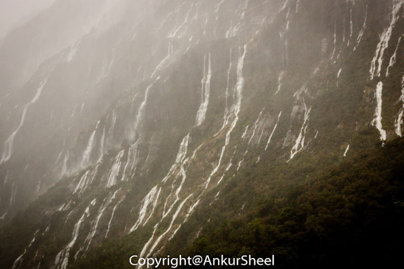

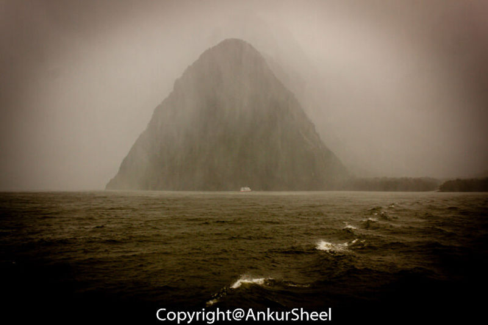

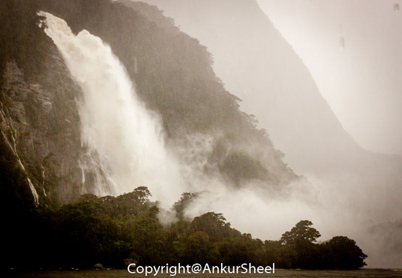

Have you visited Milford Sound? How was the weather? How was your experience? Let me know.
