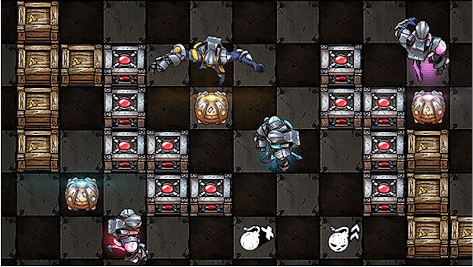

Every couple of weeks, there is a contest hosted by the folks at [codingame.com](http://www.codingame.com). This time around, it was a multiplayer AI bot competition based on the Bomberman theme.

If you just want to look at my statistics for this contest, you can just scroll to the bottom, but you would miss seeing all the things I did wrong. 😊

## Preamble

The game was turn-based, where each turn consisted of you reading the world state information from _stdin_ and outputting your action to _stdout_. You also had a maximum of 100 ms to submit your move before you would timeout and die. This would be repeated until only 1 bot was alive or a fixed number of rounds had passed. If there was more than 1 bot alive at the end, the winner would be decided by the number of boxes they had blown up.

There are multiple leagues:

-   Wood 3
-   Wood 2
-   Wood 1
-   Bronze
-   Silver
-   Gold
-   Legendary

To pass each league, you need to beat the boss of that league. Everyone starts from Wood 3, and depending on how good their bot fares, they move to the higher leagues. Also, as you move to the higher leagues, additional rules might apply. For example, in wood 3, bombs did not hurt you, and the goal was to blow up more boxes than your enemy. But, by the time you reached the bronze level, you could die from your own bombs, and the main goal was to stay alive. Needless to say, this tripped up a lot of players who got stuck in bronze as the naive implementations were not good enough to go through.

You can use multiple languages to submit your bot, but I went with C++ for apparent reasons.

## What Went Right

-   I had already spent a few days working on the puzzles at codingame, which gave me a good idea of how the platform works. Working with web IDE (especially with C++)is a bit clunky, but I found a google chrome plugin on the forums that allowed me to sync a local file to the web IDE. This allowed me to work in Visual Studio, which made for a much faster workflow.

-   I also realized that one major limitation of codingame is that the whole solution has to be one file. Since this is a significant hindrance for readability and debugging, I created a utility in C#, which ran through all the included files and combined them into 1 output file, which was synced to the ide (using the plugin above).

-   I spent the first day setting up the framework for my Bot. This included classes to encapsulate the GameState and AI. This allowed me to quickly tweak my algorithms based on the new enabled rules as I moved through the leagues.

-   Since the web IDE does not allow for any debugging except by using the stderr stream, I wrote a python script that would download the game data, parse it and put it into a text file consumed by my program. This allowed me to step through and debug the AI to see that my AI was failing to win because of some bug.

-   I created a straightforward algorithm to limit the number of nodes available for pathfinding by using a variant of Navmeshes.

-   Continuous refactoring after each league enabled me to tackle the new league without dealing with an unreadable mess in the later stages.

-   Using source control to keep track of the AI. I cannot even stress how helpful it was to go back a version or two because the new logic was performing even worse than a few iterations before.

-   I made it to the Silver League, which was one of the goals I had set for myself.

## What Went Wrong

-   I missed one of the rules, where the bombs were blocked by items. By chance, I noticed this because my bot started behaving unexpectedly when only a few boxes were left on the screen. This meant that the game state that my bot was evaluating was incorrect. This led to a multitude of problems, some of which are outlined below.

-   I misjudged the scope of the problem and the sophistication of the other bots. My AI eventually turned to be a simple avoidance bot that blew up a few boxes. I think it would have been better if I had spent a little bit of time trying to kill other bots. In the same vein, my bot never actively tried to pick up the items to give itself more firepower. It was lucky enough that it would find a few of the items on its route most of the time.

-   I had a very basic scoring system to decide what action to perform. Unfortunately, the way I had set up the code meant that as the rules were enabled, it became harder to incorporate them into the scoring. I should have spent time refactoring to easily score each move based on some heuristic and choose the best one.

-   My bot started trapping itself or moving into unsafe areas after we were able to collect items to place multiple bombs or increase the range of the bombs. This took me a long time to figure out.

-   No look ahead. I did not spend any time setting up a look ahead mechanism, which would have made for a more sophisticated bot. I assumed in the earlier stages that I would timeout with a look ahead logic. But, I should have added a timer to exit out before the timeout. I did add a timer eventually, but it was too late in the game

-   I did not get to spend as much time as I would have liked on this. With work and other personal commitments, I could only spend a few hours on the problem. It was also tough to stay motivated and write/debug more code after having it done for the whole day at work.

I was hoping to get the majority of it done over the weekend. But by then, I had reached my goal of reaching the Silver league and could not see myself getting enough time to reach the Gold League. What can I say? Laziness won the day.

-   I moved up the wood leagues before I had modified my AI to incorporate the new rules. This came to bite me in the ass once I reached Bronze and even more in the Silver league. In all fairness, I just resubmitted the previous bot with a minor tweak, and the next thing I knew, I had got promoted

## What would I do differently

-   Adding a more robust scoring system to decide where to move. The current scoring system just avoided tiles that were unsafe and tried to blow up a box. With a more sophisticated scoring system, I could have got it to easily place bombs where it could have achieved multiple things.

-   Adding a timer earlier on for profiling. This would have given me the confidence to add more sophisticated techniques without being afraid to run into time out issues.

-   Being better at deciding which feature to implement. By the time I reached the silver league, I had a huge scope of features that I wanted to implement, but I got struck by paralysis analysis, and I just couldn't decide which chunk would give me the most bang of the buck.

Once I realized that I had missed the rule where items block bombs, I should have added it so that the bot evaluated its moves on a correct game-state.

-   Make sure I incorporate the rule as they become available instead of being in a rush to move up the leagues.

-   Try to simulate the game so that I can test everything locally before submitting my code.

## Ranking

**League:** Silver

**Global Rank:** 721/2715 (27%)

**New Zealand:** 8/19

**India:** 5/38

This was the first time I got a chance to participate in a codingame contest, and although I did not do as well as I would have liked, it was a lot of fun.

Feel free to follow me at codingame using this [url](https://www.codingame.com/servlet/urlinvite?u=1506970).
