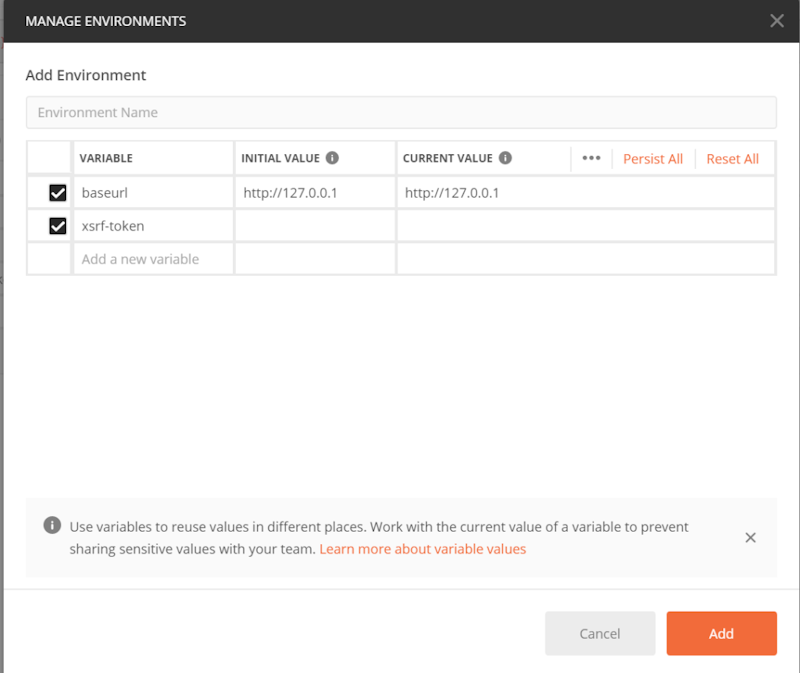

Using an anti-forgery token is a pretty standard way of securing your website from XSRF(Cross-Site Request Forgery) attacks. However, it does make it challenging to use Postman to test your ajax endpoints. Without the correct token in your request, you will get a _**401 Unauthorized**_ error.

This is something I ran into recently. So, what did I do?

## Preamble

I guess I could disable the validation for testing purposes. For a long time, I did precisely that. My super-scientific process was comprised of the following steps.

1. Disable the validation by commenting out the validating code.
2. Rebuild the solution.
3. Start the local server.
4. Test using Postman. Make fixes if required.
5. Re-enable validation.
6. Rebuild code.
7. Ship.

Now, I don't know about you, but just looking at that makes me sad, and it's not just because it doesn't allow me to test the endpoints on the deployed code. And no, deploying code with validation turned off just for testing purposes is not something I want to do.

I couldn't stop thinking that there had to be a better way to do this. Indeed, I was not the only one who would want to do this. So, I did what any good engineer does - Open my browser and search stack overflow and google. I found a few articles, but none of them worked for me.

Since I am writing this article, something worked for me, but before we get into what worked, for the uninitiated, some background.

## What is XSRF aka CSRF aka Sea Surf aka Cross-Site Request Forgery?

XSRF vulnerabilities occur when a website allows an authenticated user to perform a sensitive action but does not verify that the user is invoking that action. Instead, they verify only that the request came from the browser of an authorized user.

This can open up the website to an attack where the user has a validated auth cookie stored in their browser.

The most common way to prevent CSRF attacks is to use a CSRF-token

## What is an anti-forgery (XSRF) token?

The anti-forgery token is a way to protect against Cross-Site Scripting attacks. It is a unique random key generated for every single HTML form sent to the client.

The way it works is

1. Whenever a user requests a page with form data, the server generates an anti-forgery token which is unique and unpredictable.
2. The client sends back the token when the form is submitted.
3. The server validates the token, and if the token does not match, the request is rejected.

## What does the application look like?

Our application is built in ASP.NET and uses Razor pages. One of the ways that we can add an anti-forgery token to a Razor page is by using the `@@Html.AntiForgeryToken()` helper function inside a form. All this does is add a hidden form field containing the token. The form field that is added is similar to

```html
<input
    name="__RequestVerificationToken"
    type="hidden"
    value="HCT7cStZ5BVk3sFWdlYRsaPN2K2xUHwRc-AAEn1tIq02yWO1QSUuAiNuH4pCg6M7JgV3xZjysixJHhkqoGhOTTG8bgk0H3VWi5XpJgntnt2uc-xXwXwSOta9hBNMJQxo5JznbmiBtxPkwSx-GqxXsw2"
/>
```

Note the name of the hidden input - **_\_\_RequestVerificationToken_**. We will need it later.

We are also going to assume that the URL with the form is _http://localhost/page_. When the user presses the submit button, it posts to _http://localhost/page-ajax-action_. The form on the page itself has two fields _FirstName_ and _LastName_

## Yada Yada. But how do I test?

Enough talk; let's start Postman and set it up to test our ajax endpoints.

### Create the environment



### Setup our request


If you are wondering what _{{xsrf-token}}_ means, it's a way to tell Postman that this value will come from the _xsrf-token_ variable.

### Set the anti-forgery token variable

Now since the anti-forgery token is generated for every request, we can use a Pre-request script to set the value of the _xsrf-token_ environment variable every time we want to hit the ajax endpoint.

This is what our pre-request script will look like

```javascript
var url = pm.environment.get('baseurl');
pm.sendRequest(`${url}/login`, function (err, response) {
    if (err) {
        return console.error(err);
    } else {
        var body = response.text();
        const html = cheerio(body);
        var allInputs = html.find('input[name="__RequestVerificationToken"]');
        var input = allInputs.first();
        var token = input.val();
        pm.environment.set('xsrf-token', token);
    }
});
```

Let's break this down one by one.

-   **_Line 1_**: We get the _baseurl_ from the environment variables and store it in _url_.
-   **_Line 2_**: We send a request to the login page. We designate the callback function, which receives 2 arguments - an error(if any) and a response.
-   **_Line 3-4_**: If there is an error, log the error to the console.
-   **_Line 6_**: Get the body from the response object.
-   **_Line 7_**: Parse the body using Postman's inbuilt support for Cheerio. To read more about cheerio visit [Cheerio](https://cheerio.js.org/)
-   **_Line 8_**: Use cheerio to find all instances of `input[name="__RequestVerificationToken` in the body.
-   **_Line 9_**: If there are multiple instances on the page, take the 1st instance.
-   **_Line 10_**: Get the value from the input.
-   **_Line 11_**: Set the _xsrf-token_ environment variable with the token value.

### And now we Test

And now, if we send a request, we can get a 200 response back from our ajax endpoint. We can also see what our environment looks like


## Conclusion

This makes it easy to test endpoints protected by a CSRF token.

Was this helpful? Did this work for you? Let me know.
