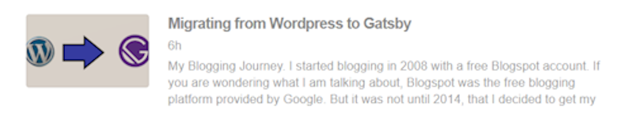

[Gatsby](https://www.gatsbyjs.org) has a good [article](https://www.gatsbyjs.org/docs/adding-an-rss-feed/) on how to add an RSS feed to your gatsby site. Although it will suffice in most cases and is a good starting point, it wasn't exactly working for me.

-   My posts live under ["_/blog/_"](https://www.ankursheel.com/blog/) but the pages are under ["www.ankursheel.com/"](https://www.ankursheel.com).
-   I am working with MDX, but the document deals with markdown posts.
-   It doesn't explain how to add the featured image in the list view.

Let us start modifying the options once we have the base from the gatsby article.

## Getting the data

```graphql
query `
{
    site {
        siteMetadata {
            siteUrl
        }
    }

    allMdx(
        limit: 1000
        filter: { fileAbsolutePath: { regex: "//content/posts//" } }
        sort: { order: DESC, fields: [frontmatter___date] }
    ) {
        edges {
            node {
                excerpt(pruneLength: 140)
                html
                frontmatter {
                    slug
                    title
                    date
                    featuredImage {
                        publicURL
                    }
                }
            }
        }
    }
}
`;
```

So what am I doing here?

-   **_Lines 3-7_**: I get the siteUrl from the site metaData. We will need this to build the URL to the posts.
-   **_Line 9_**: Since all of my content is in MDX files instead of markdown, I use **_allMdx_**.
    -   **_Line 10_**: I limit it to 1000 records. I guess this could be a much smaller value, but it's ok for the time being.
    -   **_Line 11_**: I want to build the feed only for my posts, so I add a regex to get only those records that are present in _"content/posts"_.
    -   **_Line 12_**: I sort the records by date in descending order.
-   **_Lines 14-26_**: I get the _excerpt_ and _html_. I also get the _slug_, _title_, _date_ and the _featured image url_ from the frontmatter. The excerpt is also pruned to a maximum length of 140 characters.

## Build the feed object

The documentation states that every feed must include _option_, _query_ and _title_. It also recommends passing a serialize function to customize the feed structure. This is what the final _feeds_ array looks like

```javascript
feeds: [
    {
        serialize: ({ query: { site, allMdx } }) => {
            const {
                siteMetadata: { siteUrl },
            } = site;

            return allMdx.edges.map(edge => {
                const {
                    node: {
                        frontmatter: { title, date, slug, featuredImage },
                        excerpt,
                        html,
                    },
                } = edge;

                const blogUrl = `${siteUrl}/blog/${slug}`;

                return Object.assign({}, edge.node.frontmatter, {
                    title,
                    description: excerpt,
                    date,
                    url: blogUrl,
                    guid: blogUrl,
                    enclosure: featuredImage && {
                        url: siteUrl + featuredImage.publicURL,
                    },
                    custom_elements: [{ 'content:encoded': html }],
                });
            });
        },

        output: '/blog/rss.xml',
        title: "Ankur Sheel's Ramblings",
    },
],
```

Let's break this down.

-   **_Line 3_**: Create the serialize function which destructures _site_ and _allMdx_ from the query object.
-   **_Lines 4-6_**: Destructure the _siteUrl_ from the _site_ object.
-   **_Line 8_**: Loop through all the edges and map to a feed item.
    -   **_Lines 9-15_**:Destructure _title_, _date_, _slug_, _featuredImage_, _excerpt_ and _html_.
    -   **_Line 17_**: Create the URL to the blog post.
    -   **_Line 19_**: Create the feed item to be returned.
        -   **_Line 20-24_**: Nothing fancy happening here. Just setting the feed item properties.
        -   **_Line 25-27_**: **_enclosure_** is required to set the featured image. It takes in a URL that is set to the public URL of the featured image. If there is no featured image, then the enclosure will be empty.
        -   **_Line 28_**: Set the content to be the HTML content.
-   **_Line 33_**: Set the path and filename for the RSS feed.
-   **_Line 34_**: Set the title for the RSS feed.

## Conclusion

After making the changes, the RSS feed for my blog now looks like 

Are you showing images in your RSS feed? How did you go about it? Let me know.
