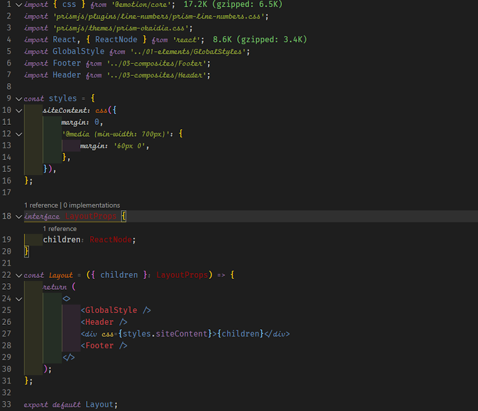

I have been using FiraCode as my font of choice in VS Code since I found about it. The use of ligatures while typing code is handy and has been a game-changer. However, lately, I have seen some VS code screenshots with cursive fonts in the text editor, and I wanted some of that. But, I also wanted to keep the ligatures that FiraCode has already spoiled me with.

Using my googling skills, I found a few articles, and it seemed the most straightforward way was to install a theme with a cursive font already built in such as [this](https://marketplace.visualstudio.com/items?itemName=idbartosz.darkpp-italic). However, I like the flexibility of changing themes, so this was not a viable option for me.

## Final Output



Now that we know what we are looking to achieve let's see how to make it happen.

## Updating VS Code's settings

My search for a font that encapsulates ligatures and Cursive fonts led me to [Fira Code iScript](https://github.com/kencrocken/FiraCodeiScript) made by Ken Krocken. It combines 2 fonts - Fira Code as the regular font and Script12 as the italic font.

After installing the font on my system, I changed the editor settings to use _Fira Code iScript_ as the first option for _font family_.

```json
"editor.fontLigatures": true,
"editor.fontFamily": "'Fira Code iScript', 'Fira Code', Consolas, 'Courier New', monospace",
```

VS Code uses the TextMate grammar syntax to define how it needs to render code. You can read more in the [official documentation](https://code.visualstudio.com/api/language-extensions/syntax-highlight-guide). In VS Code _settings.json_, you can override the font style for the current theme by modifying the _textMateRules_ under _editor.tokenColorCustomizations_.

```json
{
    "editor.tokenColorCustomizations": {
        "textMateRules": [
            {
                "scope": [], // array of Scopes to which the style should be applied to
                "settings": {
                    "fontStyle": "italic" // the font style that should be applied
                }
            }
        ]
    }
}
```

You might be wondering how to get the scope to put in the above JSON. Luckily, VS code has a command to help us with this - **Developer: Inspect Editor Tokens and Scopes**. You can trigger this by using the Command Palette (Ctrl + Shift + P) after ensuring that the active cursor is on the token you want to inspect.

The scope inspector displays the following information:

-   The current token.
-   Metadata about the token and information about its computed appearance.
-   Theme rules that apply to the token.
-   Complete scope list, with the most specific scope at the top.

The one that we will use is _scope list_. Whichever token you want to make italic, add it to the scopes in the _scopes_ array.

You can see my current config for an example.

## My current config

```json
"editor.tokenColorCustomizations": {
    "textMateRules": [
        {
            "scope": [
            //following will be in italic (=FlottFlott)
                "comment",
                "entity.name.type.class", //class names
                "keyword", //import, export, return…
                "storage.modifier", //static keyword
                "storage.type", //class keyword
                "support.class.builtin",
                "keyword.control",
                "constant.language",
                "entity.other.attribute-name",
                "string.quoted.single",
                "entity.name.method",
                "entity.name.tag"
            ],
            "settings": {
                "fontStyle": "italic",
            }
        }
    ]
}
```

## Conclusion

After these steps, I have both ligatures and cursive fonts in my editor.

### Thanks

-   Daniel de Souza pointed out some changes he needed to make to [get it working with a 4K monitor](https://github.com/tonsky/FiraCode/issues/1161#issuecomment-734453611).
-   Manjunath Vadigeri for reaching out and letting me know that the steps don't work in the latest VS Code. _The article has been updated to reflect the changes._
