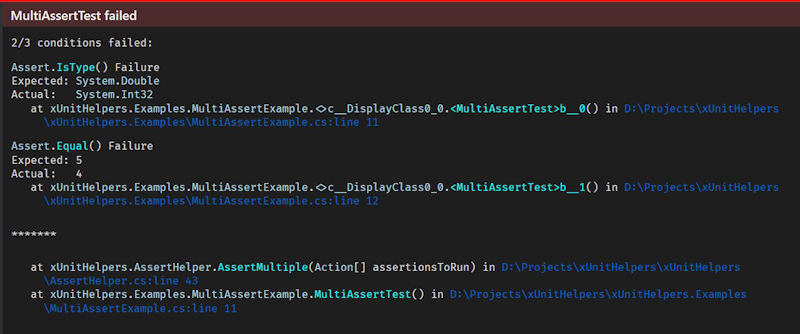

I created [Codinators.XunitHelpers](https://www.nuget.org/packages/Codinators.XunitHelpers/)(a NuGet package) to add some useful unit testing functionality that is missing in xUnit.

This release adds support for reporting multiple assertion failures in one method in xUnit tests similar to how [Nunit does it](https://github.com/nunit/docs/wiki/Multiple-Asserts).

## Installation

Install it by using the following command

```bash
dotnet add package Codinators.XunitHelpers
```

## Usage

```csharp
[Fact]
public void MultiAssertTest()
{
    var result = 2 + 2;
    AssertHelper.AssertMultiple(() => Assert.IsType<double>(result),
                                () => Assert.Equal(5, result),
                                () => Assert.Equal(4, result));
}
```

## Screenshot


