When you first create your AWS account, you create a root user. A root user can access everything that AWS offers, and you cannot reduce the permissions associated with it.

Amazon best practices recommend that you can create an admin group for administrative tasks. However, IAM users do not have access to the _AWS Billing and Cost Management Console_ by default, so we need to explicitly enable access.

Let's see how we can create a user with administrator and Billing Access rights to reduce the number of reasons we need to log in as a root user.

First login as the root user

## Enable Access to Billing Informations for IAM users

On the navigation bar, choose the account name and click on _My Account_.

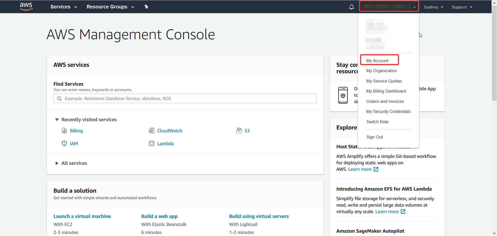

### Enable Access to Billing Information

In the _IAM User and Role Access to Billing Information_ section, select the _Activate IAM Access_ checkbox and click on the _Update_ button.

## Secure root user

Navigate to the IAM(Identity and Access Management) console.

-   Activate MFA on the root account to secure it.

-   Change the sign-in link to be more friendly by clicking on the _Customize_ button. 

## Add User with Administrator Rights

Click on the _User_ item in the navigation pane and click the _Add User_ button.

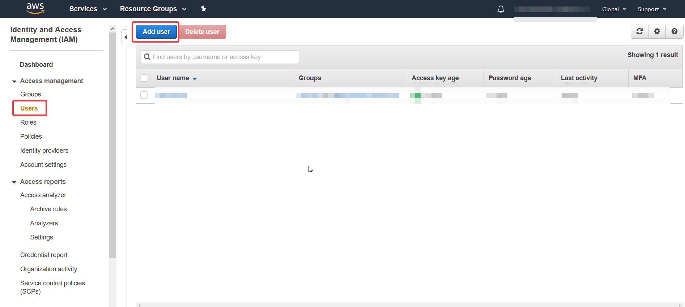

### Set User Details

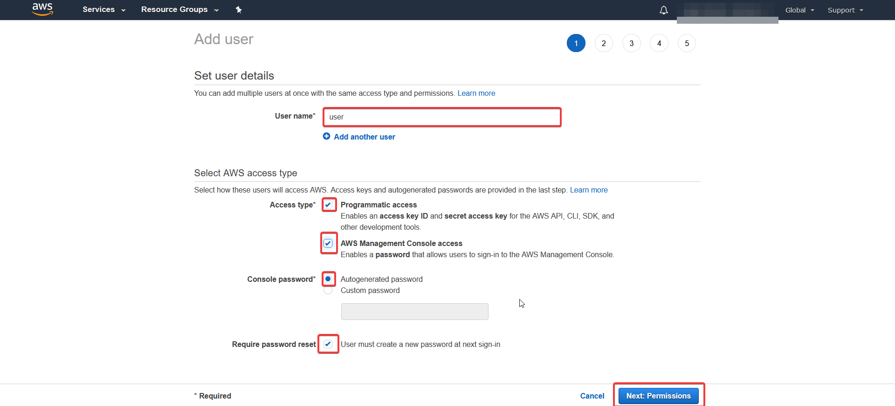

-   Add the username, e.g. _user_.
-   Select the _Programmatic Access_ and _AWS Management Console Access_ checkboxes.
-   Select _Autogenerated password_ for _Console Password_.
-   Select the _Require Password Reset_ checkbox.
-   Click the _Next: Permissions_ button.

### Set Permissions

-   Select the _Add user to group_ item.
-   Click on the _Create group_ button.

### Create Admin Group

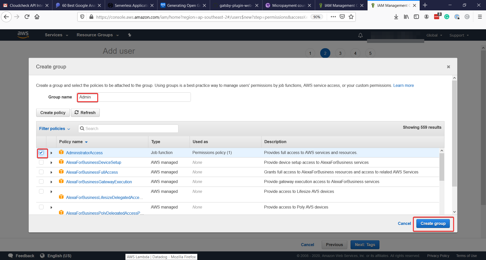

-   Add the group name. e.g. _Admin_.
-   Select the _AdminstratorAccess_ policy from the list of the policies.
-   Click _Create Group_. This will take you back to the _Set Permissions_ screen.

### Add user to Admin group

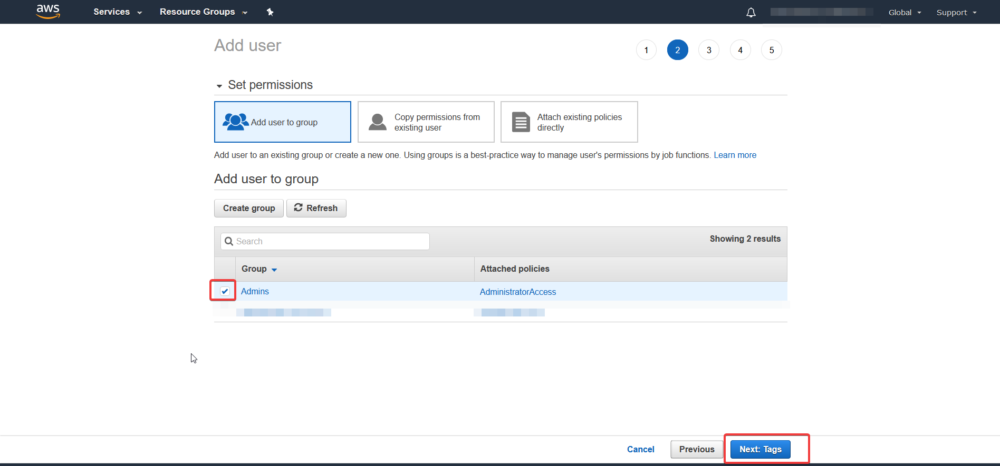

-   Select the Admin group that you just created.
-   Click on _Next: Tags_.

### Add tags

Adding tags is optional, so we will skip tags.

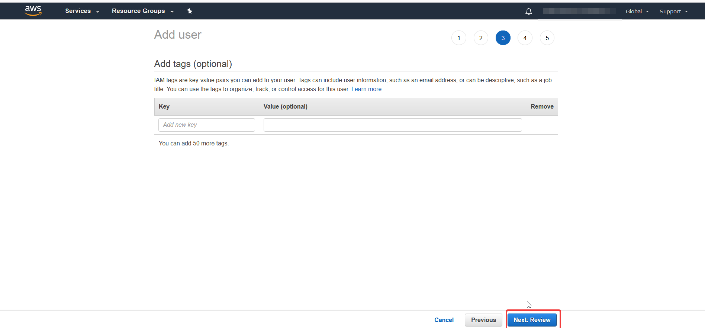

Click on _Next: Review_.

### Review User

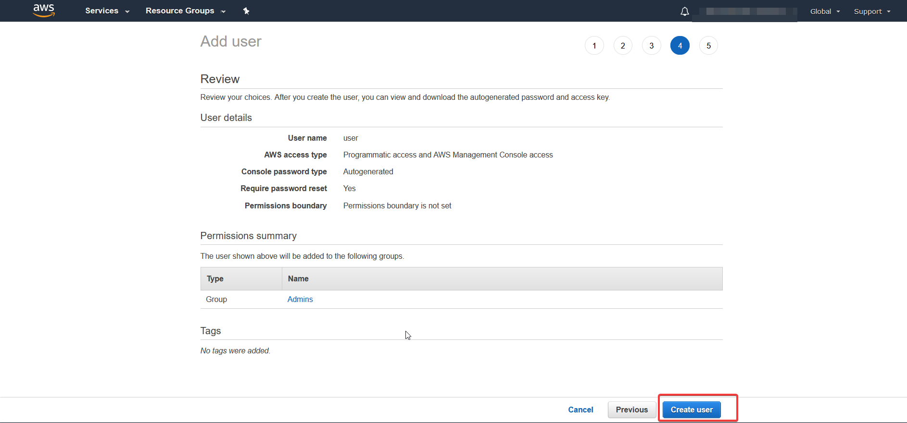

Review the settings, and if everything is correct, press the _Create user_ button.

### Download Credential Information

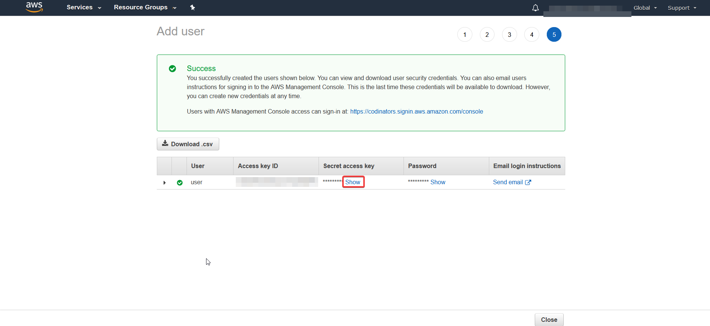

Once the user has been created, you can download the credential information. Remember that this will be the only time you can access this information.

## Create a group and policy for accessing Billing Service

Click on the _Policies_ item in the navigation pane and click the _Create Policy_ button.

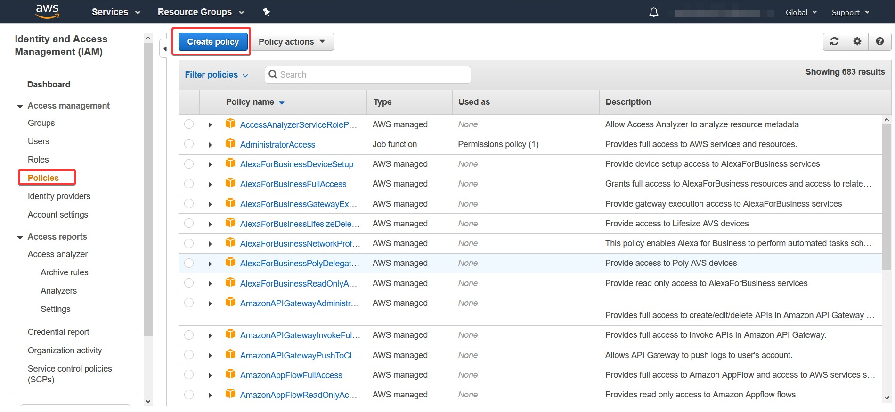

### Add Billing Service

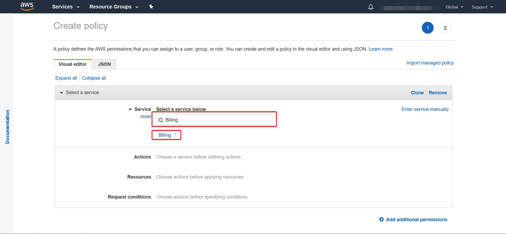

In the _Select a service_ section, search for _Billing_ and then select _Billing_.

### Add Allowed Actions for Billing Policy

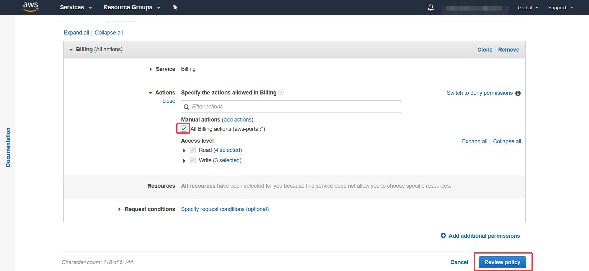

-   Select the _All Billing actions_ checkbox.
-   Click on the _Review policy_ button.

### Create Billing Policy

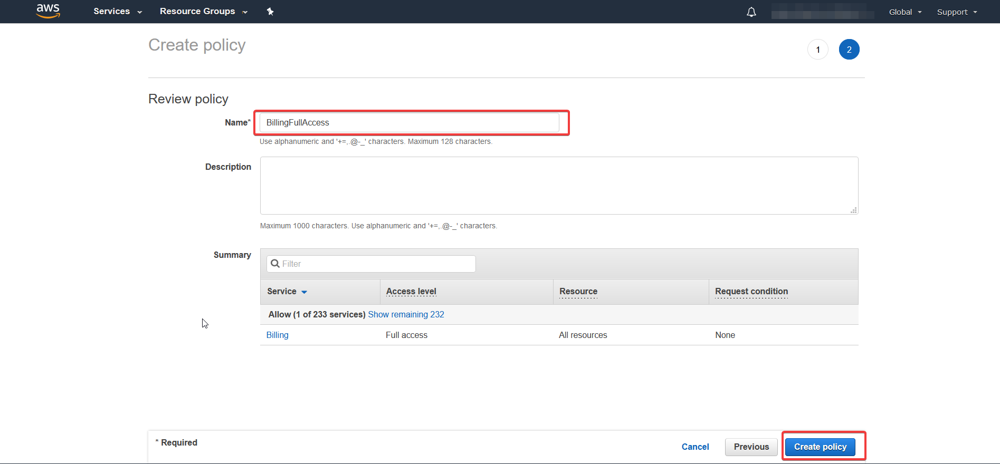

-   Add the name for the policy, e.g. _BillingFullAccess_.
-   Click the _Create Policy_ button.

### Create Billing Group

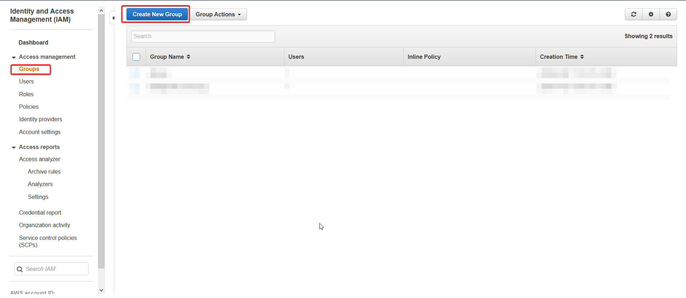

Click on the _Groups_ item in the navigation pane and click the _Create New Group_ button.

### Set group name

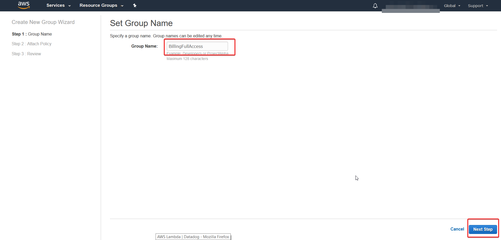

-   Give a name for the Billing group, e.g. _BillingFullAccess_.
-   Click on the _Next Step_ button.

### Attach Policy

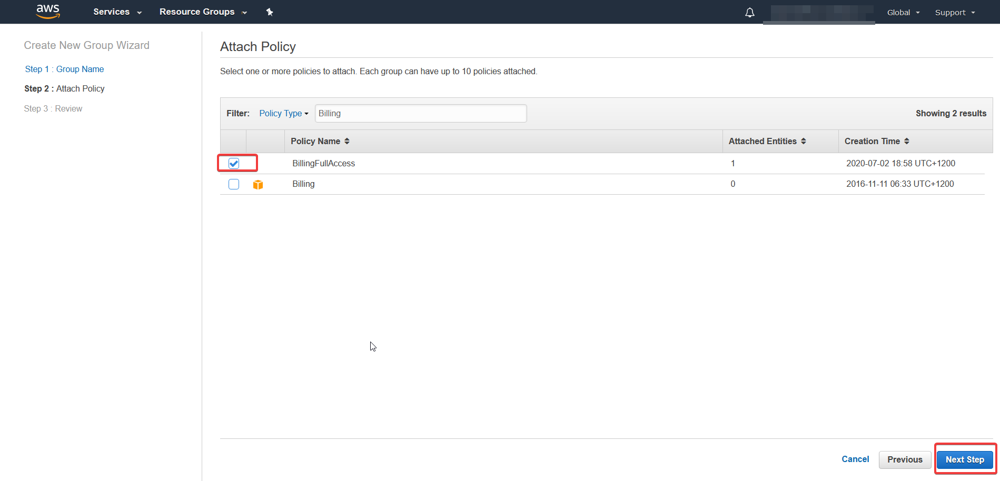

-   Search for _Billing_ in the filter.
-   Select the _BillingFullAccess_ policy checkbox.
-   Click on the _Next Step_ button.

### Review Group

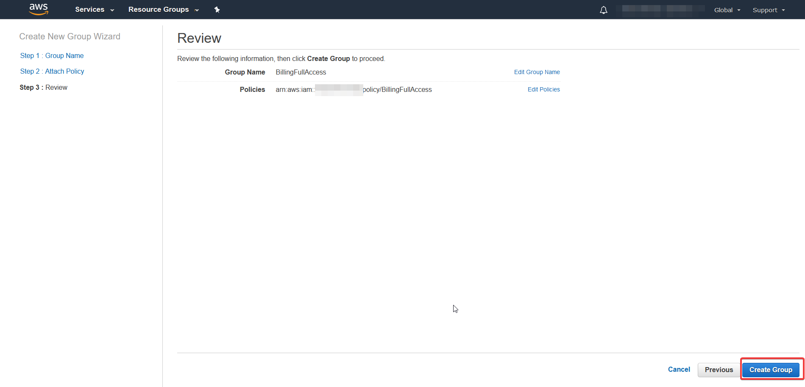

-   Click the _Create Group_ button.

## Add User to the Billing Group

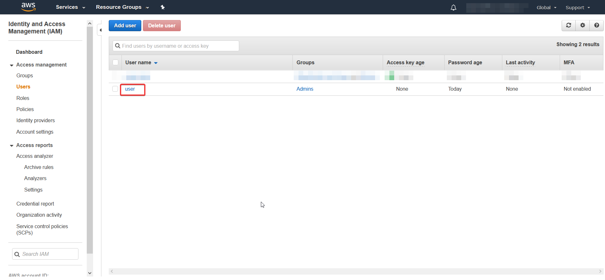

Click on the _Users_ item in the navigation pane and click the user you want to add to the group.

### Groups

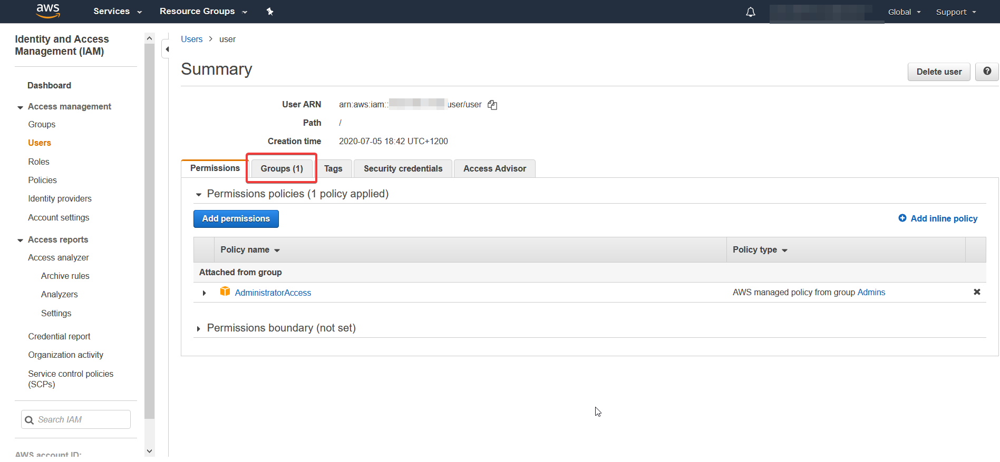

Select the _Groups_ tab.

### Add user to group

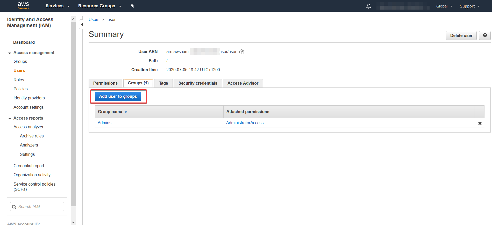

Click on the _Add User to Group Button_.

### Select Billing group

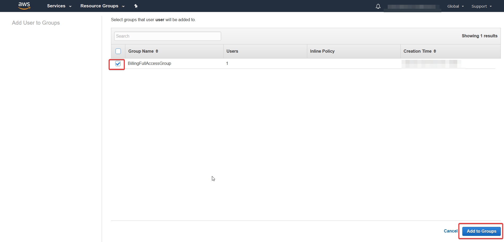

-   Select the _BillingFullAccessGroup_ checkbox.
-   Click on the _Add to Groups_ button.

## Conclusion

We now have an IAM user with administrator rights for our AWS account and has full access to the AWS Billing and Cost Management Console. It is also easy to give other users access to either Administrator rights or Billing rights.
