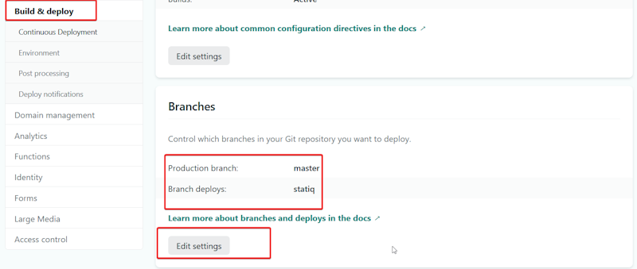

## Problem

As part of the [migration from Gatsby to Statiq](./migrating-gatsby-statiq), I wanted to keep the original site running with gatsby but deploy the new branch using statiq.

## Solution

First, we need to allow branch deploys for our branch.



In the above screenshot, my branch for the migration is named _statiq_.

To override the build settings set in the Netlify UI, we can add the following snippet to _netlify.toml_

```toml
[build]
  command = "dotnet run --project ./subDir/"
  publish = "./subDir/output"
```

So, what's happening here?

-   **Line 1**: Apply the build settings globally and override anything set in the UI.
-   **Line 2**: Use the `dotnet run` as the build command and specify the project path.
-   **Line 3**: The relative directory to the root directory containing the deploy-ready HTML files and assets.

## Conclusion

The advantage of updating the _netlify.toml_ file is that when we merge our branch back to master, it will automatically use Statiq to build the site.

## Further Reading

-   [Netlify File Based Configuration](https://docs.netlify.com/configure-builds/file-based-configuration/)
-   [Dotnet run command](https://docs.microsoft.com/en-us/dotnet/core/tools/dotnet-run)
